# ALBERT: A Lite BERT for Self-supervised Learning of Language Representations
## Information
- arXiv 2019(submitted to ICLR 2020)
- Lan, Zhenzhong, et al.

## Keywords
- NLU
- Pre-train
- BERT
- Model Compression

## Contribution
- Present two parameter-reduction techniques to lower memory consumption and increase the training speed of BERT.
- Use a self-supervised loss that focuses on modeling inter-sentence coherence, and show it consistently helps downstream tasks with multi-sentence inputs.

## Summary
- Design A Lite BERT(ALBERT) architecture that has significantly fewer parameters than a traditional BERT architecture to address all of the resources consumption problems.
	- ALBERT incorporates two parameter reduction techniques that lift the major obstacles in scaling pre-trained models.
	- To further improve the performance of ALBERT, this paper also introduces a self-supervised loss for sentence-order prediction (SOP).

- The Elements of ALBERT:
	- The backbone of the ALBERT architecture is similar to BERT in that it uses a transformer encoder with GELU nonlinearities.
	- Generate masked inputs for the MLM targets using n-gram masking([SpanBERT setting](https://arxiv.org/abs/1907.10529)).
	1. Factorized embedding parameterization
		- Use a factorization of the embedding parameters, decomposing them into two smaller matrices.
		- Instead of projecting the one-hot vectors directly into the hidden space of size H, we first project them into a lower dimensional embedding space of size E, and then project it to the hidden space.
		- By using this decomposition, we reduce the embedding parameters from O(V x H) to O(V x E + E x H).
	2. Cross-layer parameter sharing
		- Propose cross-layer parameter sharing as another way to improve parameter efficiency.
		- The default decision for ALBERT is to share all parameters across layers.
		- Observe that the transitions from layer to layer are much smoother for ALBERT than for BERT, which shows that weight-sharing has an effect on stabilizing network parameters.
			- 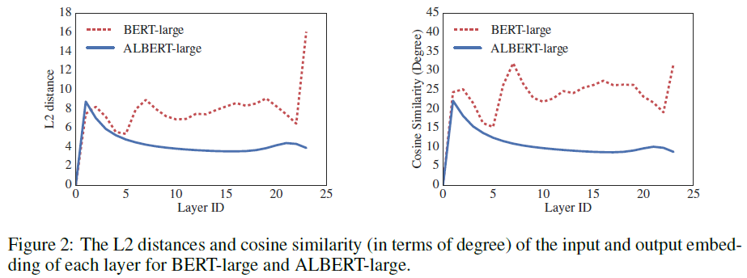
	3. Inter-sentence coherence loss (Sentence-Order Prediction(SOP) loss)
		- The main reason behind NSP's ineffectiveness is its lack of difficulty as a task, as compared to MLM.
			- As formulated, NSP conflates topic prediction and coherence prediction in a single task. However, topic prediction is easier to learn compared to coherence prediction, and also overlaps more with what is learned using the MLM loss.
		- A sentence-order prediction(SOP) loss, which avoids topic prediction and instead focuses on modeling inter-sentence coherence.
		- The SOP loss uses as positive examples the same technique as BERT (two consecutive segments from the same document), and as negative examples the same two consecutive segments but with their order swapped.
		- This forces the model to learn finer-grained distinctions about discourse-level coherence properties.

- Hyperparameters Comparison
	- Due to the design choices discussed above, ALBERT models have much smaller parameter size compared to corresponding BERT models.
	- 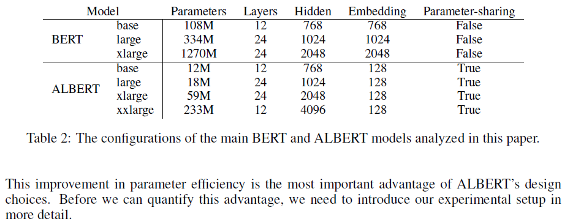
	- This improvement in parameter efficiency is the most important advantage of ALBERT's design choices.

- Experiments:
	- Overall comparison between ALBERT and BERT:
		- 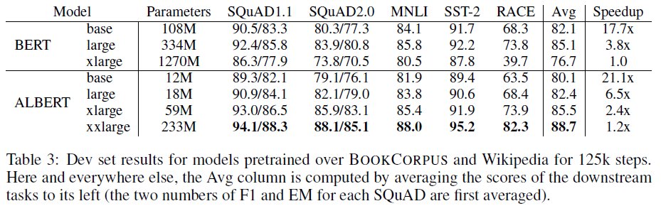
	- Current state-of-the-art NLU Tasks
		- The single-model ALBERT configuration incorporates the best-performing settings discussed: an ALBERT-xxlarge configuration using combined MLM and SOP losses, and no dropout.
		- GLUE benchmark
			- 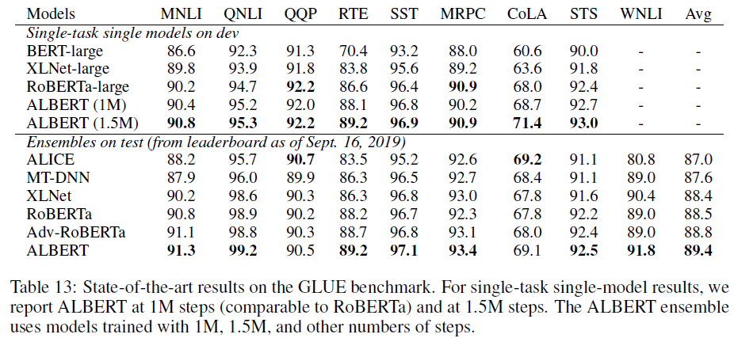
		- SQuAD and RACE benchmarks
			- 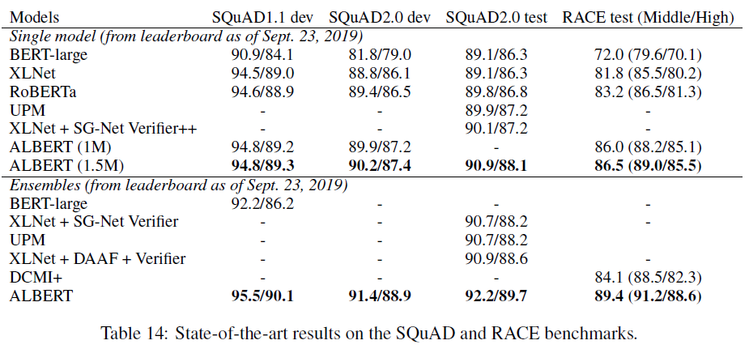
	- Ablation experiments:
		- The vocabulary embedding size E
			- 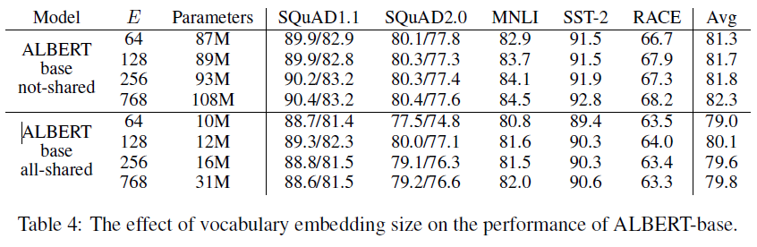
			- Under the non-shared condition (BERT-style), larger embedding sizes give better performance, but not by much.
			- Under the all-shared condition (ALBERT-style), an embedding of size 128 appears to be the best.
		- Various cross-layer parameter-sharing strategies
			- 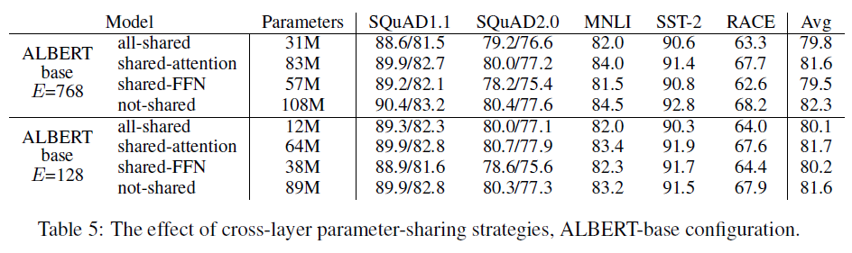
			- The all-shared strategy hurts performance under both conditions.
		- Additional inter-sentence loss
			- 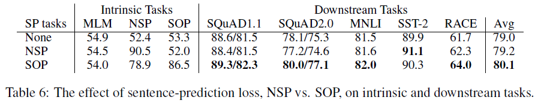
			- The results on the intrinsic tasks reveal that the NSP loss brings no discriminative power to the SOP task.
				- This allows us to conclude that NSP ends up modeling only topic shift.
			- The SOP loss does solve the NSP task relatively well.
			- The SOP loss appears to consistently improve downstream task performance for multi-sentence encoding tasks.
		- Effect of network depth
			- 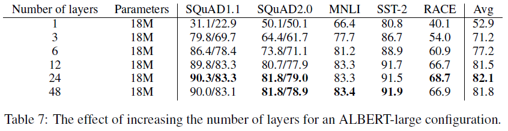
			- Networks with 3 or more layers are trained by fine-tuning using the parameters from the depth before.
		- Effect of network width
			- 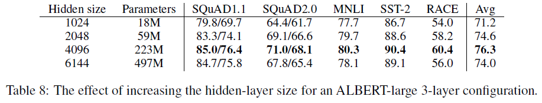
		- The same training time:
			- 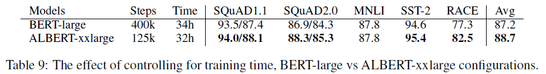
			- After training for roughly the same amount of time, ALBERT-xxlarge is significantly better than BERT-large.
		- Network depth for very wide ALBERT model
			- 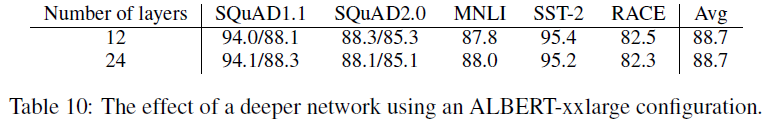
			- The answer is given by the results from Table 10. The difference between 12-layer and 24-layer ALBERT-xxlarge configurations in terms of downstream accuracy is negligible, with the Avg score being the same.
			- When sharing all cross-layer parameters (ALBERT-style), there is no need for models deeper than a 12-layer configuration.
		- Additional training data
			- 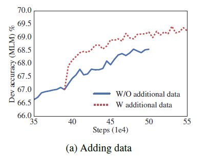
			- 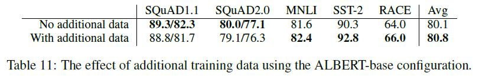
			- Observe performance improvements on the downstream tasks.
		- Dropout effects
			- 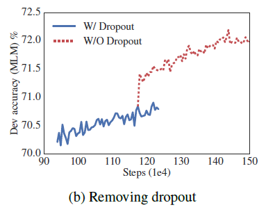
			- 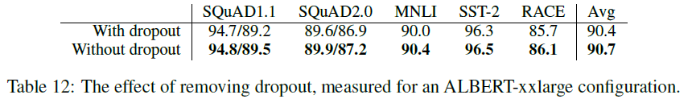
			- Note that, even after training for 1M steps, the largest models still do not overfit to their training data.
			- As a result, we decide to remove dropout to further increase our model capacity.

## Source Code
- [albert_zh](https://github.com/brightmart/albert_zh) (not official)
