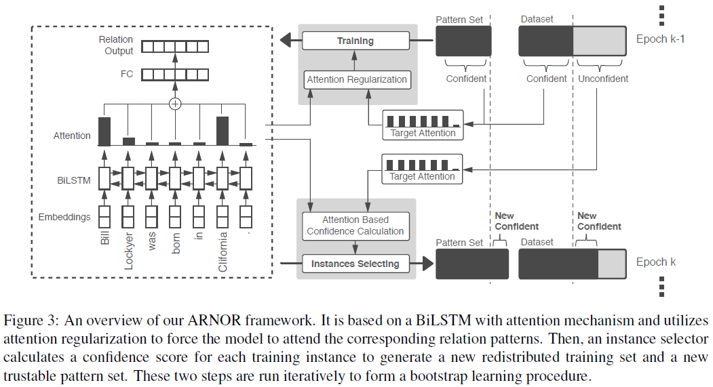
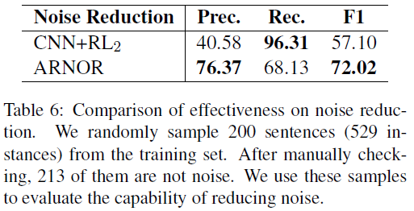

# ARNOR: Attention Regularization based Noise Reduction for Distant Supervision Relation Classification (ARNOR)
## Information
- 2019 ACL
- Jia, Wei, et al.

## Keywords
- Distant Supervision
- Attention
- Relation Classification
- Relation Extraction

## Contribution
- Propose a novel attention regularization method for reducing the noise in distant supervision(DS).
- ARNOR framework achieves significan improvement over state-of-the-art noise reduction methods, in terms of both Relation Classification(RC) performance and noise reduction effect.
- Publish a better manually labeled sentence-level test set for evaluating the performance of RC models.

## Summary
- ARNOR, a novel **A**ttention **R**egularization based **NO**ise **R**eduction framework for distant supervision relation classification.
	- ARNOR, a novel attention regularization based framework for noise reduction.
	- Assumes that a trustable relation label should be explained by the neural attention model.
		- 
		- The clearer the model explain the relation in an instance, the more trustable this in stance is.
	- ARNOR framework iteratively learns an interpretable model and utilizes it to select trustable instances.

- Distant Supervision(DS)
	- The problem of DS:
		- DS obviously brings plenty of noisy data, which may significantly reduce the performance of an RC model.
	- Methods to solve:
		- There are mainly three kinds of methods for dealing with such noise problem.
		1. Multi-instance learning
			- Relax the DS assumption as **at-least-one**.
			- In a bag of sentences that mention the same entity pair, it assumes that at least one sentence expresses the relation.
			- Carries out classification on bag-level and often fails to perform well on sentence-level prediction.
		2. Reinforcement learning or adversarial training to select trustable data
			- Select confident relation labels by matching the predicted label of the learned model with DS-generated label
			- As the model is also learned from DS data, it might still fail when model predictions and DS-generated labels are both wrong.
		3. Pattern-based extraction
			- Widely used in information extraction.
			- Kinds of Methods:
				1. **The generative model** directly models the labeling process of DS and finds noisy patterns that mistakenly label a relation.
				2. **Data programming** fuses DS-based labels and manual relation patterns for reducing noise.

- The ARNOR Framework
	- 
	- Reduce DS noise and make the model more interpretable according to the observation that a relation should be expressed by its sentence context.
		- RC classifier should rely on relation patterns to decide the relation type for a pair of entities.
		- For a training instance, if such an interpretable model cannot attend to the pattern that expresses the relation type, it is possible that this instance is a noise.
	- Parts of the ARNOR:
		1. Attention-based BiLSTM Encoder
			1. Input Embeddings
				1. Word embedding
				2. Position embedding
				3. Entity type embedding
					- Introduce entity type information by looking up an entity type embedding matrix.
				- The final input embeddings are a concatenation of these embeddings.
			2. Attention-based BiLSTM
				- The final sentence representation u is a weighted sum of the hidden vectors of BiLSTM encoder H.
				- 
				, where wT is a trained parameter vector.
				- For noisy data generated by distant supervision, it almost only focuses on entities, but neglects relation patterns which are more informative for RC.
					- 
		2. Attention Regularization
			- Attention Regularization (AR) aims to teach the model to attend to the relation patterns for identifying relations.
			- Steps:
				- Given inputs:
					1. A T-word sentence s = {xi}Ti=1
					2. A pair of entities (e1, e2) in the s
					3. A relation label y
					4. A relation patterns m (that explains the relation y of e1 and e2)
				- Calculate an attention guidance value am, according to pattern mention significance function q(z|s,e1,e2,m) condition on input m, where z represents the pattern words in a sentence.
					- 
				- Hope that the classifier can approximate its attention distribution as = p(z|s) to am, where p represents the classifier network.
					- Apply KL (Kullback–Leibler divergence) as the optimized function.
					- 
			- Adapt lossa into classification loss to regularize attention learning lossc as:
				- loss = lossc +  βlossa
				, where β is a weight for lossa, which generally set as 1 in the experiments.
		3. Instance Selection with Attention from Model
			- Based on attention mechanism, a trained RC model can tells us the importance of each word for identifying the relation type.
			- For a training instance, if the relation pattern words that the model focuses on do not match the pattern m which explains the relation type, this instance is probably a false positive.
			- Apply KL to count the confidence score c of an instance:
				- 
			- Calculate the confidence score for all instances in the training set and select instances whose score is more than a threshold ct, which is a hyperparameter.
		4. Bootstrap Learning Procedure
			- The relation patterns m requirements for different steps:
				1. In the model training step, we need more precise patterns in order to guide the model to attend to important evidence for RC.
				2. In the instance selection step, more various patterns are required so as to select more trustable data as well as to discover more confident relation patterns.
			- The bootstrap learning steps:
				- 
				1. Given a pattern extractor E(which can extract a relation patterns from an instance), and an initial trustable pattern set M(which might be manually collected or simply counted up from original training dataset D using E)
				2. Redistribute training datasetDbased on M.
				3. Then, the RC model is trained for epochs only using m in M.
				4. Instance selection is run on D to select more confident training data.
				5. These new trustable instances are fed to E to figure out new trustable patterns and put them into M.
				6. Repeat such a bootstrap procedure until the F1 score on dev set does not increase.
			- The two important parts in Bootstrap Learning Procedure:
				1. Relation Pattern Extraction
					- An relation pattern extractor E is to extract a pattern from an instance.
					- The relation pattern extractor E used in this paper is simply takes the words between two entities as a relation pattern.
					- For the building of the initial pattern set M, extract relation patterns from all instances in original training dataset and count them up. M is initially built by selecting patterns with occurrences.(retain top 10% (maximum 20) patterns for each relation type)
				2. Data Redistribution
					- After the trustable pattern set M is built, dataset D will be redistributed using these patterns.
					- All positive instances that are not matched these patterns will be put into the negative set, revising their relation label to "None".
- Experiments:
	- Results on NYT Dataset
		- 
		- Comparison Models:
			- PCNN+SelATT ([Lin et al., 2016](https://www.aclweb.org/anthology/P16-1200)):
				- It is a bag-level RC model. It adopts an attention mechanism over all sentences in a bag and thus can reduce the weight of noise data.
			- CNN+RL2 ([Feng et al., 2018b](https://arxiv.org/abs/1808.08013)):
				- It is a novel reinforcement learning (RL) based model for RC from noisy data. It jointly trains a CNN model for RC as well as an instance selector to remove unconfident samples.
			- CNN+RL1 ([Qin et al., 2018b](https://arxiv.org/abs/1805.09927)):
				- It also introduces RL to heuristically recognize false positive instances. Different from CNN+RL2, it redistributes false positives into negative samples instead of removing them. 
			- PCNN ([Zeng et al., 2015](https://www.aclweb.org/anthology/D15-1203)):
				- It is a revision of CNN which uses piecewise max-pooling to extract more relation features.
	- Ablation Test:
		- Ablation Test with BiLSTM+ATT:
			- 
			- About initial data redistributing(IDR):
				- After using the initial redistributed dataset, which is generated by the method described in the above section, the BiLSTM+ATT model achieves about 6% improvement in F1.
					- This demonstrates that the DS dataset contains a large proportion of noise.
				- This simple method seriously affects recall.
					- Guess some relation patterns in training data are too rare to make the model learn to attend them.
			- About attention regularization(ART):
				- Believe this is the power of guiding the model to understand which words are more crucial for identifying relations.
			- About bootstrap learning procedure(BLP):
				- In this procedure, ARNOR will collect more confident longtail patterns to improve the recall of the model.
		- Ablation Test with CNN+RL2:
			- 
		- Ablation Test for Effects of Noise Reduction:
			- 

## Source Code
- [ACL2019-ARNOR](https://github.com/PaddlePaddle/models/tree/develop/PaddleNLP/Research/ACL2019-ARNOR)
