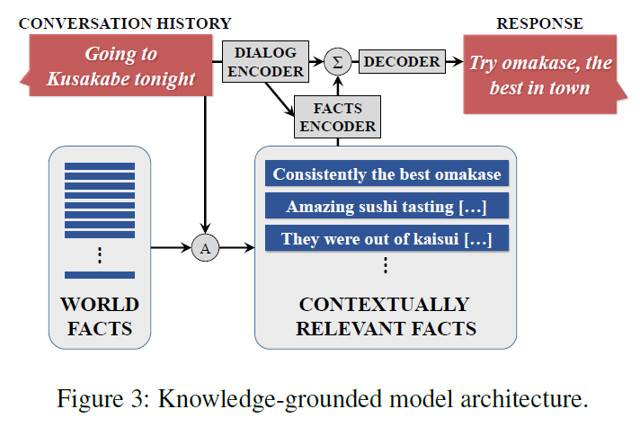
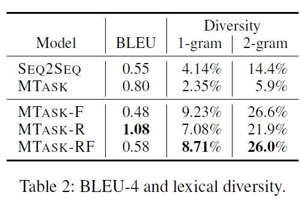
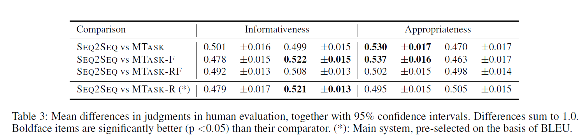

# A Knowledge-Grounded Neural Conversation Model
## Information
- 2018 AAAI
- Ghazvininejad, Marjan, et al.

## Keywords
- Knowledge
- Conversation Model

## Contribution
- Introduce knowledge(facts) to the neural conversation model to produce more contentful resposes.
- Apply multi-task learning to learn the facts encoder and dialog encoder.
- Compare different combinations of multi-task learning.

## Summary
- Use Seq2seq Model to encode dialog and facts and apply them as the features of the decoder and trained with Multi-Task Learning.

- The facts are retrieved with the input sequence by keyword-based IR engine.
- Facts encoder is similar to the Memory Network model.

- Multi-Task Learning:
1. FACTS task: 
 Expose the full model to ({f1, ..., fn,S}, R) training examples
2. NOFACTS task: 
 Expose the model without fact encoder to (S, R) examples.
3. AUTOENCODER task: 
 Similar to the FACTS task, except that we replace the response with each of the facts, i.e., this model is trained on ({f1, ..., fn,S}, fi) examples.

- Models with different combinations of Multi-Task Learning tasks
1. SEQ2SEQ: 
 Trained on task NOFACTS with the 23M general conversation dataset. Since there is only one task, it is not per se a multi-task setting
2. MTASK: 
 Trained on two instances of the NOFACTS task, respectively with the 23M general dataset and 1M grounded dataset (but without the facts). While not an interesting system in itself, we include it to assess the effect of multi-task learning separately from facts
3. MTASK-R: 
 Trained on the NOFACTS task with the 23M dataset, and the FACTS task with the 1M grounded dataset.
4. MTASK-F:
 Trained on the NOFACTS task with the 23M dataset, and the AUTOENCODER task with the 1M dataset.
5. MTASK-RF:
 Blends MTASK-F and MTASK-R, as it incorporates 3 tasks: NOFACTS with the 23M general dataset, FACTS with the 1M grounded dataset, and AUTOENCODER again with the 1M dataset.

## Source Code
- Not found