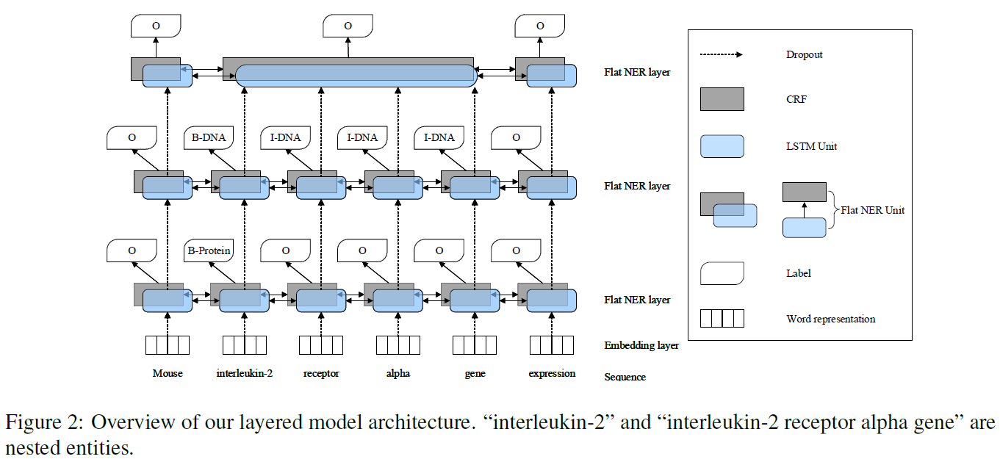
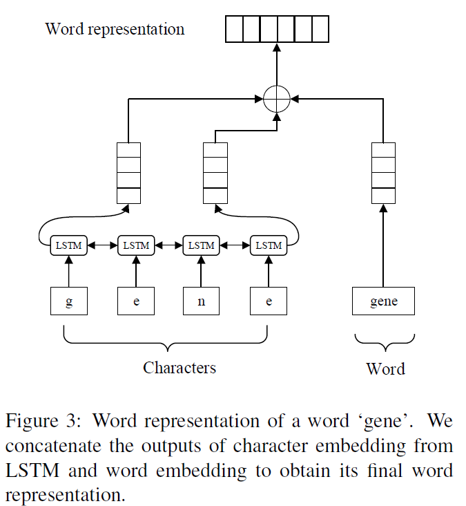
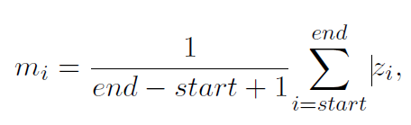
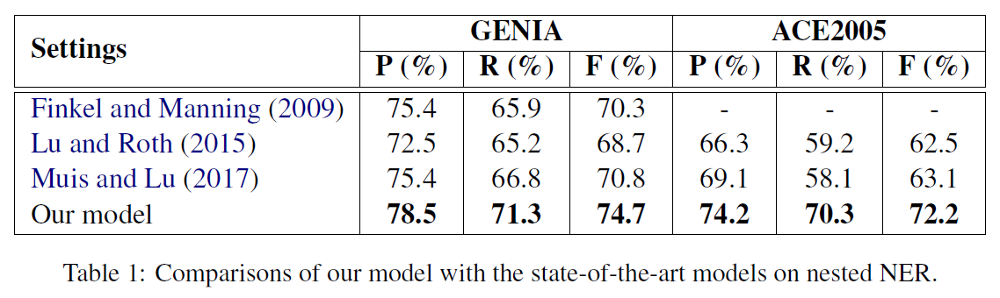

# A Neural Layered Model for Nested Named Entity Recognition
## Information
- 2018 NAACL
- Ju, Meizhi, Makoto Miwa, and Sophia Ananiado

## Keywords
- NER
- Nested NER

## Contribution
- Use the dynamically stacked flat NER model to handle the nested NER problem.

## Summary
- Propose a novel neural model to identify nested entities by dynamically stacking flat NER layers(LSTM+CRF). 
- The model dynamically stacks the flat NER layers until no outer entities are extracted.
	
- Neural Layered Model:
	1. Embedding layer:
		Represent each word by concatenating character sequence embeddings and word embeddings for the first flat NER layer.
		
	2. Flat NER layer:
		Consists of an LSTM layer and a CRF layer. The LSTM layer captures the bidirectional context representation of sequences and subsequently feeds it to the CRF layer to globally decode label sequences.
	3. Stacking flat NER layers:
		- Merge and average current context representation of the regions composed in the detected entities, as described in the following equation:
			
		- Dynamically stacks the flat NER layers until no outer entities are extracted.

- The Results:
	

## Source Code
- [Nested-NER](https://github.com/meizhiju/layered-bilstm-crf)