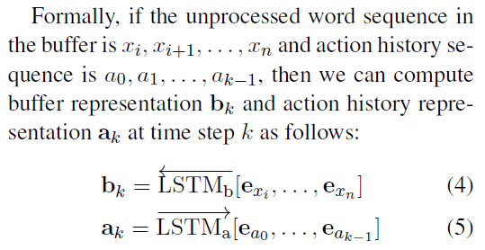

# A Neural Transition-based Model for Nested Mention Recognition
## Information
- 2018 EMNLP
- Wang, Bailin, et al.

## Keywords
- NER
- Nested NER

## Contribution
- This paper introduces a scalable transition-based method to model the nested structure of mentions which is inspired by the recent success of employing transition-based methods for constituent parsing.

## Summary
- The transition-based system learns to construct the forest formed by the outermost mention consisting of its inner mentions through a sequence of shift-reduce actions.

- Neural Transition-based Model:
	- Forest that represent a sentence:
		- 
		- Map a sentence with nested mentions to a designated forest where each mention corresponds to a constituent of the forest.
	- Shift-Reduce based system:
		- Shift reduce based system learns to construct the forest structure in a bottom-up manner through an action sequence whose maximal length is guaranteed to be three times of the sentence length.
		- The system employs a stack to store (partially) processed nested elements.
		- System's state is defined as which denotes stack, buffer front [S, i, A] index and action history respectively.
		- Transition Actions:
			- 
			1. SHIFT:
				- Push the next word from buffer to the stack.
			2. REDUCE-X:
				- Pops the top two items t0 and t1 from the tack and combines them as a new tree element which is then pushed onto the stack.
			3. UNARY-X:
				- Pops the top two items t0 from the stack and constructs a new tree element which is pushed back to the stack.
			- Since the shift-reduce system assumes unary and binary branching, the paper binarizes the trees in each forest in a left-branching manner
			- Action Constraints:
				- To make sure that each action sequence is valid, the paper makes some hard constraints on the action to take.
					- E.g. REDUCE-X action can only be conducted when there are at least two elements in the stack.
		- Example of sequence of transition actions for the sentence:
			- 
		- The distribution of actions:
			- 
			, where pk is the feature vector for the parser state at time step k.

	- Neural Model:
		- Based on Stack-LSTM which is employed to efficiently and effectively represent the states of the system in a continuous space, the system is further incorporated with a character-based component to capture letter level patterns.
		1. Representation of Words:
			- 
			- Character level LSTM:
				- Based on the observation that letter-level patterns such as capitalization and prefix can be beneficial in detecting mentions, the paper incorporates a character level LSTM to capture such morphological information.
				- Using a bidirectional LSTM:
					- 
		2. Representation of Parser States:
			- Vanilla LSTM:
				- The buffer and action history are encoded using two vanilla LSTMs.
				- 
			- Stack-LSTM:
				- Employ Stack-LSTM to represent the system's state, which consists of the states of input, stack and action history, in a continuous space incrementally.
				- 
		- The state of the system pk:
			- Concatenation of the states of buffer, stack and action history:
				- 
		- Training:
			- Employ the greedy strategy to maximize the log-likelihood of the local action classifier in equation(1)
			- 
			, where zik denote the k-th action for the i-th sentence and λ is the l2 coefficient.

- Results:
	- Results on the GENIA dataset:
		- 

## Source Code
- [Neural Transition-based Model](https://github.com/berlino/nest-trans-em18)