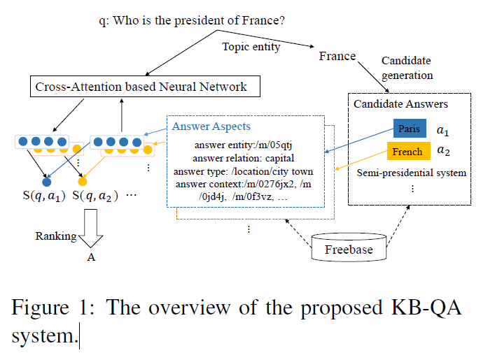
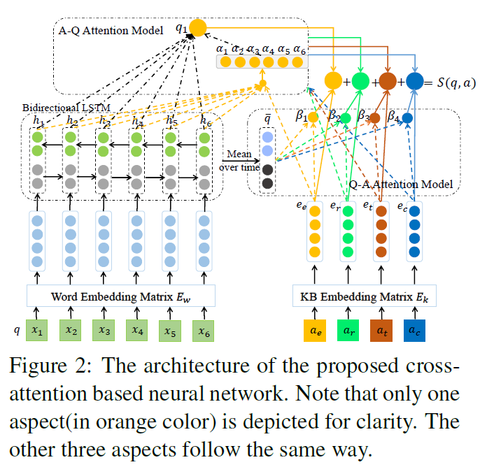
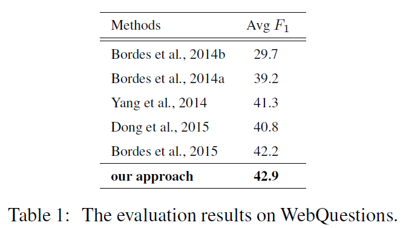

# An End-to-End Model for Question Answering over Knowledge Base with Cross-Attention Combining Global Knowledge
## Information
- 2017 ACL
- Hao, Yanchao, et al.

## Keywords
- Question Answering(QA)
- Question Answering over Knowledge Bases (KBQA)

## Contribution
- Present a novel cross-attention based NN model tailored to KB-QA task.
- Leverage the global KB information(with TransE), representing the answers more precisely.

## Summary
- Present an end-to-end neural network model to represent the questions and their corresponding scores dynamically according to the various candidate answer aspects via cross-attention mechanism.
	
1. Candidate Generation:
	- Use Freebase API to identify the topic entity.
	- Collect all entities that is directly connected or 2-hop connected as candidate answer set.
2. The Neural Cross-Attention Model:
	
	1. For each answer candidate, attention on four aspects of it to get the question-answer embedding and answer-question embedding
		1. answer entity ae ,as embedding ee
		2. answer relation ar ,as embedding er
		3. answer type at ,as embedding et
		4. answer context ac ,as embedding ec:
			- average embedding of contexts from all resources in KB
	2. Obtain answer score using weighted sum of each aspect's question-answer score, which the weight is the q-a attention Beta
	3. Pick the higest score candidate as the final answer
3. Combining Global Knowledge:
	- Enhance the KB embedding matrix with TransE method.
	- Perform KB-QA training and TransE training in turns.

- Results:
	

## Source Code
not found