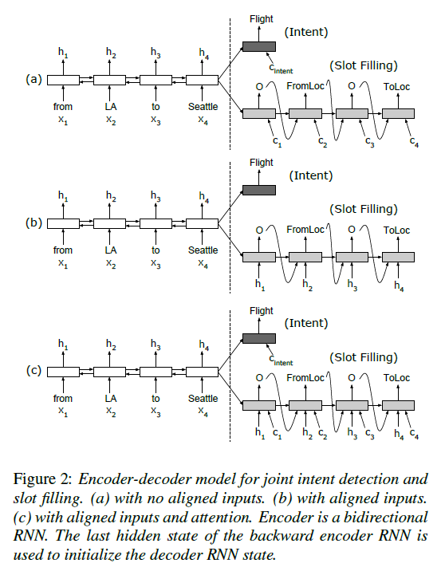
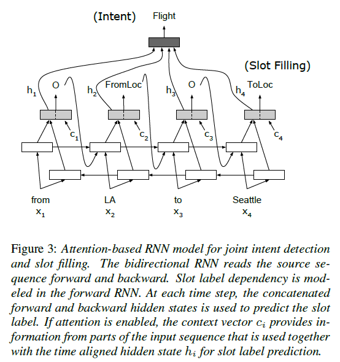
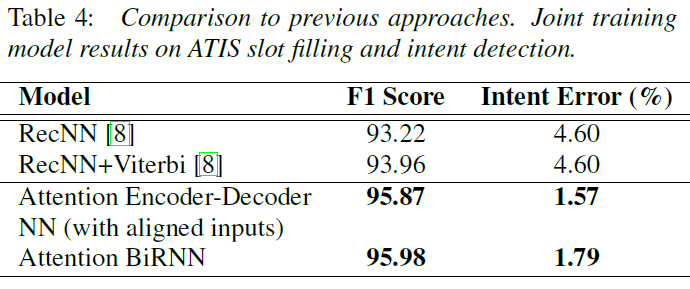

# Attention-Based Recurrent Neural Network Models for Joint Intent Detection and Slot Filling
## Information
- 2016 Interspeech
- Bing Liu and Ian Lane

## Keywords
- NLU
- Intent Detection
- Slot Filling

## Contribution
- Propose two models that jointly learn the intent detection and slot filling to boost each other.

## Summary
- Propose the Encoder-Decoder Model with Aligned Inputs to jointly learn the intent detection and slot filling.
- Jointly Learning:
	1. Encoder-Decoder Model with Aligned Inputs:
		
	2. Attention-Based bi-RNN Model:
		

- Results:
	

## Source Code
- [rnn-nlu](https://github.com/HadoopIt/rnn-nlu)