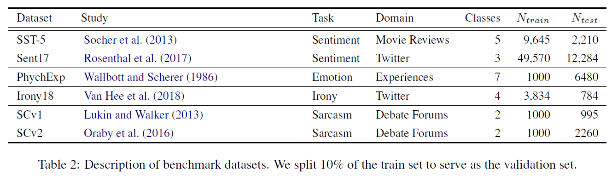

# Attention-based Conditioning Methods for External Knowledge Integration
## Information
- 2019 ACL
- Margatina, Katerina, Christos Baziotis, and Alexandros Potamianos.

## Keywords
- NLU
- Attention

## Contribution
- Propose an alternative way for incorporating external lexicon features into the self-attention mechanism of RNN-based architectures.

## Summary
- Propose a novel way of utilizing word-level prior information encoded in linguistic, sentiment, and emotion lexicons, to improve classification performance.
- Enable the self-attention mechanism of RNN-based architectures to identify the most informative words, by directly conditioning on their additional lexicon features.

- Proposed Model:
	- Network Architecture
		- Word Embedding Layer:
			- Initialize the weights of the embedding layer with pretrained word embeddings.
		- LSTM Layer:
			- Takes as input the words of a sentence and produces the word annotations h1, h2, ..., hT
		- Self-Attention Layer:
			- The attention mechanism assigns a score ai to each word annotation hi .
			- Compute the fixed representation r of the input sequence, as the weighted sum of all the word annotations.
			- 
	- External Knowledge(Lexicon Features)
		- Leverage lexica containing psycho-linguistic, sentiment and emotion annotations.
		- Construct a feature vector c(wi) for every word in the vocabulary by concatenating the word's annotations.
	- Conditional Attention Mechanism
		- Use as input to the self-attention layer both the word annotation hi, as well as the lexicon feature c(wi) of each word.
		- Replace f(hi) in Self-Attention Layer with f(hi, c(wi))
		1. Attentional Concatenation (conc.)
			- 
			- 
		2. Attentional Feature-based Gating (gate)
			- 
			- A gate mechanism with a sigmoid activation function, generates a mask-vector from each c(wi) with values between 0 and 1.
			- 
		3. Attentional Affine Transformation (affine)
			- 
			- Adopted from the work of [Perez et al. (2017)](https://arxiv.org/abs/1709.07871) and applies a feature-wise affine transformation to the latent space of the hidden states.
			- 

- Results:
	- Datasets:
		- 
	- Results:
		- Baselines:
			- baseline:
				- An LSTM-based architecture augmented with a selfattention mechanism with no external knowledge.
			- emb. conc.
				- Incorporates lexicon information by concatenating the c(wi) vector to the word representations in the embedding layer.
		- 

## Source Code
- [affective-attention](https://github.com/mourga/affective-attention)