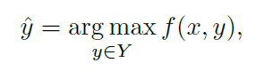
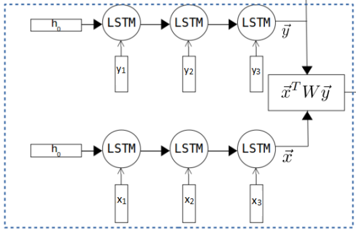
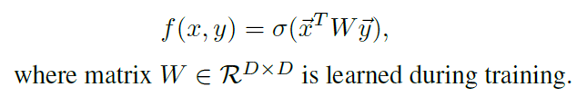
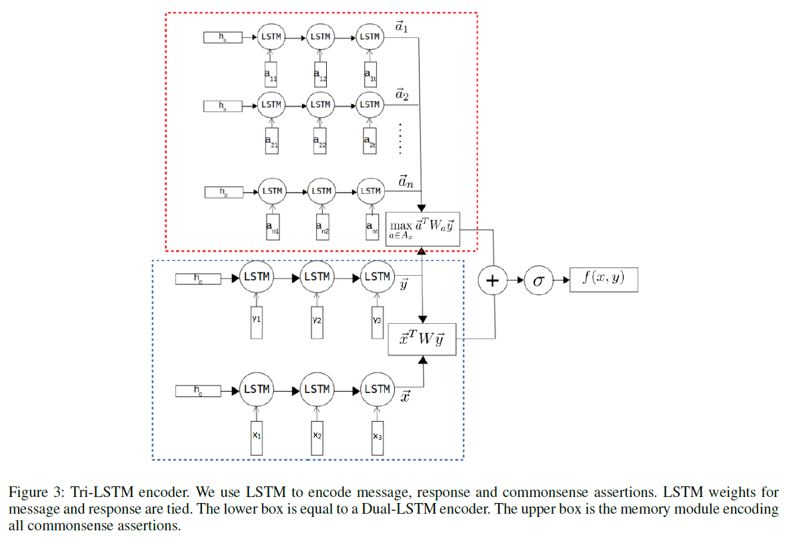
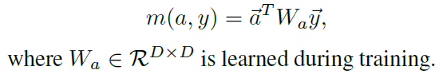
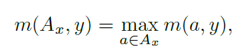
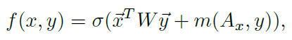
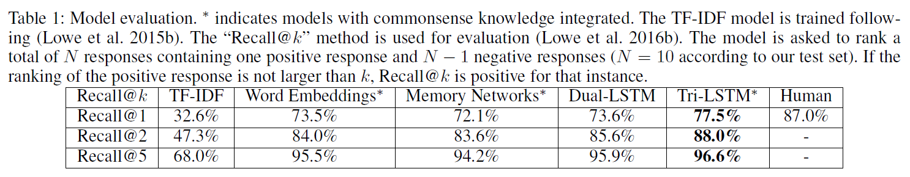

# Augmenting End-to-End Dialogue Systems with Commonsense Knowledge
## Information
- 2018 AAAI
- Young, Tom, et al.

## Keywords
- Knowledge
- Conversation Model

## Contribution
- 

## Summary
- This paper investigates the impact of providing commonsense knowledge about the concepts covered in the dialogue. 
- Mainly concentrate on integrating commonsense knowledge into retrieval-based conversational models, which choose the most appropriate response from a set of response candidates.
	
- The model is trained on **<message, response, label>** triples with cross entropy loss, where label is binary indicating whether the  <message, response> pair from real data or is randomly combined. 

1. Dual-LSTM Encoder:
	
	1. Represents the message x and response y as fixed size embeddings with the last hidden states of the same LSTM.
	2. The compatibility function of the Dual-LSTM Encoder is thus defined by:
		
2. Tri-LSTM Encoder:
	
	1. Commonsense Knowledge Retrieval:
		- Assume that a commonsense knowledge base is composed of assertions A about concepts C. Each assertion a in A takes the form of a triple <c1, r, c2>.
		- Use simple n-gram matching to retrive the assertions according to the message x.
	2. Tri-LSTM Encoder:
		- Using another LSTM for encoding all assertions a in A. Where concept(if is multi-word phrases) in a is chunked into words, and feed into the LSTM.
		- match score of assertion a and response y as:
			
		- However, usually very few assertions in Ax are related to a particular response y, we define the match score of Ax and y as:
			
		only consider the commonsense assertion a with the highest match score with y.
		- The compatibility function of the Tri-LSTM Encoder:
			
- The Results:
	

## Source Code
not found