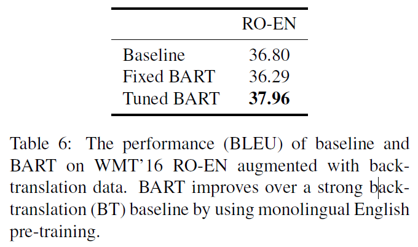

# BART: Denoising Sequence-to-Sequence Pre-training for Natural Language Generation, Translation, and Comprehension (BART)
## Information
- 2019 arXiv
- Lewis, Mike, et al.

## Keywords
- NLU
- NLG
- Pre-train

## Contribution
- Present BART, a denoising autoencoder for pretraining sequence-to-sequence models.

## Summary
- Present BART, which pre-trains a model combining Bidirectional and Auto-Regressive Transformers.
- BART is a denoising autoencoder built with a sequence-to-sequence model that is applicable to a very wide range of end tasks.
- BART is trained by:
	1. corrupting text with an arbitrary noising function
	2. learning a model to reconstruct the original text

- BART Model:
	- BART is a denoising autoencoder that maps a corrupted document to the original document it was derived from.
	- 
	- Architecture:
		- BART uses the standard sequence-to-sequence Transformer architecture, except, following GPT, that modify ReLU activation functions to GeLUs.
		- The architecture is closely related to that used in BERT, with the following differences:
			1. Each layer of the decoder additionally performs cross-attention over the final hidden layer of the encoder (as in the transformer sequence-to-sequence model).
			2. BERT uses an additional feed-forward network before word prediction, which BART does not.
		- In total, BART contains roughly 10% more parameters than the equivalently sized BERT model.
	- Pre-training BART:
		- BART is trained by corrupting documents and then optimizing a reconstruction loss - the cross-entropy between the decoder's output and the original document.
		- BART allows to apply any type of document corruption. The transformations we used are summarized below:
			- 
			1. Token Masking
				- Following BERT, random tokens are sampled and replaced with [MASK] elements.
			2. Token Deletion
				- Random tokens are deleted from the input.
			3. Text Infilling
				- A number of text spans are sampled, with span lengths drawn from a Poisson distribution (λ=3). Each span is replaced with a single [MASK] token.
				- Text infilling teaches the model to predict how many tokens are missing from a span.
			4. Sentence Permutation
				- A document is divided into sentences based on full stops, and these sentences are shuffled in a random order.
			5. Document Rotation
				- A token is chosen uniformly at random, and the document is rotated so that it begins with that token.
	- Fine-tuning BART:
		- 
		1. Sequence Classification Tasks
			- For sequence classification tasks, the same input is fed into the encoder and decoder, and the final hidden state of the final decoder token is fed into new multi-class linear classifier.
		2. Token Classification Tasks
			- For token classification tasks, such as answer endpoint classification for SQuAD, we feed the complete document into the encoder and decoder, and use the top hidden state of the decoder as a representation for each word. This representation is used to classify the token.
		3. Sequence Generation Tasks
			- Because BART has an autoregressive decoder, it can be directly fine tuned for sequence generation tasks such as abstractive question answering and summarization.
		4. Machine Translation
			- Replace BART's encoder embedding layer with a new randomly initialized encoder.
			- The model is trained end-to-end, which trains the new encoder to map foreign words into an input that BART can de-noise to English.
			- Train the source encoder in two steps, in both cases backpropagating the cross-entropy loss from the output of the BART model.
				1. Freeze most of BART parameters and only update the randomly initialized source encoder, the BART positional embeddings, and the self-attention input projection matrix of BART’s encoder first layer.
				2. Train all model parameters for a small number of iterations.

- Experiments:
	- Main Results:
		- 
		- Several observations:
			- Performance of pre-training methods varies significantly across tasks.
			- Token masking is crucial.
			- Left-to-right pre-training improves generation.
			- Bidirectional encoders are crucial for SQuAD.
			- The pre-training objective is not the only important factor.
			- Pure language models perform best on ELI5.
			- BART achieves the most consistently strong performance.
	- Large-scale Pre-training Experiments:
		- 
	- Experiments on summarization datasets:
		- 
	- Experiments on Generation Tasks:
		- 
	- Experiments on question answering tasks:
		- 
	- Experiments on Translation Tasks:
		- 

## Source Code
- not found