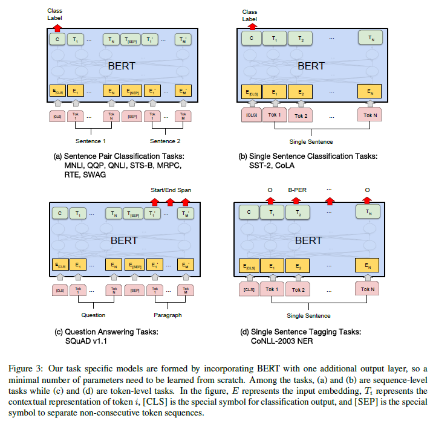

# BERT: Pre-training of Deep Bidirectional Transformers for Language Understanding
## Information
- 2018 arXiv
- Jacob Devlin, Ming-Wei Chang, Kenton Lee, and Kristina Toutanova

## Keywords
- Language Representation
- Fine-tunning

## Contribution
- Demonstrate the importance of bidirectional pre-training for language representations.
- BERT is the first fine-tuning based representation model that achieves state-of-the-art performance on a large suite of sentence-level and token-level tasks.

## Summary
- BERT : **B**idirectional **E**ncoder **R**epresentations from **T**ransformers
- BERT is designed to pre-train deep bidirectional representations by jointly conditioning on both left and right context in all layers
	

- Input Representation:
	- The input embeddings is the sum of the token embeddings, the segmentation embeddings and the position embeddings.
		
	-  Only use the sentence A embeddings for single-sentence inputs.
- Pre-training Tasks
	- Use pre-training tasks method (Masked LM and Next Sentence Prediction) and the Transformer to train the BERT.
	1. Masked Language Model(MLM):
		- The MLM randomly masks some of the tokens from the input, and the objective is to predict the original vocabulary id of the masked word based only on its context.
		- MLM improve the tradition LSTM one-direction(left-to-right or right-left) training problem.
	2. Next Sentence Prediction:
		- In order to let model understands sentence relationships.
		- When choosing the sentences A and B for each pretraining example:
			1. Positive label : 50% of the time, B is the actual next sentence that follows A
			2. Negative label : 50% of the time, it is a random sentence from the corpus
- Task specific models:
	- Incorporating BERT with one additional output layer
		

- Results:
	

## Source Code
- [BERT](https://github.com/google-research/bert)