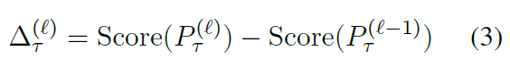

# BERT Rediscovers the Classical NLP Pipeline
## Information
- 2019 ACL
- Tenney, Ian, Dipanjan Das, and Ellie Pavlick.

## Keywords
- NLU
- Pre-train
- BERT
- Explainable
- Probing

## Contribution
- Present an analysis that spans the common components of a traditional NLP pipeline.
- Qualitatively analyze how individual sentences are processed by the BERT network, layer-by-layer.

## Summary
- Find that the model represents the steps of the traditional NLP pipeline in an interpretable and localizable way, and that the regions responsible for each step appear in the expected sequence.

- Edge Probing:
	- Base on [Tenney et al.(2019)](https://arxiv.org/abs/1905.06316)
	- Aims to measure how well information about linguistic structure can be extracted from a pre-trained encoder(BERT).
	- Use eight labeling tasks from the edge probing suite:
		- part-of-speech (POS)
		- constituents (Consts.)
		- dependencies (Deps.)
		- entities
		- semantic role labeling (SRL)
		- coreference (Coref.)
		- semantic proto-roles (SPR)
		- relation classification (SemEval)
	- Freeze the encoder weights to prevents the encoder from rearranging its internal representations to better suit the probing task.
	- **Scalar Mixing Weights**
		- 
		- Tell us which layers, in combination, are most relevant when a probing classifier has access to the whole BERT model.
		- Learned solely from the training data. They tell us which layers the probing model finds most useful.
		- Interpret higher weights as evidence that the corresponding layer contains more information related to that particular task.
		- Center-of-Gravity:
			- 
			- Reflects the average layer attended to for each task; intuitively, we can interpret a higher value to mean that the information needed for that task is captured by higher layers.
	- **Cumulative Scoring**
		- Tells us how much higher we can score on a probing task with the introduction of each layer.
		- Derived entirely from an evaluation set, and tell us how many layers are needed for a correct prediction.
		- Train a series of classifier {Pτ(l)}l which use scalar mixing to attend to current layer as well as all previous layers.
		- Differential Score:
			- Measures how much better we do on the probing task if we observe one additional encoder layer.
			- 
		- Expected Layer:
			- Compute a (pseudo) expectation over the differential scores as a summary statistic.
			- 
			- This can be thought of as, approximately, the expected layer at which an example can be correctly labeled, assuming that example could not be resolved by the non-contextual baseline Pτ(0).

- Results:
	- It appears that basic syntactic information appears earlier in the network, while high-level semantic information appears at higher layers.
	- We observe that in general, syntactic information is more localizable, with weights related to syntactic tasks tending to be more "spiky".
	- Information related to semantic tasks is generally spread across the entire network.
	- Summary statistics on BERT-large:
		- 
	- Layer-wise metrics on BERT-large:
		- 

## Source Code
- [Edge Probing Code](https://github.com/jsalt18-sentence-repl/jiant)