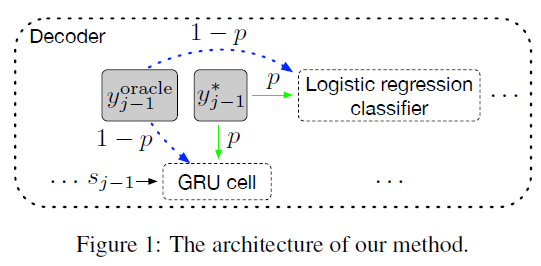
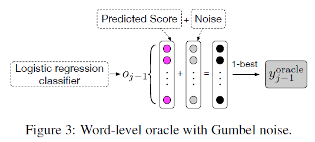
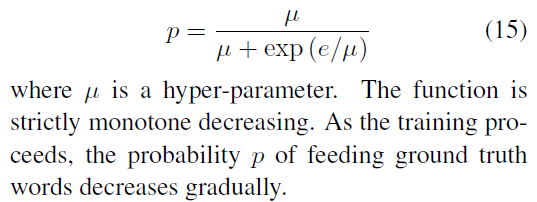
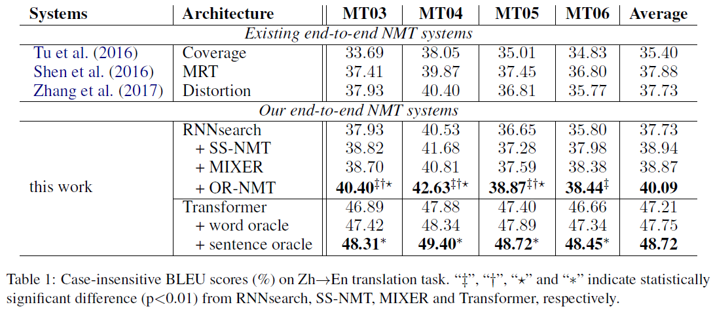
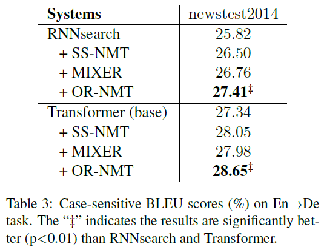
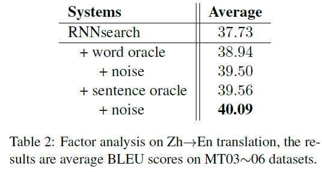

# Bridging the Gap between Training and Inference for Neural Machine Translation
## Information
- 2019 ACL
- Zhang, Wen, et al.

## Keywords
- NMT
- Exposure Bias
- Overcorrection Phenomenon

## Contribution
- Solve the **Exposure Bias problem** and **Overcorrection Phenomenon problem** by sampling context words not only from the ground truth sequence but also from the predicted sequence by the model during training.
- Demonstrate that the approach can achieve significant improvements on multiple datasets.

## Summary
- Address Exposure Bias and Overcorrection Phenomenon issues by sampling context words not only from the ground truth sequence but also from the predicted sequence by the model during training, where the predicted sequence is selected with a sentence-level optimum.

- Problems of NMT Task:
	1. Exposure Bias:
		- At training time, NMT model predicts with the ground truth words as context while at inference it has to generate the entire sequence from scratch.
		- This discrepancy of the fed context leads to error accumulation among the way.
	2. Overcorrection Phenomenon:
		- Word-level training requires strict matching between the generated sequence and the ground truth sequence which leads to overcorrection over different but reasonable translations.
		- A sentence usually has multiple reasonable translations and it cannot be said that the model makes a mistake even if it generates a word different from the ground truth word.

- Oracle Word Selection Approach:
	- 
	- The method is to **feed as context** either the ground truth words or the previous predicted words, i.e. oracle words, with a certain probability.
	- Steps:
		1. Select an oracle word at the {j-1}-th step.
		2. Sample from the ground truth word with a probability of p or from the oracle word with a probability of 1-p.
		3. Use the sampled word as the input context, then perform the following prediction of the attention-based NMT.
	- Choices of Oracle Word Selection:
		1. Word-Level Oracle(WO):
			- 
			- Select the oracle words at the word level with a greedy search algorithm.
			- In practice, we can acquire more robust word-level oracles by introducing the Gumbel-Max technique which provides a simple and efficient way to sample from a categorical distribution.
				- The Gumbel noise is treated as a form of regularization.
				- The Gumbel noise is just used to select the oracle and it does not affect the loss function for training.
		2. Sentence-Level Oracle(SO):
			- Optimize the oracle by enlarging the search space with beam search and then reranking the candidate translations with a sentencelevel metric, e.g. BLEU.
			- Steps:
				- Perform beam search for all sentences in each batch, assuming beam size is k, and get k-best candidate translations.
				- In the process of beam search, we also could apply the Gumbel noise for each word generation.
				- Use the translation with the highest BLEU score as the oracle sentence.
			- Force Decoding Mechanism:
				- Force the two sequences(ground truth word and the sentence-level oracle word) to have the same number of words.
				- Mechanism:
					1. At j-th step, if j < the length of the ground truth sequence, and EOS is the top first word to be choose.
						- Select the top second word as the j-th word of this candidate translation.
					2. At j-th step, if j == the length of the ground truth sequence, and EOS is not the top first word to be choose.
						- Select EOS as the j-th word of this candidate translation.
	- Sampling with Decay Mechanism:
		- Reasons to use the Sampling with Decay Mechanism
			- At the beginning of training, as the model is not well trained, using oracle word too often would lead to very slow convergence, even being trapped into local optimum.
			- At the end of training, if the context is still selected from the ground truth word at a large probability, the model is not fully exposed to the circumstance which it has to confront at inference and hence can not know how to act in the situation at inference.
		- In this sense, the probability p of selecting from the ground truth word can not be fixed, but has to decrease progressively as the training advances.
			- At the beginning, p=1, which means the model is trained entirely based on the ground truth words. As the model converges gradually, the model selects from the oracle words more often.
			- Define p with a decay function dependent on the index of training epochs e (starting from 0)
			- 

- Experiments:
	- Case-insensitive BLEU scores on Zh->En translation task:
		- 
	- Case-insensitive BLEU scores on En->Zh translation task:
		- 
	- Ablation study:
		- 

## Source Code
- not found
