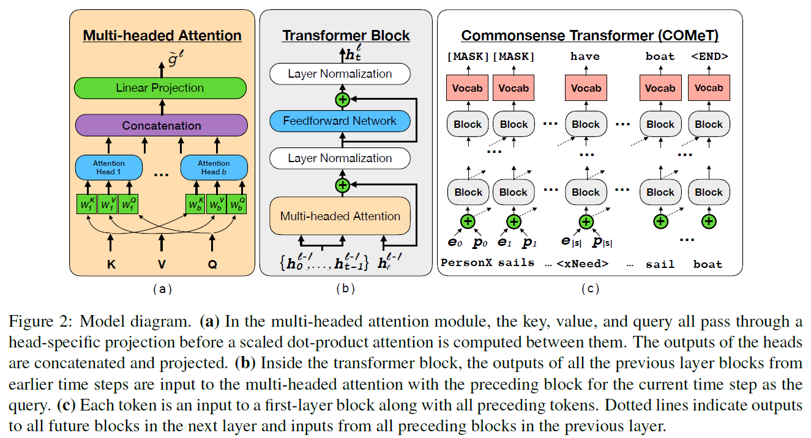
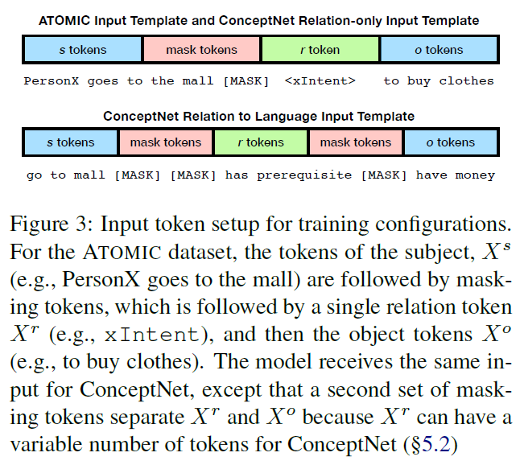
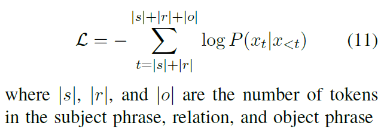
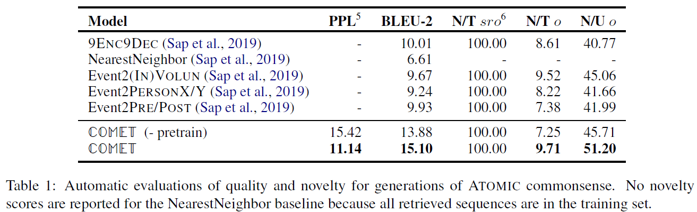
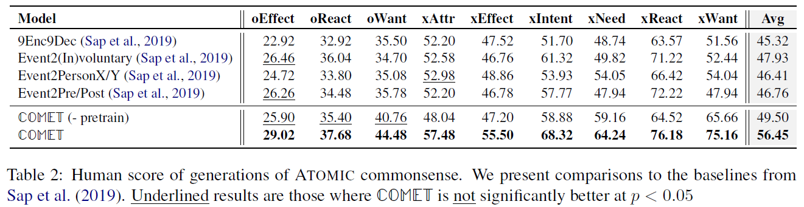
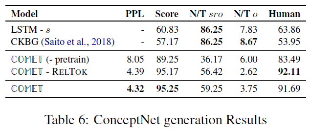

# COMET: Commonsense Transformers for Automatic Knowledge Graph Construction
## Information
- 2019 ACL
- Bosselut, Antoine, et al.

## Keywords
- Knowledge Graph Construction
- Knowledge
- Transformer

## Contribution
- Develop a generative approach to knowledge base construction.
- Develop a framework for using large-scale transformer language models(GPT) to learn to produce commonsense knowledge tuples.

## Summary
- Propose **COM**mons**E**nse **T**ransformers(COMET) that learn to generate rich and diverse commonsense descriptions in natural language.
- COMET constructs commonsense KBs by using existing tuples as a seed set of knowledge on which to train. Using this seed set, a pre-trained language model learns to adapt its learned representations to knowledge generation, and produces novel tuples that are high quality.

- Model Structure with Transformer
	- 
	- Transformer Block
	- Multi-headed Attention
	- Input Encoder:
		- As the input of the model, present a knowledge tuple {s, r, o} as a concatenated sequence of the words of each item of the tuple: **X** = {Xs, Xr, Xo}
		- For any input word xt in **X**, the encoding ht0 of the input is the sum of its word embedding et, with a position embedding pt encoding its absolute position in the sequence X: ht0 = et + pt

- Traing Task:
	- Task Definition:
		- COMET is trained to learn to produce the phrase object o of a knowledge tuple given the tuple's phrase subject s and relation r.
		- More specifically, given the concatenation of the tokens of s and r : [Xs, Xr] as input, the model must learn to generate the tokens of o: Xo.
	- Input token setup for training configurations:
		- 
	- Loss Function:
		- COMET is trained to maximize the conditional log-likelihood of predicting the phrase object tokens, Xo:
			- 

- Experiments:
	- ATOMIC Experiment Results:
		- Automatic evaluations
			- 
		- Human score
			- 
	- ConceptNet Experiment Results:
		- 

## Source Code
- [comet-commonsense](https://github.com/atcbosselut/comet-commonsense)

## Demo Link
- [COMeT](https://mosaickg.apps.allenai.org/)
