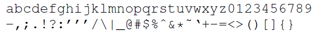
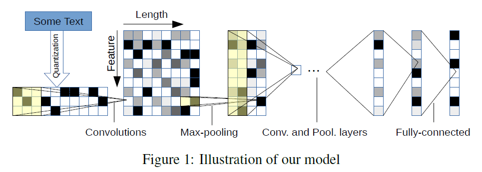
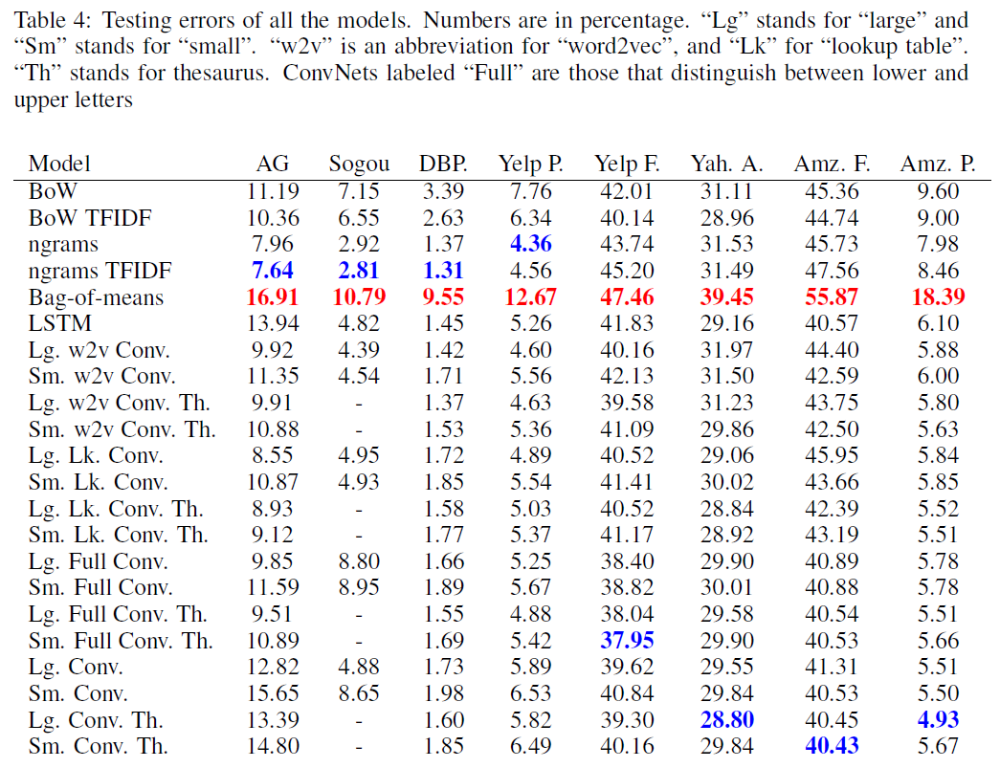

# Character-level Convolutional Networks for Text Classification
## Information
- 2015 NIPS
- Zhang, Xiang, Junbo Zhao, and Yann LeCun.

## Keywords
- CNN
- char-CNN
- Text Classification

## Contribution
- Consider character level input text representation for Text Classification task

## Summary
1. Transform the input text into one-hot encode with the 70 kinds of character for each dimension

2. Apply the encode from step1 to a CNN

- Some Tricks:
	1. Data Augmentation with synonyms replacement
	2. Encode the input text with backward order to make it easy for fully connected layers to associate weights with the latest reading

## Source Code
- [Unofficial source](https://github.com/mhjabreel/CharCNN)