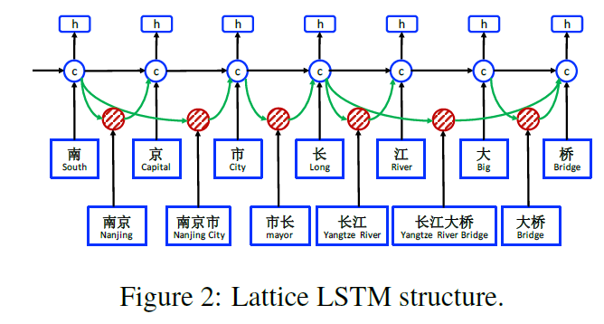

# Chinese NER Using Lattice LSTM
## Information
- 2018 ACL
- Zhang, Yue, and Jie Yang.

## Keywords
- NER
- Chinese

## Contribution
- Investigate a lattice-structured LSTM model for Chinese NER, which encodes a sequence of input characters as well as all potential words that match a lexicon.
- Annotate the chinese NER dataset : resume NER dataset.

## Summary
- Use character-based LSTM-CRF as the main network structure, and integrate latent word information.

- Drawback of previous NER models:
	- Character-based:
		- Explicit word and word sequence information is not fully exploited, which can be potentially useful.
	- Word-based:
		- Suffer from the potential issue of error propagation, i.e. incorrectly segmented entity boundaries lead to NER errors.

- The proposed Lattice LSTM model has the advantage of leveraging explicit word information over character sequence labeling without suffering from segmentation error.

- Models:
	- Character-Based Model
		- 
		- Uses an LSTM-CRF model on the character sequence c1, c2, ..., cm
			- 
		- Apply bidirectional LSTM with two distinct sets of parameters and concatenate the two direction results as the hidden vector representation.
		- Different Settings:
			1. Char + bichar:
				- Augment the character-based model with bigram information by concatenating bigram embeddings with character embeddings.
				- 
				, where eb denotes a charater bigram lookup table.
			2. Char + softword:
				- Augment the character representation with segmentation information by concatenating segmentation label embeddings to character embeddings.
				- 
				, where es represents a segmentation label embedding lookup table. seg(cj) denotes the segmentation label on the character cj given by a word segmentor.
	- Word-Based Model
		- 
		- The word embedding ew(wi) is the representation of each word wi.
			- 
		- Different Settings:
			- Both character CNN and LSTM have been used for representing the character sequence within a word.
			- Denoting the representation of characters within wi as xci, a new word representation is obtained by concatenation:
				- 
			1. Word + char LSTM
				- Use a bi-directional LSTM to learn hidden states for characters in the word wi.
				- 
			2. Word + char LSTM'
				- Uses a single LSTM to obtain two direction of hidden representation for each cj.
			3. Word + char CNN
				- A standard CNN structure is used on the character sequence of each word to obtain its character representation xci.
				- 
	- Lattice Model
		- 
		- Detailed Information of Lattice Model:
			- 
		- The Lattice Model can be viewed as an extension of the character-based model, integrating word-based cells and additional gates for controlling information flow.
		- The input to the model is a character sequence c1, c2, ..., cm, together with all character subsequences that match words in a lexicon D.
			- Use automatically segmented large raw text for building D.
		- Different from the character-based model, however, the computation of ccj now considers lexicon subsequences in the sentence.
		- Use an addition gate for each subsequence cell to controll all possible lexicon subsequences' contribution.

- Experiments:
	- Segmentation Settings:
		- For OntoNotes, gold segmentation is available for the training, development and test sections.
		- For MSRA datasets, gold-standard segmentation is only available in the training sections.
			- Train the segmentor ([Yang et al. 2017a](https://aclweb.org/anthology/P17-1078)) using gold segmentation on its respective training sets.
		- For Weibo/resume datasets, no gold segmentation is available.
			- Take the best model of ([Yang et al. 2017a](https://aclweb.org/anthology/P17-1078)) off the shelf.
	- Results on OntoNotes dataset:
		- 
	- Results on MSRA dataset:
		- 
	- Results on Weibo NER dataset:
		- 
	- Results on resume NER dataset:
		- 

## Source Code
- [LatticeLSTM](https://github.com/jiesutd/LatticeLSTM)
