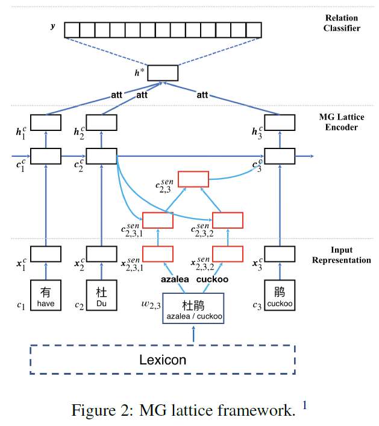
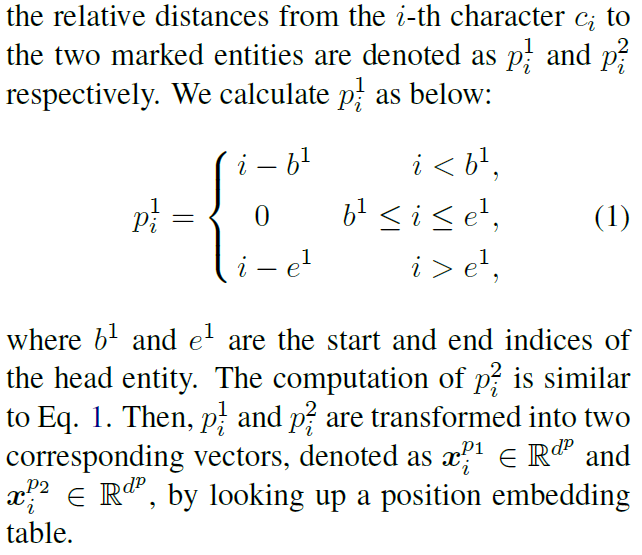
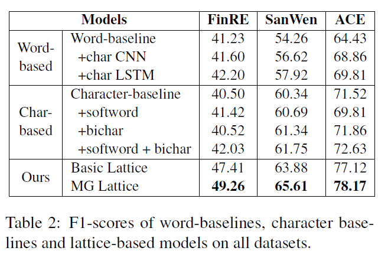
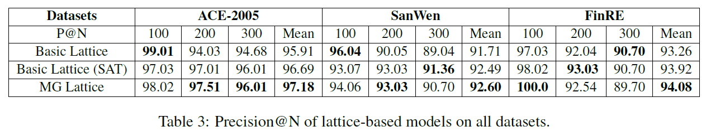
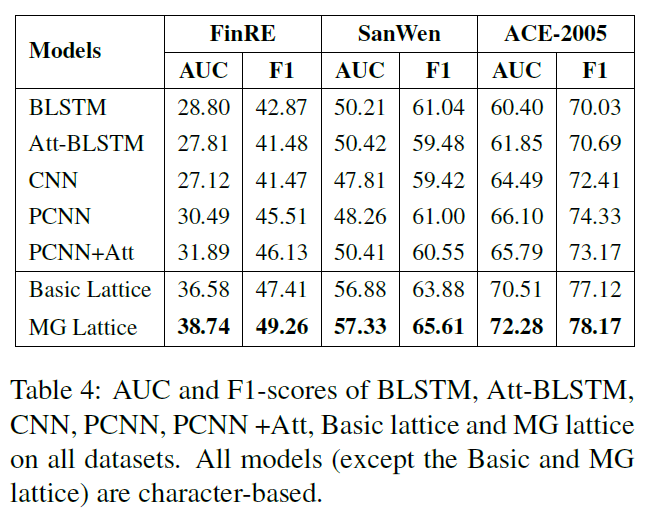

# Chinese Relation Extraction with Multi-Grained Information and External Linguistic Knowledge (MG Lattice)
## Information
- 2019 ACL
- Li, Ziran, et al.

## Keywords
- Relation Extraction
- Chinese
- Knowledge

## Contribution
- Propose a multi-grained lattice frame work (MG lattice) for Chinese relation extraction to take advantage of multi-grained language information and external linguistic knowledge.
- Incorporate word-level information into character sequence inputs so that segmentation errors can be avoided.
- Model multiple senses of polysemous words with the help of external linguistic knowledge, so as to alleviate polysemy ambiguity.

## Summary
- Proposed the multi-granularity lattice framework (MG lattice), a unified model comprehensively utilizes both internal information and external knowledge, to conduct the Chinese RE task.
	- The model uses a lattice-based structure to dynamically integrate word-level features into the character-based method.
	- To alleviate the issue of polysemy ambiguity, the model utilizes HowNet to automatically select the senses of words during the training stage and consequently the model can fully exploit the semantic information in data for better RE performance.

- Methodology:
	- 
	1. Input Representation
		- Given a Chinese sentence with two target entities as input, this part represents each word and character in the sentence.
		1. Character-level Representation
			- Map each character ci to a vector of dc dimensions via Skip-gram model.
			- Leverage position embeddings to specify entity pairs, which are defined as the relative distances from the current character to head and tail entities.
				- 
			- The input representation for character is concatenated by character embedding and the two position embeddings.
		2. Word-level Representation
			- Extract potential words that are any character subsequence that matches a word in a lexicon D built over segmented large raw text.
			- Use the word2vec to convert the potential word into a real-valued vector.
			- Incorporate HowNet as an external knowledge base into the model to represent word senses rather than words.
				- First obtain all K senses of it by retrieving the HowNet.
				- Convert each sense into a real-valued vector through the SAT model [(Niu et al., 2017)](https://www.aclweb.org/anthology/papers/P/P17/P17-1187/) which can jointly learn word and sense representations on the basis of the Skip-gram.
	2. Encoder
		- The direct input of the encoder is a character sequence, together with all potential words in lexicon D.
		- After training, the output of the encoder is the hidden state vectors h of an input sentence.
		1. Basic Lattice LSTM Encoder
			- Explicitly leverages character and word information, but could not fully consider the ambiguity of Chinese.
		2. MG Lattice LSTM Encoder
			- To address the ambiguity of Chinese shortcoming, improve the model by adding sense-level paths as external knowledge to the model.

	3. Relation Classifier
		- After the hidden state of an instance h is learnt, first adopt a character-level attention mechanism to merge h into a sentence-level feature vector, denoted as h\*.
		- Then, the final sentence representation h\* is fed into a softmax classifier to compute the confidence of each relation.

- Experiments:
	- F1-scores Results
		- 
	- Precision@N Results
		- 
	- AUC and F1-scores Results
		- 

## Source Code
- [Chinese-NRE](https://github.com/thunlp/Chinese_NRE)
