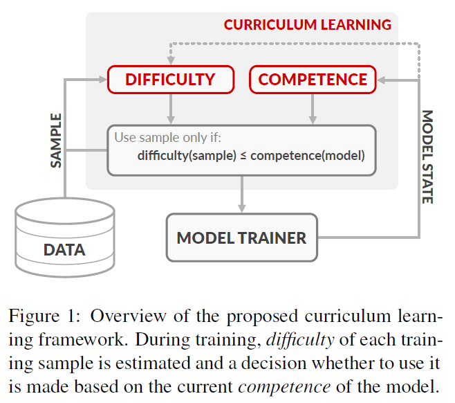
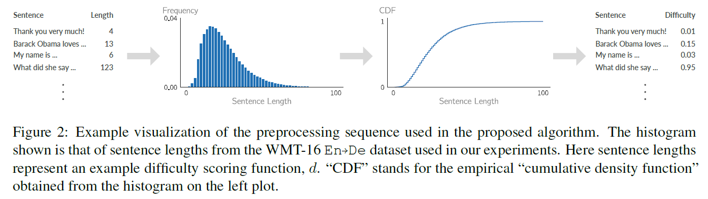
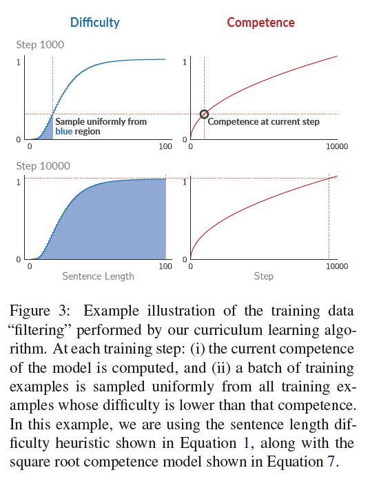
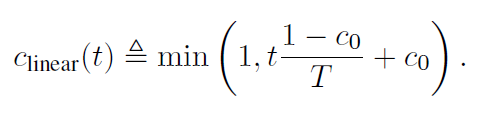
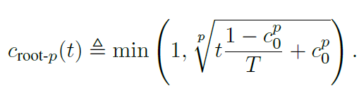
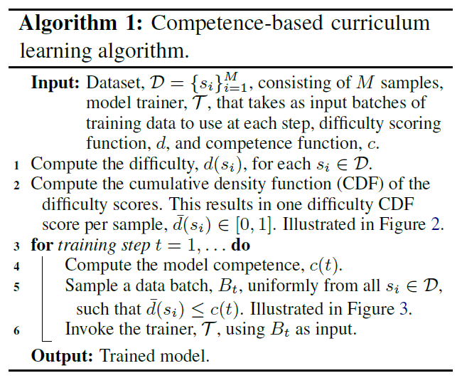
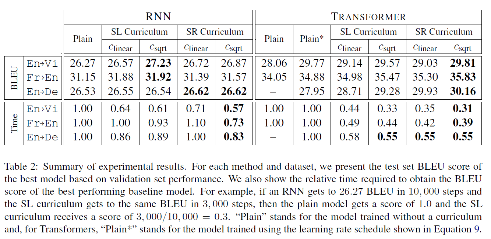

# Competence-based Curriculum Learning for Neural Machine Translation
## Information
- 2019 NAACL
- Platanios, Emmanouil Antonios, et al.

## Keywords
- Machine Translation
- Curriculum Learning

## Contribution
- Propose a curriculum learning framework for NMT that reduces training time, reduce the need for specialized heuristics or large batch sizes, and results in overall better performance.

## Summary
- Propose competence-based curriculum learning, a training framework based on the idea that training algorithms can perform better if training data is presented in a way that picks examples appropriate for the model's current competence.
	

- Central Concepts of the Framework:
	
	
	- The training examples are ranked according to their difficulty and the learner is only allowed to use the top c(t) portion of them at time t.
	1. Difficulty:
		- A value that represents the difficult of a training sample and that may depend on the current state of the learner.
		1. Sentence Length:
			Longer sentences are intuitively harder to translate due to the propagation of errors made early on when generating the target language sentence.
		2. Word Rarity: 
			Another aspect of language that can affect the difficulty of translation is the frequency with which words appear.
	2. Competence:
		- A value between 0 and 1 that represents the progress of a learner during its training.
		- Define the competence, c(t) at time t (measured in terms of training steps), of a learner as the proportion of training data it is allowed to use at that time.
		1. Linear:
			- 
			,where T denotes the time after which the learner is fully competent.
		2. Root:
			- 

- Competence-based curriculum learning algorithm:
	

- Results:
	

## Source Code
- not found