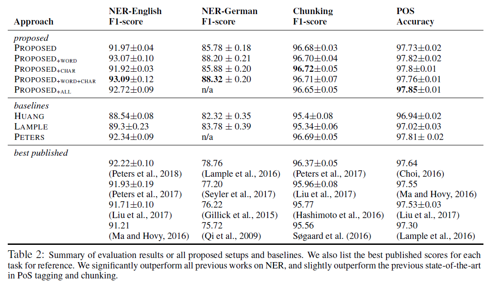

# Contextual String Embeddings for Sequence Labeling
## Information
- 2018 COLING
- Akbik, Alan, Duncan Blythe, and Roland Vollgraf.

## Keywords
- NER

## Contribution
- Proposes contextual string embeddings, a novel type of word embeddings based on character-level language modeling, and their use in a state-of-the-art sequence labeling architecture.

## Summary
- Propose to leverage the internal states of a trained character language model to produce a novel type of word embedding which we refer to as contextual string embeddings.
- The contextual string embeddings are contextualized by their surrounding text, meaning that the same word will have different embeddings depending on its contextual use.

- Contextual string embeddings:
	- 
	- Use characters as atomic units of language modeling, allowing text to be treated as a sequence of characters passed to an LSTM which at each point in the sequence is trained to predict the next character.
	- Embeddings:
		1. Extract the output hidden state after the last character in the word from the fLM
			- The hidden state encodes semantic-syntactic information of the sentence up to this point, including the word itself
		2. Extract the output hidden state before the word's first character from the bLM
			- To capture semantic syntactic information from the end of the sentence to this character.
	- Combine the best attributes of the mentioned embeddings:
		1. Attributes from **Classical word embeddings**:
			- The ability to pre-train on large unlabeled corpora.
		2. Attributes from **Character-level features**:
			- Model words and context fundamentally as sequences of characters, to both better handle rare and misspelled words as well as model subword structures such as prefixes and endings.
		3. Attributes from **Contextualized word embeddings**:
			- Capture word meaning in context and therefore produce different embeddings for polysemous words depending on their usage.

- Sequence Labeling Model Architecture:
	- 
	- Embeddings:
		1. The output hidden state after the last character in the word from the fLM
		2. The output hidden state before the word's first character from the bLM
		3. Classic word embeddings(GloVe)
			- Add potentially greater latent word-level semantics to the proposed embeddings
		4. Task-trained character features
			- To determine whether these features complement or subsume the proposed embeddings
	- The final word embeddings are passed into a BiLSTM-CRF sequence labeling module as proposed by [Huang et al. (2015)](https://arxiv.org/abs/1508.01991) to address downstream sequence labeling tasks.

- Results:
	- Results:
		- 
	- Ablation experiment:
		- 

## Source Code
- [flair](https://github.com/zalandoresearch/flair)