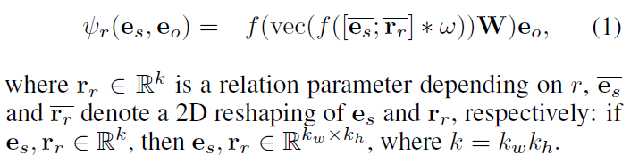
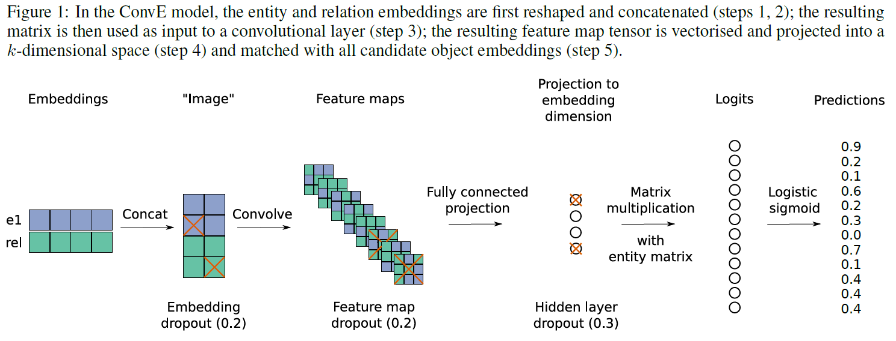
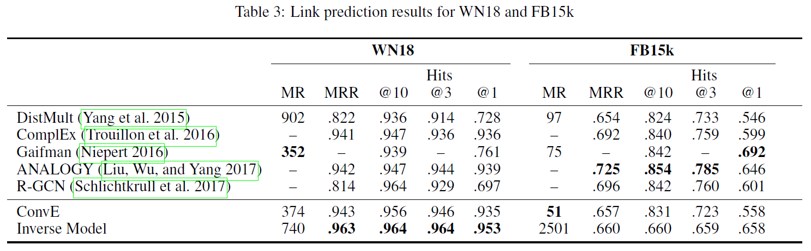
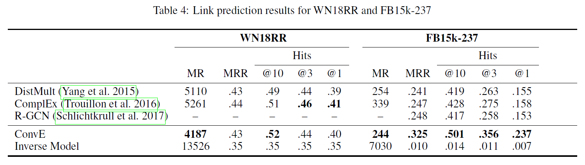
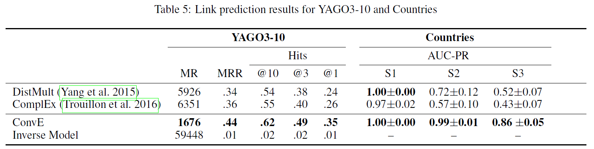

# Convolutional 2D Knowledge Graph Embeddings(ConvE)
## Information
- 2018 AAAI
- Dettmers, Tim, et al.

## Keywords
- Knowledge Graph
- Knowledge Representation
- Link Prediction

## Contribution
- Propose ConvE, a multi-layer convolutional network model for link prediction.
- Investigate the severity that the WN18 and FB15k datasets suffer from test set leakage, due to inverse relations from the training set being present in the test set(First observed by [Toutanova and Chen (2015)](https://www.aclweb.org/anthology/W15-4007)).

## Summary
- ConvE, a model that uses 2D convolutions over embeddings to predict missing links in knowledge graphs.
- ConvE is the simplest multi-layer convolutional architecture for link prediction: it is defined by 
	1. A single convolution layer
	2. A projection layer to the embedding dimension
	3. An inner product layer
- The Scoring Function:
	
- The architecture:
	
	1. Look up subject entity embedding and relation embedding
	2. Reshape both embedding to 2D, and concat them
	3. Apply convolution to the cancat embedding
	4. Use fully-connected layer to project as embedding
	5. Multiply with object entity embedding to get the final score
		- 1-N Scoring:
			Take one (s,r) and score it against all entities.
- Results:
	- Link Prediction Result:
		
	- Link Prediction Result on Remove Reverse Dataset:
		
	- Link Prediction Results for YAGO3-10 and Countries
		

## Source Code
- [ConvE](https://github.com/TimDettmers/ConvE)