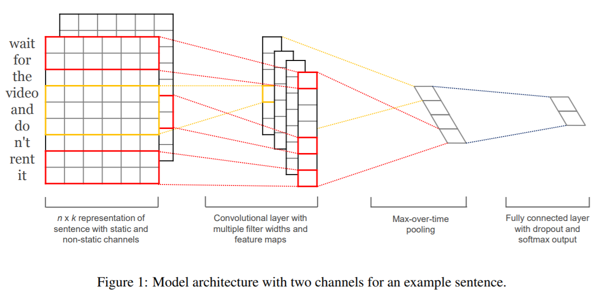
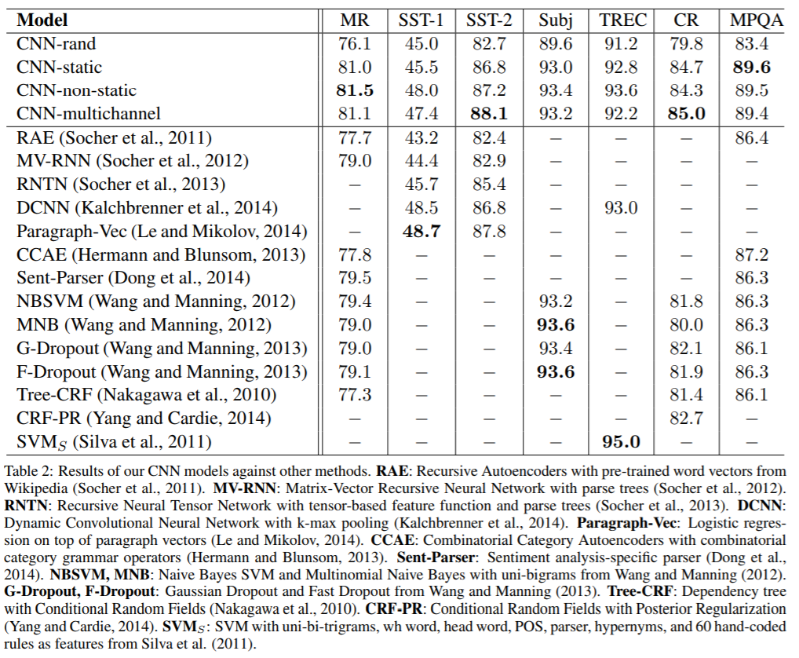

# Convolutional Neural Networks for Sentence Classification
## Information
- 2014 EMNLP
- Kim, Yoon.

## Keywords
- CNN
- Text Classification

## Contribution
- Apply CNN on NLP tasks
- Improve upon the state of the art on 4 out of 7 tasks, including sentiment analysis and question classification

## Summary
1. Use CNN to extract the features from the embeddings of the sentence

2. CNN model design
	- CNN-rand : embedding randomly initialized and modify while training
	- CNN-static : embedding initialize with google pre-train and stay static throuth training
	- CNN-non-static : embedding initialize with google pre-train but fine tune through training
	- CNN-multichannel: combine CNN-static and CNN-non-static, see them as multi-channel as RGB channel in image

## Source Code
- [CNN for Sentence Classification](https://github.com/yoonkim/CNN_sentence)