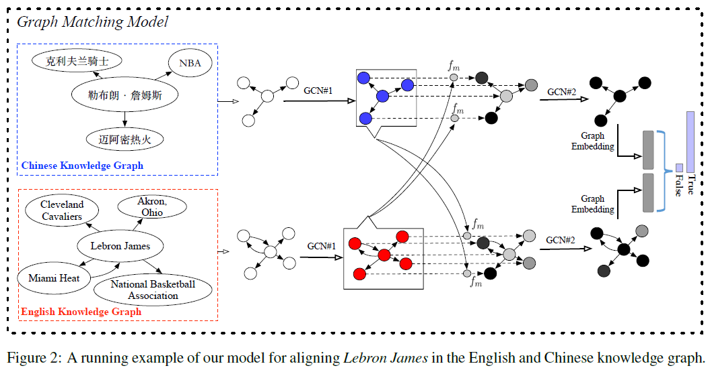
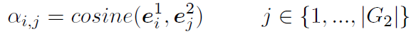
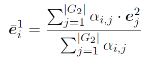
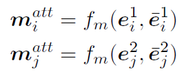
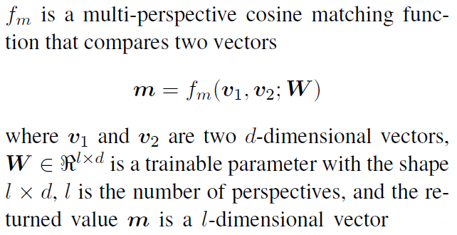
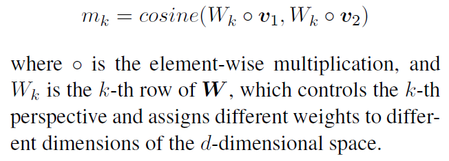
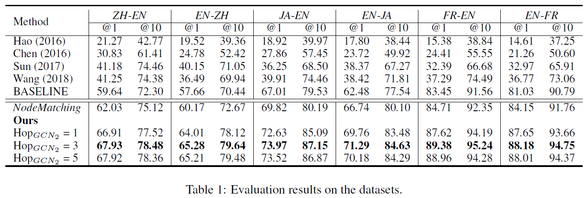

# Cross-lingual Knowledge Graph Alignment via Graph Matching Neural Network
## Information
- 2019 ACL
- Xu, Kun, et al.

## Keywords
- Knowledge Graph
- Knowledge Alignment
- Graph Convolutional Neural Network(GCN)

## Contribution
- Introduce the topic entity graph, a local sub-graph of an entity, to represent entities with their contextual information in KG.
- Propose a graph-attention based solution, which first matches all entities in two topic entity graphs, and then jointly model the local matching information to derive a graph level matching vector.

## Summary
- Propose a topic entity graph to represent the KG context information of an entity.
- Formulate the cross-lingual KG alignment as a graph matching problem between the topic entity graphs.
- Propose a novel graph matching method to estimate the similarity of two graphs.
- Graph Matching Model:
	- 
	- Topic Entity Graph
		- Represent relations among the given entity (called topic entity) and its neighbors in the knowledge base.
		- Steps to build the Topic Entity Graph:
			1. Get entities
				- Collect 1-hop neighbor entities of the topic entity, resulting in a set of entities, {e1, ..., en}, which are the nodes of the graph.
			2. Connect entities
				- For each entity pair (ei, ej), we add one directed edge between their corresponding nodes in the topic graph if they are directly connected through a relation, say r, in the KG.
				- Do not label this edge with r that ei and ej hold in KG, but just retain r's direction.
					- Find this strategy significantly improves both the efficiency and performance.
	- Graph Matching Model
		- To estimate the probability that G1 and G2 are describing the same entity, where G1 and G2 are the topic entity graphs in two KGs.
		- Model Structure(Layers)
			1. Input Representation Layer
				- Goal of this layer is to learn embeddings for entities that occurred in topic entity graphs by using a GCN(GCN#1 in Figure2).
				- Steps that generate embedding of entity v with GCN algorithm:
					1. Employ a word-based LSTM to transform v's entity name to its initial feature vector **a**v.
					2. Categorize the neighbors of v into incoming eighbors N|-(v) and outgoing neighbors N-|(v) according to the edge direction.
					3. Leverage an aggregator to aggregate the incoming representations of v's incoming neighbors into a single vector, hkN|-(v), where k is the iteration index.
						- This aggregator feeds each neighbor's vector to a fully-connected neural network and applies an element-wise mean-pooling operation to capture different aspects of the neighbor set.
					4. Concatenate v's current incoming representation with the newly generated neighborhood vector and feed the concatenated vector into a fully-connected layer to update the incoming representation of v for the next iteration.
					5. Update the outgoing representation of v using the similar procedure as introduced in previous 2 steps except that operating on the outgoing representations.
					6. Repeat steps the previous three steps by K times and treat the concatenation of final incoming and outgoing representations as the final representation of v.
			2. Node-Level (Local) Matching Layer
				- Compare each entity embedding of one topic entity graph against all entity embeddings of the other graph in both ways (from G1 to G2 and from G2 to G1)
				- Attentive-matching method:
					1. Calculate the cosine similarities of entity e1i in G1 with all entities {e2j} in G2 in their representation space.
						- 
					2. Take these similarities as the weights to calculate an attentive vector for the entire graph G2 by weighted summing all the entity embeddings of G2.
						- 
					3. Calculate matching vectors for all entities in both G1 and G2 by using a multi-perspective cosine matching function fm at each matching step.
						- 
						- 
						, where m = [m1, ..., mk, ..., ml]. 
						- Each element mk is a matching value from the k-th perspective, and it is calculated by the cosine similarity between two weighted vectors.
							- 
			3. Graph-Level (Global) Matching Layer
				- Intuitively, the above matching vectors capture how each entity in G1 (G2) can be matched by the topic graph in the other language. However, they are local matching states and are not sufficient to measure the global graph similarity.
				- Apply another GCN (GCN#2 in Figure2) to propagate the local matching information throughout the graph.
				- Intuitively, if each node is represented as its own matching state, by design a GCN over the graph (with a sufficient number of hops) is able to encode the global matching state between the pairs of whole graphs.
				- Feed these matching representations to a fully-connected neural network and apply the element-wise max and mean pooling method to generate a fixed-length graph matching representation.
			4. Prediction Layer
				- Use a two-layer feedforward neural network to consume the fixed-length graph matching representation and apply the softmax function in the output layer.
		- Training and Inference:
			- To train the model, we randomly construct 20 negative examples for each positive example (e1i, e2j) using a heuristic method.
				- Generate rough entity embeddings for G1 and G2 by summing over the pretrained embeddings of words within each entity's surface form.
				- Select 10 closest entities to e1i (or e2j) in the rough embedding space to construct negative pairs with e2j (or e1i)
			- During testing, given an entity in G1, we rank all entities in G2 by the descending order of matching probabilities that estimated by the model.
- Results:
	- Results on DBP15K datasets:
		- 

## Source Code
- [Crosslingula-KG-Matching](https://github.com/syxu828/Crosslingula-KG-Matching)