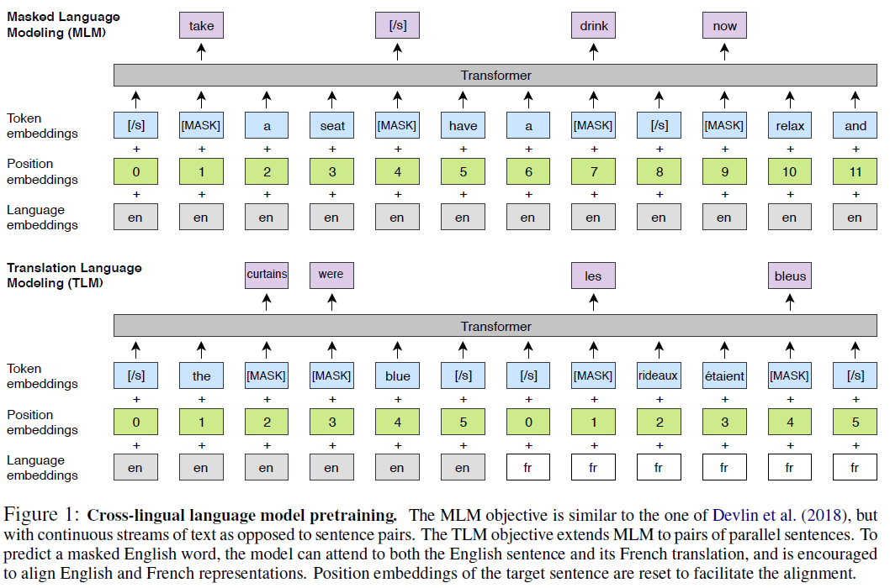
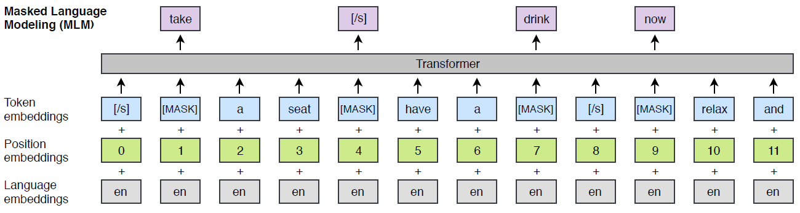
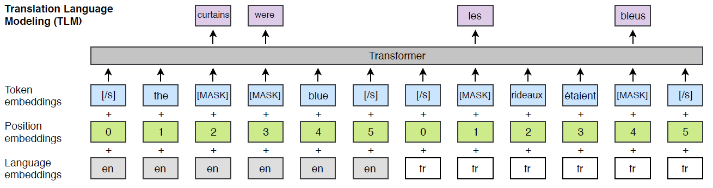
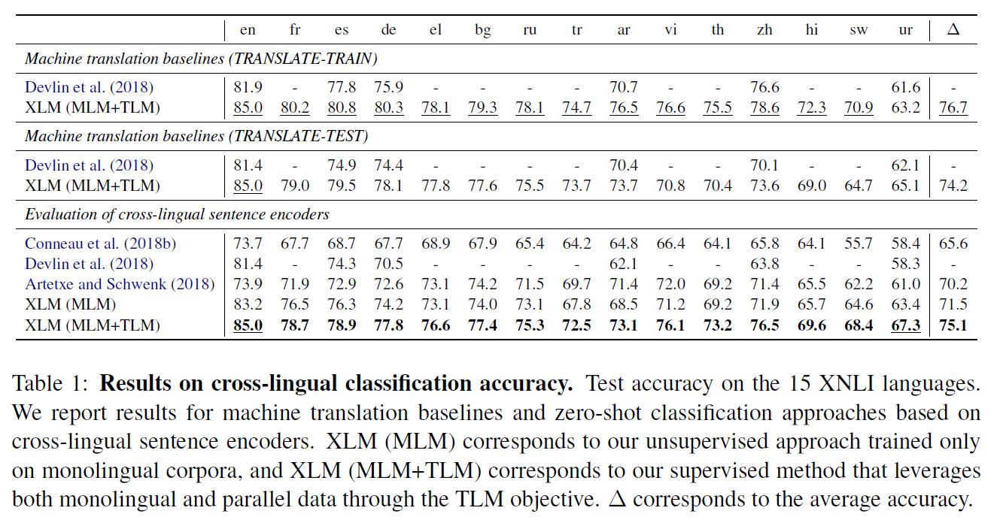

# Cross-lingual Language Model Pretraining
## Information
- 2019 arXiv
- Guillaume Lample and Alexis Conneau

## Keywords
- Language Model(LM)

## Contribution
- Introduce a new unsupervised method for learning cross-lingual representations using cross-lingual language modeling and investigate two monolingual pretraining objectives
- Introduce a new supervised learning objective that improves cross-lingual pretraining when parallel data is available.

## Summary
- Process the language data with Byte Pair Encoding (BPE) and propose 2 methods to learn cross-lingual language models (XLMs).

1. MLM(Masked Language Modeling):
	MLM is an unsupervised method that derives from the idea of BERT.
	
2. TLM(Translation Language Modeling): 
	TLM is an supervised method which uses parallel data and the masked method in BERT to train model.
	

- Results:
	

## Source Code
- [XLM](https://github.com/facebookresearch/XLM)