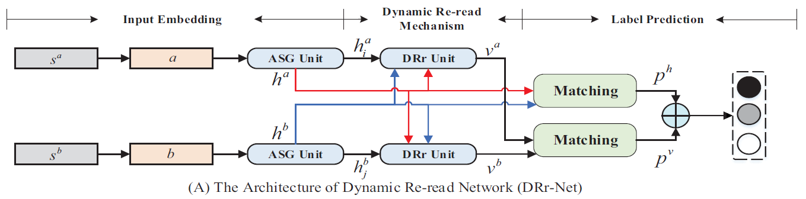
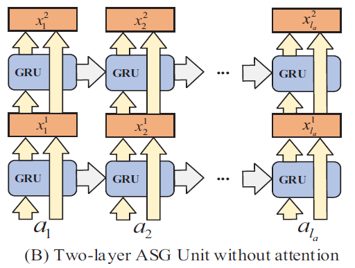
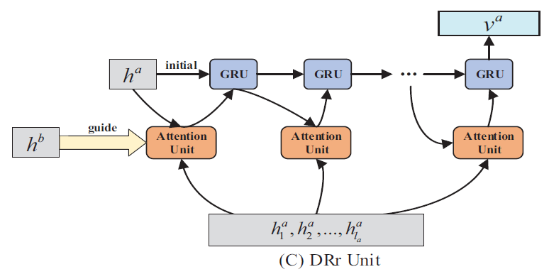
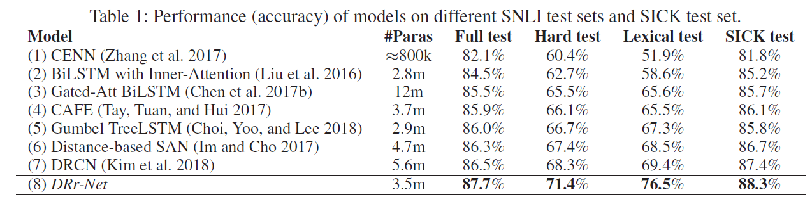
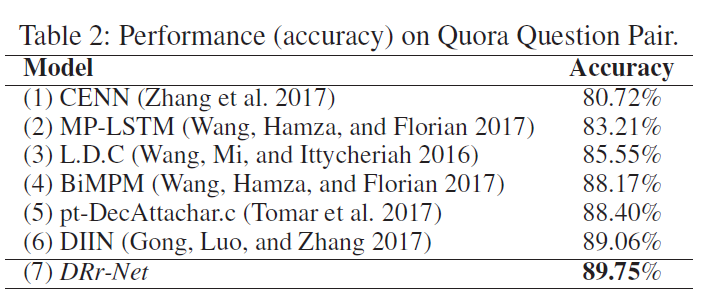
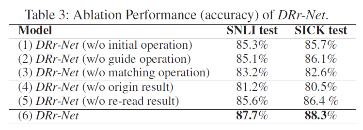

# DRr-Net: Dynamic Re-read Network for Sentence Semantic Matching
## Information
- 2019 AAAI
- Zhang, Kun, et al.

## Keywords
- NLU
- Attention Mechanism

## Contribution
- Propose a novel Dynamic Re-read Network (DRr-Net) approach for better sentence semantic matching.

## Summary
- Propose a Dynamic Re-read Network (DRr-Net) approach for sentence semantic matching, which is able to pay close attention to a small region of sentences at each step and re-read the important words for better sentence semantic understanding.
	

- Architecture of DRr-Net
	1. Input Embedding:
		- Encoding each word in the sentence with sufficient features and encoding sentence semantic in a comprehensive way.
		1. Word embedding:
			- Concatenation of pre-trained word embedding + character features + syntactical features
		2. Attention Stack-GRU (ASG) unit:
			
	2. Dynamic Re-read Mechanism:
		- Focusing on one important word at each step and repeatedly reading the important words with the consideration of learned information regardless of the words sequence
			
	3. Label Prediction:
		- Utilizing original representations and dynamic representations to predict the sentence semantic classification results robustly.

- Results:
	- Results on SNLI test sets and SICK test set
		
	- Results on Quora Question Pair
		
	- Ablation Performance of DRr-Net
		

## Source Code
not found