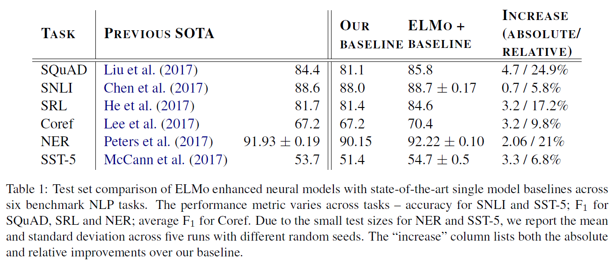

# Deep contextualized word representations (ELMo)
## Information
- 2018 NAACL
- Peters, Matthew E., et al.

## Keywords
- Language Representation

## Contribution
- Combine the internal network states of BiLM as the word representations, not just as the previous work that only use the output layer of BiLM.

## Summary
- ELMo (Embeddings from Language Models)
- ELMo representations are deep, in the sense that they are a function of all of the internal layers of the biLM.
- ELMo on supervised NLP task
	Simply run the biLM and record all of the layer representations for each word. Then, let the end task model learn a linear combination of these representations.
- Results:
	

## Source Code
- [ELMo](https://github.com/allenai/bilm-tf)