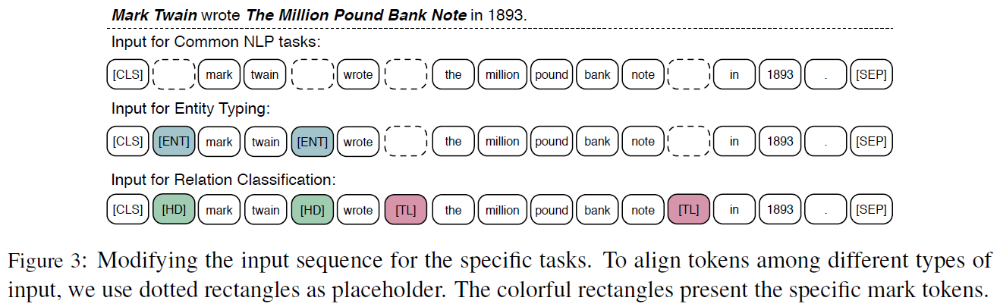

# ERNIE: Enhanced Language Representation with Informative Entities
## Information
- 2019 ACL
- Zhang, Zhengyan, et al.

## Keywords
- Language Representation
- Fine-tunning
- Knowledge Graph
- Knowledge Representation

## Contribution
- Utilize both large-scale textual corpora and KGs to train an enhanced language representation model (ERNIE), which can take full advantage of lexical, syntactic, and knowledge information simultaneously.

## Summary
- Challenges for incorporating external knowledge into language representation models:
	1. Structured Knowledge Encoding:
		- How to effectively extract and encode its related informative facts in KGs for language representation models is an important problem.
	2. Heterogeneous Information Fusion:
		- How to design a special pre-training objective to fuse the lexical, syntactic, and knowledge information is another challenge.

- Overview of **E**nhanced Language **R**epresentatio**N** with **I**nformative **E**ntities(ERNIE):
	- Pretrains a language representation model on both large-scale textual corpora and knowledge graphs.
	- The Steps of Whole Process:
		1. Recognize named entity mentions in text and then align these mentions to their corresponding entities in KGs.
		2. Encode the graph structure of KGs with knowledge embedding algorithms like TransE.
		3. Based on the alignments between text and KGs, ERNIE integrates entity representations in the knowledge module into the underlying layers of the semantic module.
		4. Similar to BERT, this paper adopt the masked language model and the next sentence prediction as the pre-training objectives.
		5. For the better fusion of textual and knowledge features, design a new pre-training objective:
			- Randomly masking some of the named entity alignments in the input text and asking the model to select appropriate entities from KGs to complete the alignments.
			- These objectives require models to aggregate both context and knowledge facts for predicting both tokens and entities, and lead to a knowledgeable language representation model.
			- Refer to this procedure as a **denoising entity auto-encoder**(**dEA**).
			- Considering that the size of entities is quite large for the softmax layer, we thus only require the system to predict entities based on the given entity sequence instead of all entities in KGs.
			- Define the aligned entity distribution for the token wi as follows,
				- 
				- This equation will be used to compute the cross-entropy loss function for dEA.
			- Considering that there are some errors in tokenentity alignments, we perform the following operations for dEA:
				1. 5% of the time: 
					- For a given token-entity alignment, replace the entity with another random entity.
					- Aims to train the model to correct the errors that the token is aligned with a wrong entity.
				2. 15% of the time:
					- Mask token-entity alignments.
					- Aims to train the model to correct the errors that entity alignment system doesn't extract all existing alignments.
				3. The rest of the time:
					- Keep token-entity alignments unchanged.
					- Aims to encourage the model to integrate the entity information into token representations for better language understanding.

- Model Architecture:
	- 
	1. Textual encoder (T-Encoder):
		- Responsible to capture basic lexical and syntactic information from the input tokens.
	2. Knowledgeable encoder (K-Encoder):
		- Responsible to integrate extra token-oriented knowledge information into textual information from the underlying layer,so that the model can represent heterogeneous information of tokens and entities into a united feature space.
		- The Steps of K-Encoder:
			1. Firstly fed token embeddings and entity embeddings into two multi-head self attentions.
				- 
			2. The i-th aggregator adopts an information fusion layer for the mutual integration of the token and entity sequence, and computes the output embedding for each token and entity.
				- The information fusion process is as follows:
					- 
				, where **h**j is the inner hidden state integrating the information of both the token and the entity. σ(.) is the non-linear activation function, which usually is the GELU function.
				- For the tokens without corresponding entities, the information fusion layer computes the output embeddings without integration:
					- 
	- The Steps of Whole Model:
		1. The textual encoder firstly sums the token embedding, segment embedding, positional embedding for each token to compute its input embedding, and then computes lexical and syntactic features as follows:
			- 
			, where T-Encoder(.) is a multi-layer bidirectional Transformer encoder identical to its implementation in BERT.
		2. Mapping the entity tokens to the embeddings which are pre-trained by the effective knowledge embedding model TransE.
		3. Both token embeddings and entity embeddings are fed into K-Encoder for fusing heterogeneous information and computing final output embeddings.
			- 

- Fine-tuning for Specific Tasks:
	- 
	1. Various common NLP asks:
		- Adopt the fine-tuning procedure similar to BERT.
	2. Relation classification:
		- Modifies the input token sequence by adding two mark tokens([HD] and [TL] for head entities and tail entities respectively) to highlight entity mentions.
		- These extra mark tokens play a similar role like position embeddings in the conventional relation classification models.
	3. Entity typing:
		- Modified input sequence with the mention mark token [ENT].
		- Guide ERNIE to combine both context information and entity mention information attentively.

- Results:
	- Results of Entity Typing:
		- FIGER Dataset:
			- 
		- Open Entity Dataset:
			- 
	- Results of Relation Classification:
		- 
	- Ablation Study:
		- 

## Source Code
- [ERNIE](https://github.com/thunlp/ERNIE)