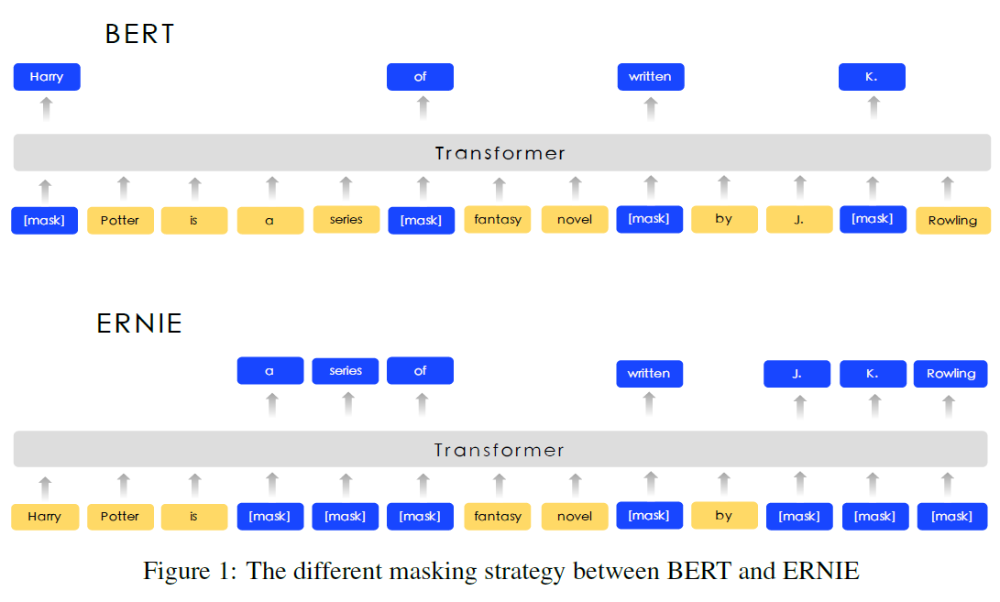
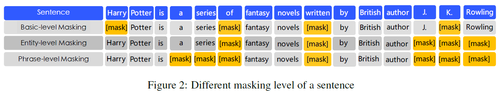
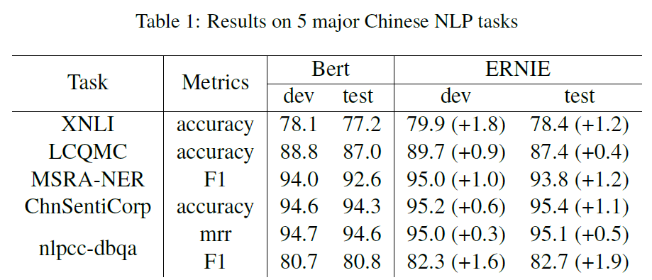
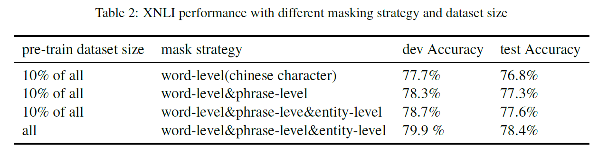

# ERNIE: Enhanced Representation through Knowledge Integration (ERNIE 1.0)
## Information
- 2019 arXiv
- Sun, Yu, et al.

## Keywords
- NLU
- Pre-train
- BERT

## Contribution
- Introduce a new learning processing of language model which masking the units such as phrases and entities in order to implicitly learn both syntactic and semantic information from these units.
- Significantly outperforms the previous state-of-the art methods on various Chinese natural language processing tasks.

## Summary
- Propose a model called ERNIE(Enhanced Representation through kNowledge IntEgration) by using knowledge masking strategies.
	- 
- By using knowledge masking strategies, the prior knowledge of phrases and entities are implicitly learned during the training procedure, instead of adding the knowledge embedding directly.

- Model Details(Knowledge Integration)
	- 
	- Instead of adding the knowledge embedding directly, ERNIE proposed a multi-stage knowledge masking strategy to integrate phrase and entity level knowledge into the Language representation.
	1. Basic-Level Masking:
		- The first learning stage: treat a sentence as a sequence of basic Language unit, and randomly mask 15 percents of basic language units, and using other basic units in the sentence as inputs, and train a transformer to predict the mask units.
		- High level semantic knowledge is hard to be fully modeled.
	2. Phrase-Level Masking:
		- The second stage: randomly select a few phrases in the sentence, mask and predict all the basic units in the same phrase.
		- Phrase information is encoded into the word embedding.
	3. Entity-Level Masking:
		- The third stage: first analyze the named entities in a sentence, and then mask and predict all slots in the entities.
		- Entity information is encoded into the word embedding.

- Experiments:
	- Results on Chinese NLP tasks:
		- 
	- XNLI performance with different masking strategy and dataset size:
		- 

## Source Code
- [ERNIE 1.0](https://github.com/PaddlePaddle/ERNIE/blob/develop/README.zh.md#ernie-10-enhanced-representation-through-knowledge-integration)
