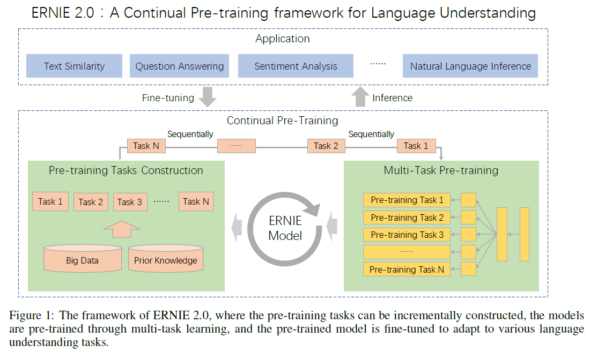
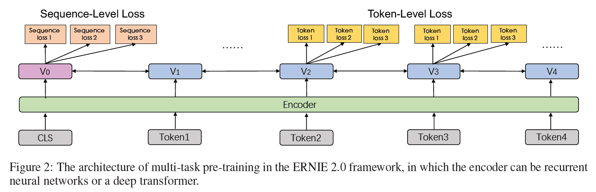
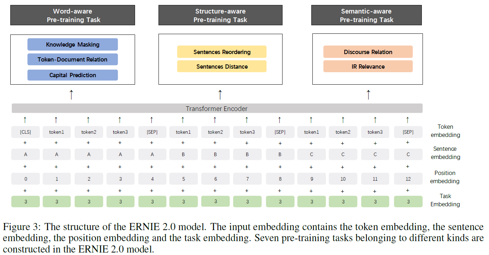
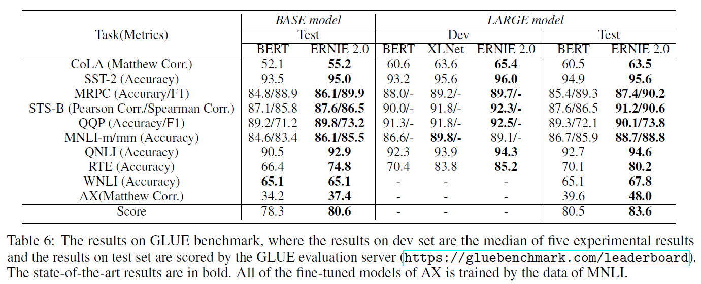
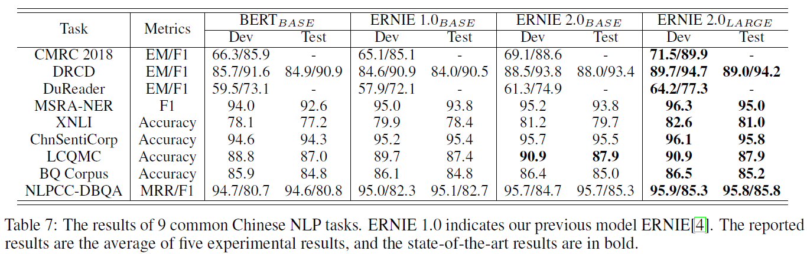

# ERNIE 2.0: A Continual Pre-training Framework for Language Understanding(ERNIE 2.0)
## Information
- 2019 arXiv
- Sun, Yu, et al.

## Keywords
- NLU
- Pre-train
- BERT
- Multi-Task Learning
- Continual Learning

## Contribution
- Propose a continual pre-training framework ERNIE 2.0, which supports customized training tasks and multi-task pre-training in an incremental way.
- Construct several unsupervised language processing tasks to verify the effectiveness of the proposed framework.

## Summary
- In order to extract to the fullest extent, the lexical, syntactic and semantic information from training corpora, we propose a continual pre-training framework named ERNIE 2.0 which builds and learns incrementally pre-training tasks through constant multi-task learning.

- The ERNIE 2.0 Framework:
	- 
	- Instead of training with a small number of pre-training objectives, it could constantly introduce a large variety of pre-training tasks to help the model efficiently learn the lexical, syntactic and semantic representations.
	1. Continual Pre-training:
		- The architecture of multi-task pre-training:
			- 
		- Continual learning aims to train the model with several tasks in sequence so that it remembers the previously learned tasks when learning the new ones.
		- Steps:
			1. Continually construct unsupervised pre-training tasks with big data and prior knowledge involved.
			2. Incrementally update the ERNIE model via multi-task learning.
				1. First train an initial model with a simple task before constantly introducing new pre-training tasks to upgrade the model.
				2. When adding a new task, we initialize the parameters of the previous one.
				3. Whenever a new task is introduced, it would be trained with the previous ones to make sure that the model does not forget the knowledge it has learnt.
		- All of these pre-training tasks rely on self-supervised or weak-supervised signals that could be obtained from massive data without human annotation.
		- There are two kinds of loss functions in the framework:
			1. Sequence-level loss
				- Can be combined with multiple token-level loss functions
			2. Token-level loss
				- Similar to the loss functions of BERT.
	2. Fine-tuning for Application Tasks:
		- Fine-tuning with task-specific supervised data, the pre-trained model can be adapted to different language understanding tasks.
		- Each downstream task has its own fine-tuned models after being fine-tuned.

- ERNIE 2.0 Model Structure:
	- 
	- Structure:
		1. Transformer Encoder
			- The transformer can capture the contextual information for each token in the sequence via self-attention, and generate a sequence of contextual embeddings.
		2. Task Embedding
			- Represent different tasks with an id ranging from 0 to N.
			- Each task id is assigned to one unique task embedding.
			- The corresponding token, segment, position and task embedding are taken as the input of the model.
	- Pre-training Tasks:
		1. Word-aware Pre-training Tasks
			1. Knowledge Masking Task:
				- Phrase masking and named entity masking in ERNIE 1.0.
				- Use this task to train an initial version of the model.
			2. Capitalization Prediction Task:
				- Capitalized words usually have certain specific semantic value compared to other words in sentences.
				- Predict whether the word is capitalized or not.
			3. Token-Document Relation Prediction Task
				- Predict whether the token in a segment appears in other segments of the original document.
				- The words that appear in many parts of a document are usually commonly-used words or relevant with the main topics of the document.
				- Through identifying the key words of a document appearing in the segment, the task can enable the ability of a model to capture the key words of the document to some extent.
		2. Structure-aware Pre-training Tasks
			1. Sentence Reordering Task:
				- Enable the pre-trained model to learn relationships among sentences in a document.
			2. Sentence Distance Task:
				- Learn the sentence distance using document-level information.
		3. Semantic-aware Pre-training Tasks
			1. Discourse Relation Task:
				- Predict the semantic or rhetorical relation between two sentences.
			2. IR Relevance Task
				- Learn the short text relevance in information retrieval.

- Experiments:
	- Results on GLUE benchmark:
		- 
	- Results on Chinese NLP tasks:
		- 

## Source Code
- [ERNIE 2.0](https://github.com/PaddlePaddle/ERNIE)
