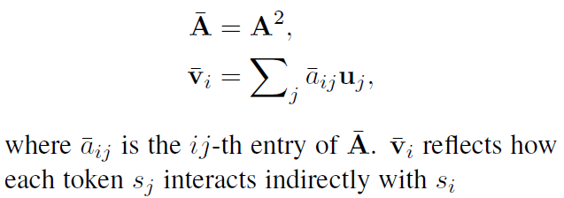

# Enhancing Pre-Trained Language Representations with Rich Knowledge for Machine Reading Comprehension (KT-NET)
## Information
- 2019 ACL
- An Yang, et al.

## Keywords
- Pre-train
- LM
- Knowledge

## Contribution
- Investigate and demonstrate the feasibility of enhancing pre-trained LMs with rich knowledge for MRC.
- Devise a new approach KT-NET to MRC which outperforms competitive baselines.

## Summary
- Knowledge and Text fusion NET(KT-NET), which employs an attention mechanism to adaptively select desired knowledge from KBs, and then fuses selected knowledge with BERT to enable context- and knowledge-aware predictions.

- KT-NET Model architecture
	- 
	- The key idea of KT-NET is to enhance BERT with curated knowledge from KBs, so as to combine the merits of the both.
	1. BERT Encoding Layer:
		- Takes as input passage P and question Q, and computes for each token a context-aware representation with BERT.
		1. Pack them into a single sequence of length m + n + 3:
			- 
			, where tokens in Q share a same segment embedding, and tokens in P also share a same segment embedding.
		2. Input representations are then fed into L successive Transformer encoder blocks
			- 
	2. Knowledge Integration Layer
		- Takes as input the BERT representations {hLi} output from the previous layer, and enriches them with relevant KB embeddings, which makes the representations not only context-aware but also knowledge-aware.
		- Component:
			1. KB Embedding:
				- Adopt the BILINEAR model[(Yang et al., 2015)](https://arxiv.org/abs/1412.6575), which measures the validity via a bilinear function.
					- 
				- Triples already stored in a KB are supposed to have higher validity. A margin-based ranking loss is then accordingly designed to learn the embeddings.
			2. KB Concepts Retrieval:
				- Treat WordNet synsets and NELL concepts as knowledge to be retrieved from KBs.
				- For WordNet, given a passage or question word, we return its synsets as candidate KB concepts.
				- For NELL, we first recognize named entities from a given passage and question, link the recognized mentions to NELL entities by string matching, and then collect the corresponding NELL concepts as candidates.
				- Relevant not only locally to the reading text but also globally about the whole KBs.
		- Steps:
			1. For each token si, get its BERT representation hLi.
			2. Retrieve a set of potentially relevant KB concepts C(si).
			3. Employ an attention mechanism to adaptively select the most relevant KB concepts.
				- Measure the relevance of concept cj to token si with a bilinear operation, and calculate the attention weight as:
					- 
				- As these KB concepts are not necessarily relevant to the token, this paper further introduce a knowledge sentinel and calculate its attention weight as;
					- 
				- The retrieved KB embeddings {cj}(as well as the sentinel) are then aligned to si and aggregated accordingly,
					- 
			4. Concatenate ki with the BERT representation hLi, which is by nature not only context-aware but also knowledge-aware.
	3. Self-Matching Layer:
		1. Takes as input the knowledge-enriched representations.
		2. Employs a self-attention mechanism to further enable interactions among the context components {hLi} and knowledge components {ki}.
			1. Direct interactions
				- Given two tokens si and sj (along with their knowledge-enriched representations ui and uj ), measure their similarity with a trilinear function:
					- 
				- The attended vector vi:
					- 
			2. Indirect interactions
				- The interaction between si and sj via an intermediate token sk.
				- Conduct a self-multiplication of the original attention matrix A, and compute for each token si another attended vector:
					- 
		3. Finally, build the output for each token by a concatenation oi:
			- 
	4. Output Layer
		- Use a linear output layer, followed by a standard softmax operation, to predict answer boundaries.

- Experiments:
	- Results on ReCoRD
		- 
	- Results on SQuAD1.1
		- 

## Source Code
- Will be avaliable at [ACL2019-KTNET](https://github.com/paddlepaddle/models/tree/develop/PaddleNLP/Research/ACL2019-KTNET)
