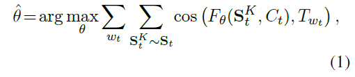
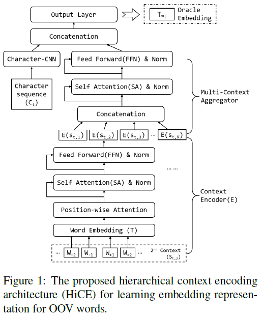
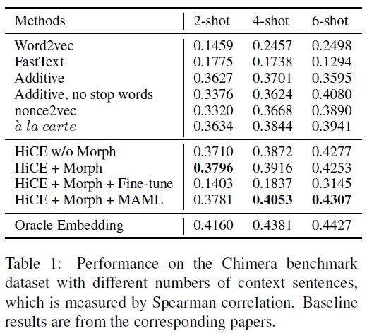
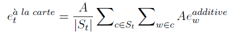
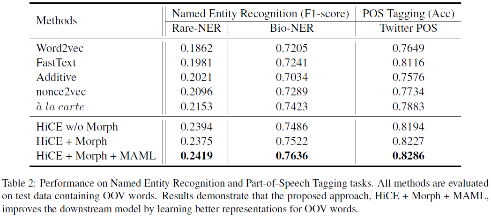

# Few-Shot Representation Learning for Out-Of-Vocabulary Words (HiCE)
## Information
- 2019 ACL
- Hu, Ziniu, et al.

## Keywords
- Language Representation
- Few-Shot Learning
- OOV

## Contribution
- Formulate the OOV word embedding learning as a K-shot regression problem.
- Propose a simulated episode-based training schema to predict oracle embeddings.
- Propose an attention-based hierarchical context encoder (HiCE) to encode and aggregate both context and sub-word information.
- Incorporate MAML for fast adapting the learned model to the new corpus by bridging the semantic gap.

## Summary
- Propose a novel hierarchical attention-based architecture to serve as the neural regression function, with which the context information of a word is encoded and aggregated from K observations.
- Formulate the learning of OOV embeddings as a few-shot regression problem, and address it by training a representation function to predict the oracle embedding vector (defined as embedding trained with abundant observations) based on limited observations.
- Can leverage Model-Agnostic Meta-Learning (MAML) for adapting the learned model to the new corpus fast and robustly.

- OOV words:
	- Most existing embedding techniques assume the availability of abundant observations of each word in the training corpus.
	- When a word occurs only a few times during training (i.e., in the few-shot setting), the corresponding embedding vector is not accurate.
	- Existing approaches for dealing with OOV words
		1. Derives embedding vectors of OOV words based on their morphological information.
			- This type of approaches has a limitation when the meaning of words cannot be inferred from its subunits (e.g., names, such as Vladimir).
		2. Attempts to learn to embed an OOV word from a few examples
			1. Demonstrating examples are treated as a small corpus and are used to fine-tune OOV embeddings
				- Fine-tuning with just a few examples usually leads to overfitting.
			2. A simple linear function is used to infer embedding of an OOV word by aggregating embeddings of its context words in the examples.
				- The simple linear averaging can fail to capture the complex semantics and relationships of an OOV word from its contexts.

- The Approach
	1. The Few-Shot Regression Framework
		- Introduce an episode based few-shot learning framework, which supposes a word with abundant observations is actually an OOV word, and uses the embedding trained with these observations as its oracle embedding.
		- The HiCE model is asked to predict the word's oracle embedding using only the word's K randomly sampled observations as well as its morphological information.
		- Method:
			- To learn an neural regression function Fθ(.) parameterized with θ on DT.
			- The function Fθ(.) takes both the few contexts and morphological features of an OOV word as input, and outputs its approximate embedding vector.
			- Pick N words with sufficient observations as the target words, and use their embeddings as oracle embeddings.
		- The training objective:
			- 
			, where Ct is the target word's character sequence, and StK is the masked supporting context set(randomly sample K sentences from St where the target word appears.)
	2. Hierarchical Context Encoding (HiCE)
		- 
		- An attention-based hierarchical context encoder (HiCE), which can leverage both sentence examples and morphological information.
		- Adopts multi-head self-attention to integrate information extracted from multiple contexts, and the morphological information can be easily integrated through a character-level CNN encoder.
		- Requirements of HiCE:
			1. Analyze the complex semantics of context.
			2. Aggregate multiple pieces of context information for comprehensive embedding prediction.
			3. Incorporate morphological features.
		- HiCE Architecture:
			1. The Context Encoder
				- Position-wise attention 
					- To distinguish the importance of different relative locations in a sequence.
				- Self-attention encoding block
					- To enrich the interaction of the sequence input and effectively extract both local and global information.
			2. The Multi-Context Aggregator
				- Character-level CNN 
					- To encode the morphological features.
				- Self-attention encoding block 
					- To combines multiple encoded contexts.
	3. Fast and Robust Adaptation with MAML
		- Propose to adopt Model-Agnostic Meta-Learning (MAML) ([Finn et al., 2017](https://arxiv.org/abs/1703.03400)) to assist the fast and robust adaptation of a pre-trained HiCE model, which allows HiCE to better infer the embeddings of OOV words in a new domain by starting from a promising initialization.

- Experiments:
	- Results on the Chimera benchmark
		- 
		- Baseline models:
			- Additive:
				- Additive model is a purely non-parametric algorithm that averages the word embeddings of the masked supporting contexts.
			- nonce2vec:
				- This algorithm is a modification of original gensim Word2Vec implementation, augmented by a better initialization of additive vector, higher learning rates and large context window, etc.
			- a la carte:
				- This algorithm is based on an additive model, followed by a linear transformation A that can be learned through an auxiliary regression task.
					- 
	- Results on the NER and POS benchmarks
		- 

## Source Code
- [HiCE](https://github.com/acbull/HiCE)
