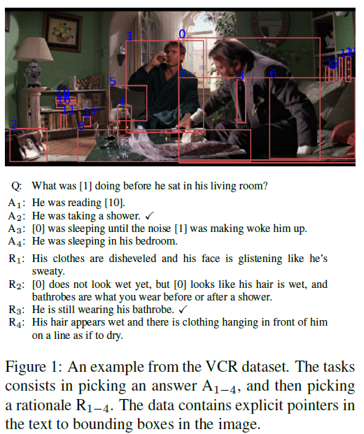
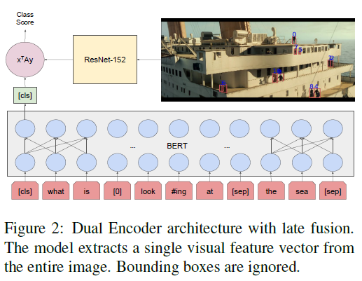
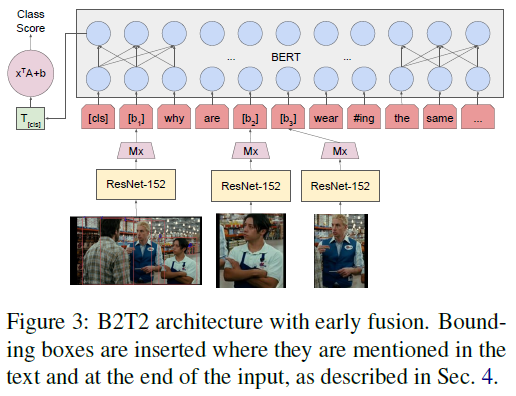
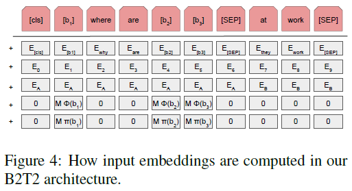
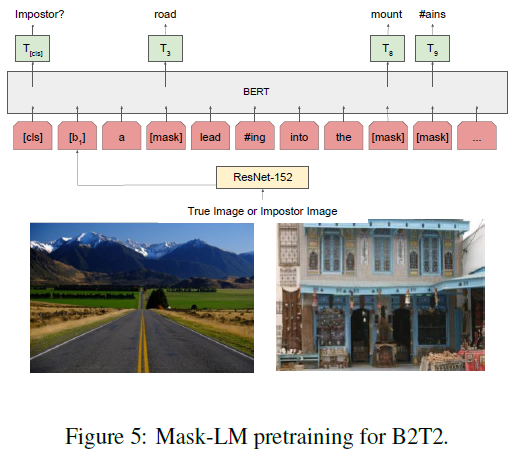
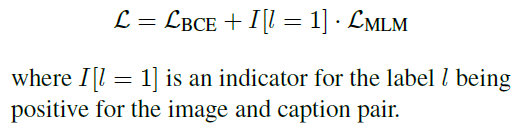
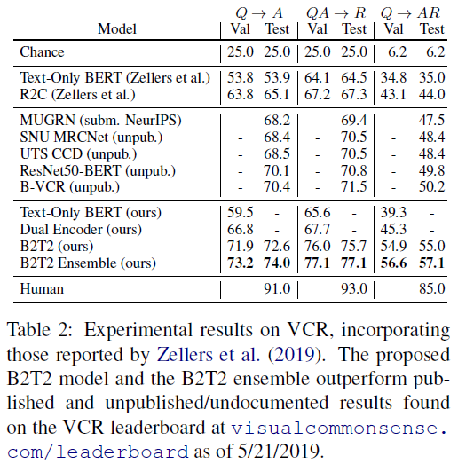
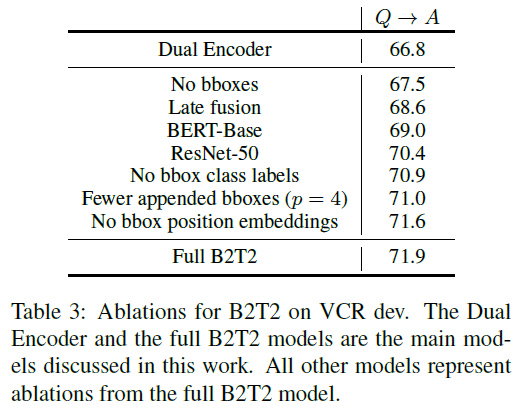
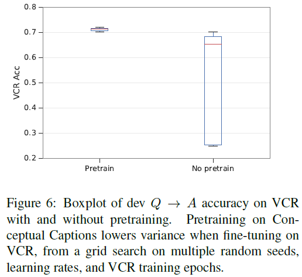

# Fusion of Detected Objects in Text for Visual Question Answering (B2T2)
## Information
- 2019 arXiv
- Alberti, Chris, et al.

## Keywords
- MultiModel
- BERT
- VQA(Visual Question Answering)

## Contribution
- Design the Bounding Boxes in Text Transformer(B2T2), a neural architecture for multimodal encoding of natural language and images.
- Found that early fusion of co-references between textual tokens and visual features of objects was the most critical factor in obtaining improvements on VCR.
- Found that the more visual object features included in the model's input, the better the model performed, even if they were not explicitly co-referent to the text, and that positional features of objects in the image were also helpful.
- Use pretraining framework to initialize the B2T2 model to make it more reliable.

## Summary
- Bounding Boxes in Text Transformer(B2T2) is a simple yet powerful neural architecture for data that combines vision and natural language.

- VQA(Visual Question Answering) Problem Formulation
	- 
	- The input data comprised of 4-tuples (I, B, T, l).
		1. I is an image
		2. B = [b1, ..., bm] is a list of bounding boxes referring to regions of I, , where each bi is identified by the lower left corner, height and width
		3. T = [t1, ..., tn] is a passage of tokenized text, with the peculiarity that some of the tokens are not natural language, but explicit references to elements of B. (e.g. [1] in Question in Figure 1 that references the man in the image bounding by the box labeled with "1".)
		4. l is a numerical class label in {0, 1}

- Baseline and B2T2 Models
	1. Dual Encoder
		- 
		- A late fusion architecture where image and text are encoded separately and answer scores are computed as an inner product.
	2. B2T2
		- 
		- An early fusion architecture where visual features are embedded on the same level as input word tokens.
		- The key difference from Dual Encoder is that text, image and bounding boxes are combined at the level of the non-contextualized token representations rather than right before the classification decision.
		- The input Embeddings:
			- 
			1. The tokenized text embedding
			2. The position embedding
			3. The passage embedding
			4. The visual feature vector of the referenced image bounded by the bounding box.
			5. The embedding of bi's shape and position information.
		- Pretraining:
			- 
			- Pretraining Tasks:
				1. Impostor identification
					- Sample a random negative caption for each image and ask the model to predict whether the caption is correctly associated.
				2. Masked language model prediction
					- Using a Mask-LM pretraining technique like the one used in BERT.
					- Randomly replace tokens in the caption with the [MASK] token, and the model must predict the original token.
			- Do not consider bounding boxes during pretraining.
			- Loss:
				- The loss for impostor identification is binary cross entropy LBCE
				- To ensure that the model correctly grounds the language to the image with the mask LM loss, we only use it for positive captions, zeroing it out for negative captions.
				- 

- Experiments:
	- Results on the VCR dataset
		- 
	- Ablations
		- 
		1. Use of Bounding Boxes:
			- The bounding boxes considered by B2T2 model turns out to be the most important factor in improving the accuracy.
		2. Late Fusion vs. Early Fusion:
			- If in the the full B2T2 model we add visual embeddings in the last layer of BERT rather than in the first.
		3. Effect of Textual Model Size:
			- Using BERT-base rather than BERT-large to initialize the B2T2 model.
		4. Effect of Visual Model Size:
			- Swap out ResNet-152 for ResNet-50.
		5. Position of Bounding Boxes:
			- Removing position information from the model.
		6. Pretraining:
			- Performance improvements from pretraining are quite small, but initializing from a pretrained model heavily reduces variance of results.
				- 

## Source Code
- not found
