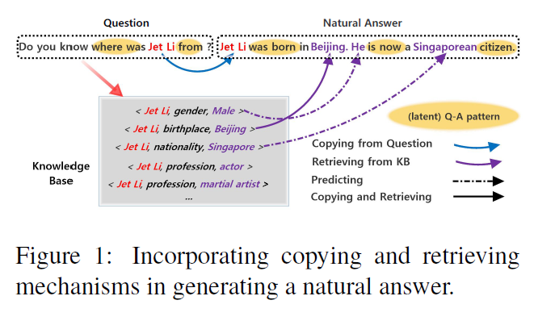
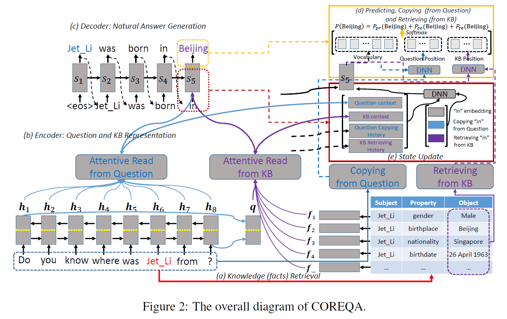
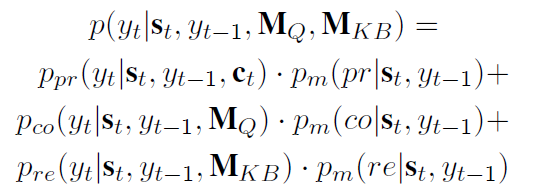
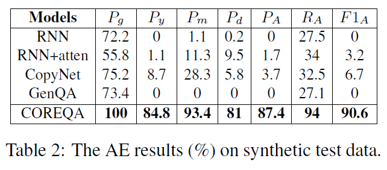
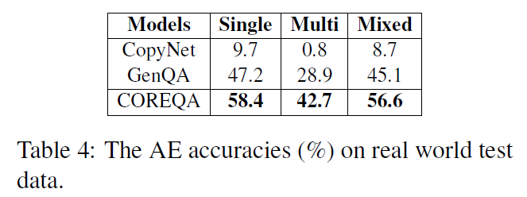
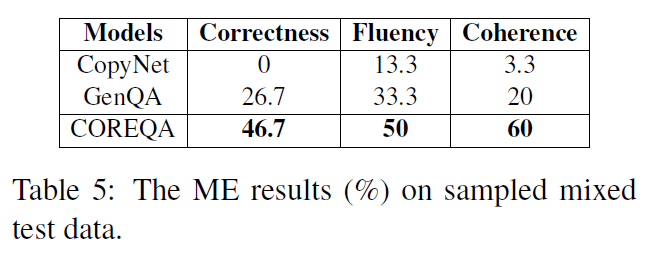
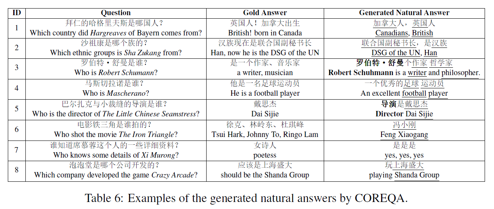

# Generating Natural Answers by Incorporating Copying and Retrieving Mechanisms in Sequence-to-Sequence Learning
## Information
- 2017 ACL
- Shizhu He, Cao Liu, Kang Liu, and Jun Zhao.

## Keywords
- NLG
- QA
- KBQA

## Contribution
- Propose a neural network based model, named as COREQA, by incorporating copying and retrieving mechanism in Seq2Seq learning.

## Summary
- Propose a Seq2Seq model called COREQA, which incorporates copying and retrieving mechanisms to generate natural answers within an encoder-decoder framework.

- COREQA:
	
	COREQA is an encoder decoder framework plugged with a KB engineer
	1. Knowledge (facts) Retrieval:
		- Utilizes the gold topic entities to retrieve the related facts from the corresponding KB.
	2. Encoder:
		1. Question Encoding:
			- Bi-RNN is used to transform the question sequence into a sequence of concatenated hidden states.
		2. Knowledge Base Encoding:
	3. Decoder:
		COREQA predicts SUs(Sematic Units) based on a mixed probabilistic model of three modes, namely the predict-mode, the copy-mode and the retrieve-mode.
		
		1. Predict-mode:
			Predicts words with the vocabulary.
		2. Copy-mode:
			Predicts words from the source questions.
		3. Retrieve-mode:
			Predicts words from matched KB.

- Results:
	- Automatic evaluation (AE) on synthetic test data:
		
	- AE on real world test data:
		
	- Manual evaluation (ME) sampled mixed test data:
		
	- Examples of the generated natural answers by COREQA:
		

## Source Code
not found