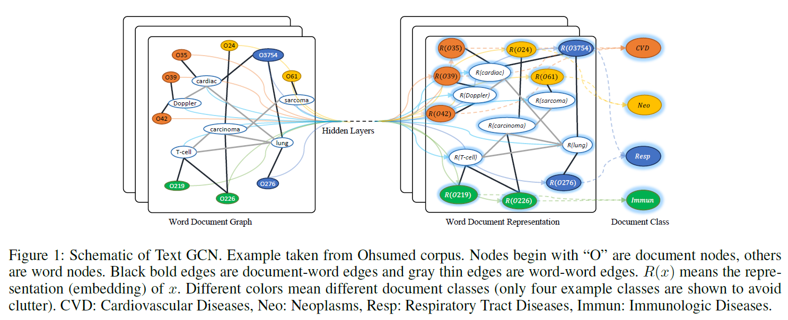
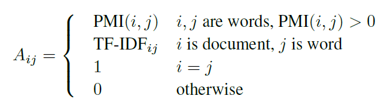
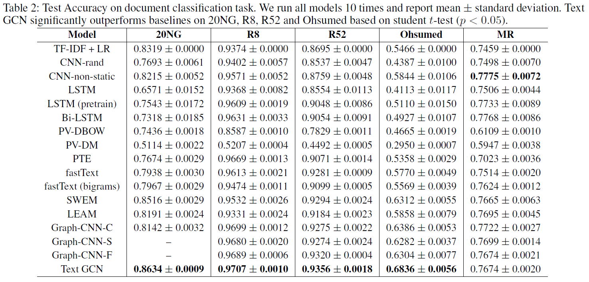

# Graph Convolutional Networks for Text Classification
## Information
- 2019 AAAI
- Yao, Liang, Chengsheng Mao, and Yuan Luo.

## Keywords
- Graph Convolutional Network (GCN)
- Text Classification

## Contribution
- Apply GCN with heterogeneous graph on Text Classification

## Summary
1. Build a large and heterogeneous text graph which contains word nodes and document nodes

2. Use Tfidf, PMI for the edge between document-word and word-word respectively

3. Feed the graph build from step2 to a two layers of GCN

## Source Code
- [text_gcn](https://github.com/yao8839836/text_gcn)