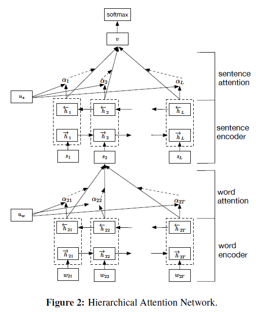
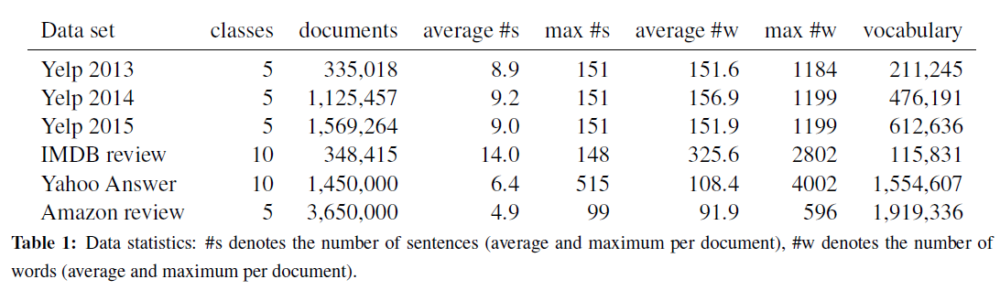
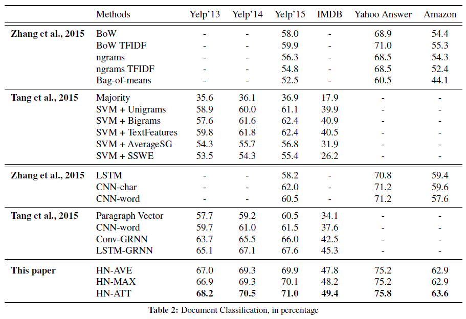

# Hierarchical Attention Networks for Document Classification (HAN)
## Information
- 2019 NAACL
- Yang, Zichao, et al.

## Keywords
- Text Classification
- Attention
- Hierarchical Attention

## Contribution
- Propose a new neural architecture, the Hierarchical Attention Network (HAN) that is designed to capture two basic insights about document structure.
	1. Documents have a hierarchical structure(word-sentence-document)
		- Construct a document representation by first building representations of sentences and then aggregating those into a document representation.
	2. Different words and sentences in a documents are differentially informative.
		- Include two levels of attention mechanisms, word level and sentence level.

## Summary
- Propose a hierarchical structure that mirrors the hierarchical structure of documents.
- Two levels of attention mechanisms applied at the word and sentence-level, enabling it to attend differentially to more and less important content when constructing the document representation.
- The key difference to previous work is that the HAN model uses context to discover when a sequence of tokens is relevant.

- Architecture
	- Hierarchical Attention Network
		- 
		- Word Encoder
			- Use a bidirectional GRU to get annotations of words by summarizing information from both directions for words, and therefore incorporate the contextual information in the annotation.
		- Word Attention
			- Introduce attention mechanism to extract such words that are important to the meaning of the sentence and aggregate the representation of those informative words to form a sentence vector.
		- Sentence Encoder
			- Use a bidirectional GRU to encode the sentences.
		- Sentence Attention
			- Use attention mechanism and introduce a sentence level context vector and use the vector to measure the importance of the sentences.
	- Document Classification Part
		- The document vector v is a high level representation of the document and can be used as features for document classification.
		- Use the negative log likelihood of the correct labels as training loss.

- Experiments:
	- The datasets of Document Classification
		-  
	- The results on Document Classification Tasks:
		- 

## Source Code
- [textClassifier](https://github.com/richliao/textClassifier) (not official)
