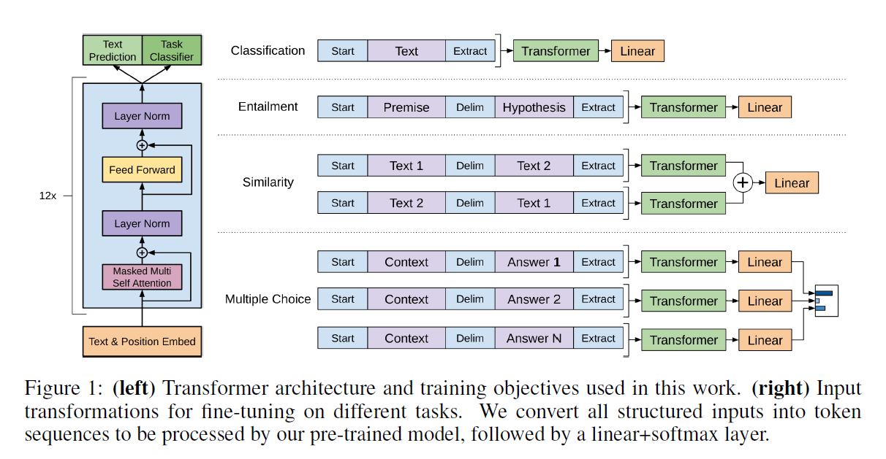
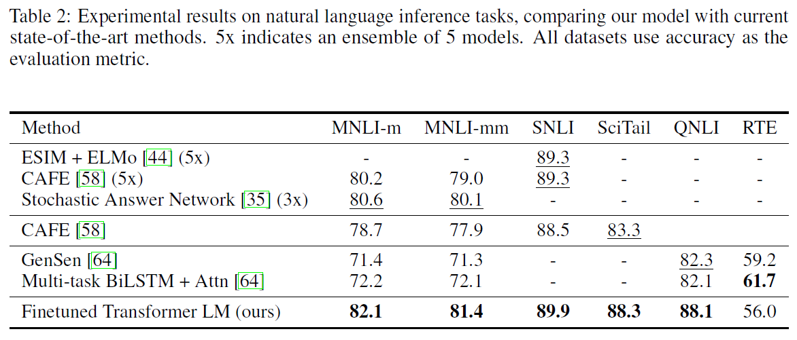
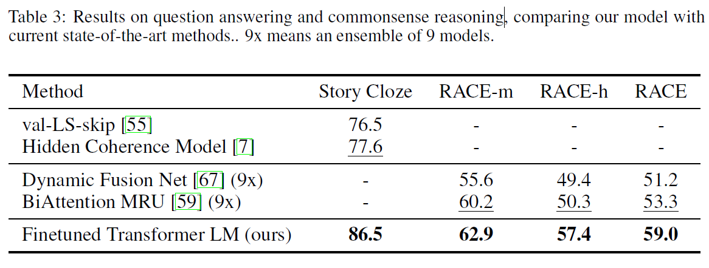
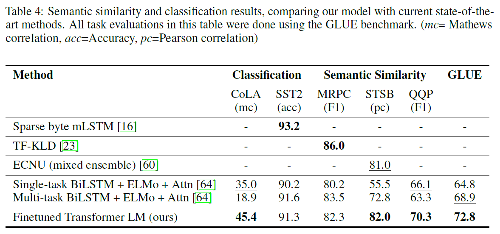

# Improving Language Understanding by Generative Pre-Training
## Information
- 2018 [website](https://openai.com/blog/language-unsupervised/)
- Radford, Alec, et al.

## Keywords
- Language Representation
- Fine-tunning

## Contribution
- Demonstrate that large gains on the NLU tasks can be realized by **generative pre-training** of a language model on a diverse corpus of unlabeled text, followed by discriminative fine-tuning on each specific task.

## Summary
- Explore a semi-supervised approach for language understanding tasks using a combination of unsupervised pre-training and supervised fine-tuning.
- Employ a two-stage training procedure. 
	1. Use a language modeling objective on the unlabeled data to learn the initial parameters of a neural network model(Transformer).
	2. Adapt these parameters to a target task using the corresponding supervised objective.
	- Transformer architecture and training objectives:
		

- Results:
	- Results on natural language inference tasks:
		
	- Results on question answering and commonsense reasoning:
		
	- Results on semantic similarity and classification:
		

## Source Code
- [finetune-transformer-lm](https://github.com/openai/finetune-transformer-lm)