# Improving Low Resource Named Entity Recognition using Cross-lingual Knowledge Transfer
## Information
- 2018 IJCAI
- Feng, Xiaocheng, et al.

## Keywords
- NER
- Transfer Learning

## Contribution
- Build neural networks to model the external semantic representation of each low resource language word based on the translations from high resource languages.
- Learn a linear projection function between the low resource word embedding space and the high resource language translation semantic space, accordingly, the out-of-lexicon low resource language words can also be estimated with a new semantic representation.
- Calculate its distributional probabilities over all entity types and add them as additional features to the original word representation for both low resource and high resource languages.

## Summary
- Present a neural-based sequential tagger which incorporates additional word representations learned from semantic projections based on cross-lingual knowledge.

- Example of NER labels with bilingual lexicon:
	- 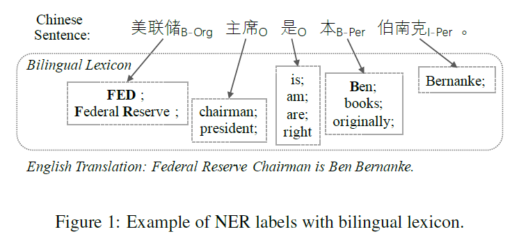

- Methodology
	1. Basic Model: **LSTM-CRF**
		- 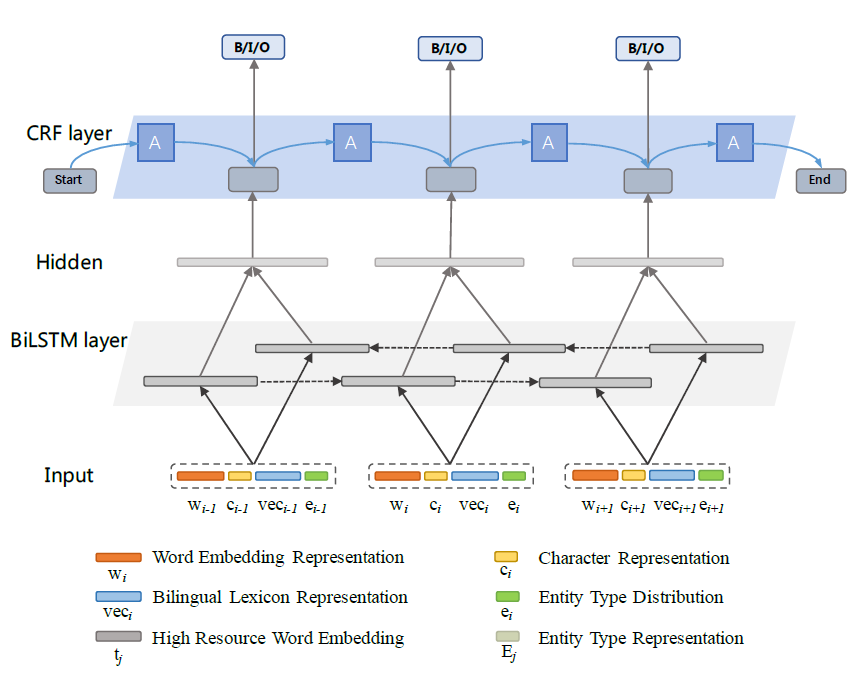
		- The vectors of each word in the input low resource sentence is made up of four parts:
			1. A word embedding wi
			2. A character-level representation ci
			3. A high resource translation vector veci or veoi
			4. An entity type distributional representation ei
		- Regard the concatenation vectors of these four representations as word representation xi = [wi, ci, veci, ei], and feed them into the previous LSTM-CRF model for NER.
		- The model is trained in a supervised manner by minimizing the cross entropy error of sequence labeling and L2 loss:
			- 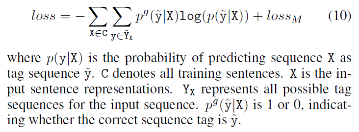
	2. Improved with **Bilingual Lexicon**
		- Develop neural networks to improve low resource word representations via knowledge transfer from high resource language using bilingual lexicons.
		- Assumption:
			- Given a low resource language sentence X = {x1, x2, ..., xi, ..., xn}, assume that each word xi has a corresponding high resource language translation Ti based on the bilingual lexicon.
		- Method:
			- The translation Ti can be viewed as a combination of multiple translation items and each translation item consists of multiple high resource language words.
			- Take the concatenation of all translation words as the input for the vanilla RNN unit.
			1. LSTM-based Network:
				- 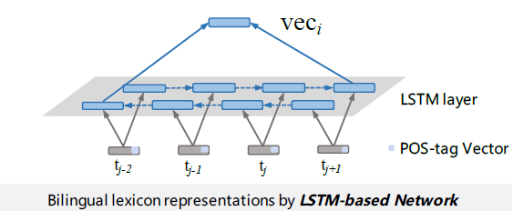
				- To better encode the structural information of different translation items, the method incorporate the POS-tag information of each translation item into their corresponding translation words.
					- Each POS-tag label is also mapped to a (a hyper dp parameter) dimensional vector, which is randomly initialized and optimized by the model.
				- Combine the embedding of each translation word ti and its corresponding POS-tag vector pi as [ti, pi], and then feed it to the Bi-LSTM unit.
				- Concatenate the outputs of forward LSTM and backward LSTM as translation representations vec.
			2. Attention-based Network :
				- 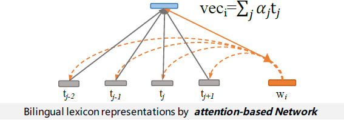
				- Considering that each word in the translation does not contribute equally to the semantic meaning of the original low resource word.
				- Introduce an attention-based network to model the bilingual lexicons.
				- Take an external translation unit T and a low resource word vector xi as input, the attention model outputs a continuous vector vec, which is a weighted sum of each piece of memory in T.
					- 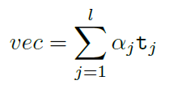
					- 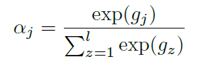
					- 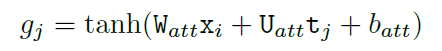
		- Example:
			- An example is given in Figure 1. The Chinese word "美联储"" has two translation items in English, namely "FED" and "Federal Reserve". We can get its translation sequence as ["FED", "Federal", "Reserve" ], of which size is 3.
	3. Improved with Mapping based **Lexicon Extension Strategy**
		- The bilingual lexicons can not cover all low resource language words.
		- Design a lexicon extension strategy to estimate the translation representations of out-of-lexicon word.
		- Suppose there is a low resource language word set W = {w1, ..., wi, ..., wf}, each word has a low resource word vector wi and a high resource language translation vector veci.
		- Method:
			- Learn a linear projection function as the transformation between the two semantic space.
				- 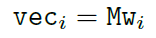
			- Minimize the following objective to optimize M:
				- 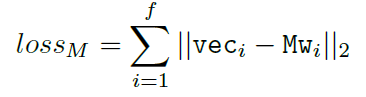
	4. Improved with Language-Independent **Entity Type Distribution**
		- The entity type-based distributional features denote the probabilities of each word to be tagged as each entity type.
		- 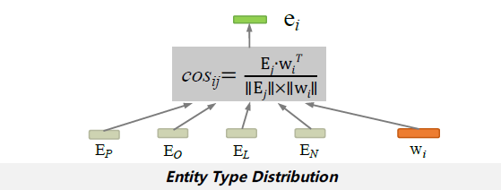
		- Observe that the same property(Similar words tend to be close to each other in the same space) also applies to the words with the same entity type.
		- Learn an approximate representation of each entity type, and use the similarities between each entity type representation and each word embedding as the entity type-based distributional feature.
			- Randomly select 10 entities from each entity type and average their embeddings as the entity type representation.
			- Randomly generate one vector representing non-entity.
			- Use standard function to calculate the cosine semantic relatedness between the low resource word embedding wi and the entity type representation Ej.
				- 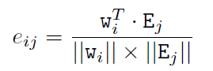

- Experiments:
	- Variations of the models:
		- LSTM-CRF+BLLSTM:
			- Extends LSTM-CRF by taking into account of the bilingual lexicon, and uses a LSTM-based network towards the translations.
		- LSTM-CRF+BL+MLSTM:
			- An extension of LSTM-CRF+BLLSTM by further incorporating the lexicon extension strategy.
		- LSTM-CRF+BL+M+ELSTM:
			- An extension of LSTM-CRF+BL+MLSTM by further concatenating the semantic representation of each word with entity type distribution features in both languages.
		- LSTM-CRF+BLATT:
			- Extends LSTM-CRF by taking into account of the bilingual lexicon, and uses an attention-based network towards the translations.
		- LSTM-CRF+BL+MATT:
			- An extension of LSTM-CRF+BLATT by further incorporating the lexicon extension strategy.
		- LSTM-CRF+BL+M+EATT:
			- An extension of LSTM-CRF+BL+MATT by further concatenating the semantic representation of each word with entity type distribution features in both languages.
	- Results on low resource NER(Dutch and Spanish):
		- 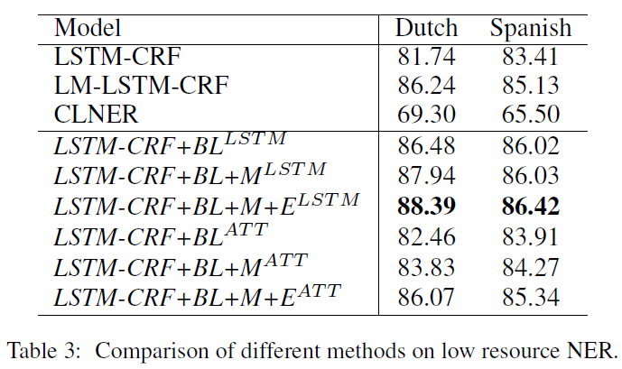
	- Results on Chinese NER:
		- 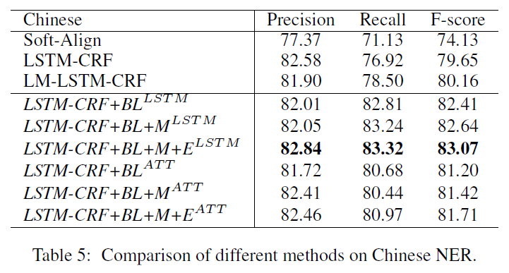
	- Results on fine-Grained Performance on Different Groups:
		- 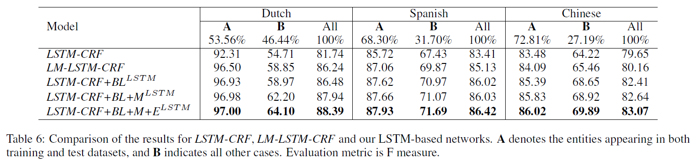
		- This demonstrates that the cross-language representation has better ability to model non-covered entities than word-level and character-level representations.

## Source Code
- [LR-NER](https://github.com/scir-code/lrner)
