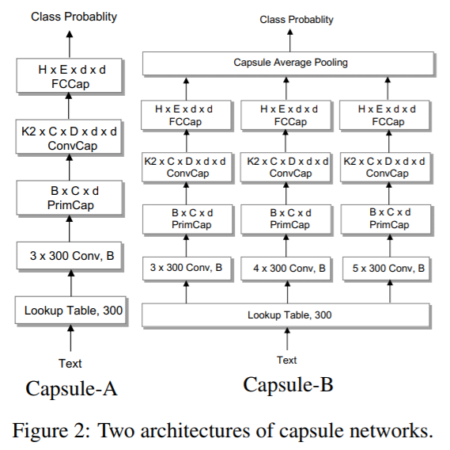

# Investigating Capsule Networks with Dynamic Routing for Text Classification
## Information
- 2018 EMNLP
- Zhao, Wei, et al.

## Keywords
- Capsule
- Text Calssification

## Contribution
- This paper is the first work that capsule networks have been empirically investigated for text modeling.
- Show that capsule network can be applied to transfer task and achieve great performance.

## Summary
- Apply capsule network on text calssification task, and achieve comparable results with LSTM or CNN.

- In addition, on sigle-label to multi-label transfer classification task, capsule network obtain significant improvement

## Source Code
- [Text Classification with Capsule Network](https://github.com/andyweizhao/capsule_text_classification)