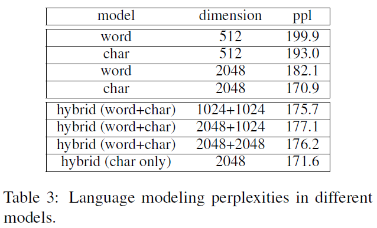
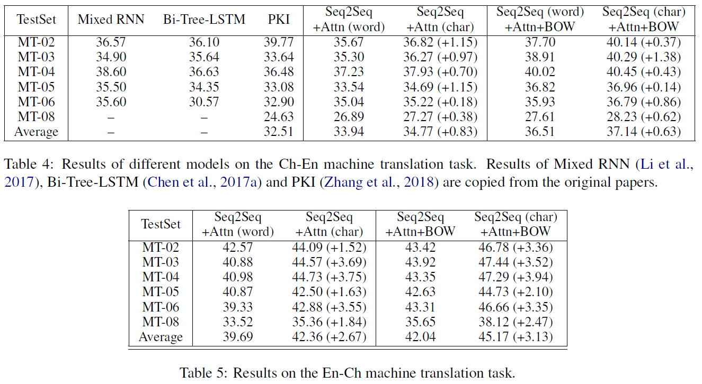
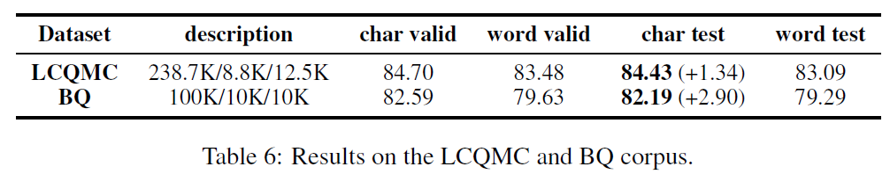
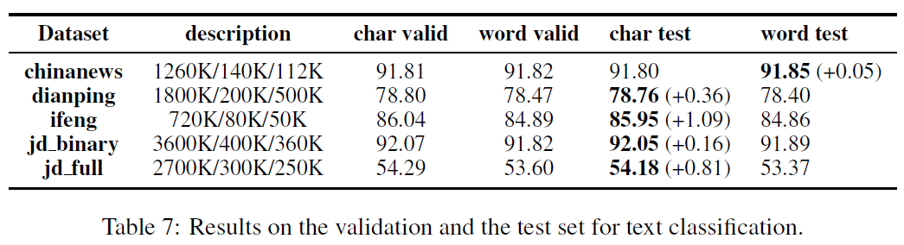
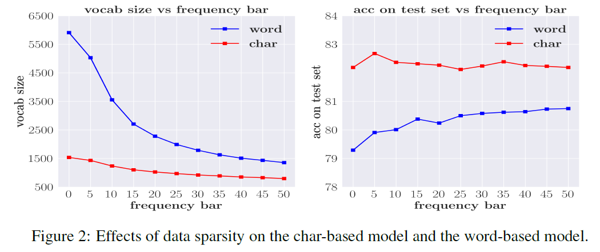
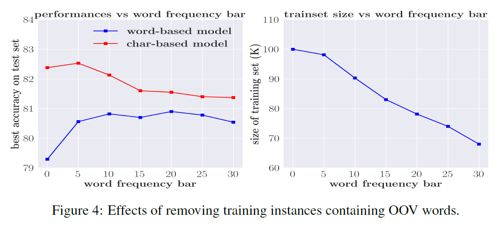
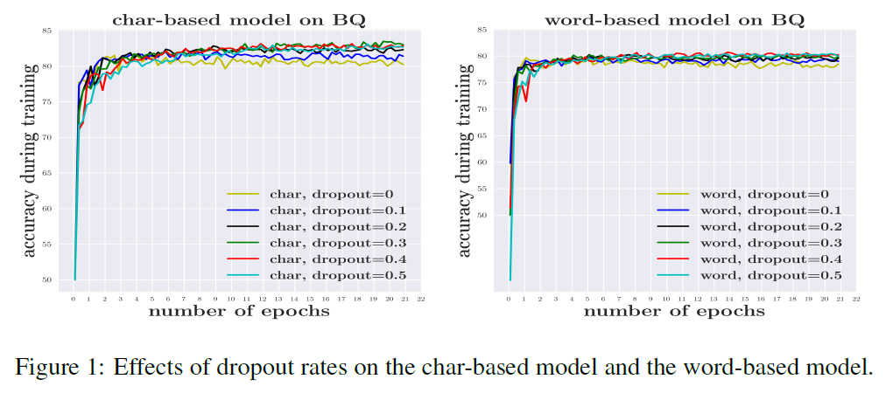

# Is Word Segmentation Necessary for Deep Learning of Chinese Representations?
## Information
- 2019 ACL
- Meng, Yuxian, et al.

## Keywords
- NLU
- Language Representation
- Word Segmentation
- Chinese

## Contribution
- Benchmark neural word-based models which rely on word segmentation against neural char-based models which do not involve word segmentation in four end-to-end NLP benchmark tasks.(language modeling, machine translation, sentence matching/paraphrase and text classification)
- Find that char-based models consistently outperform word-based models.

## Summary
- Whether Chinese word segmentation (CWS) is necessary for deep learning-based Chinese Natural Language Processing?
	- Observe that char-based models consistently outperform word-based model.

- Disadvantages of word-based models:
	1. Word Data Sparsity 
		- The data sparsity issue is likely to induce overfitting, since more words means a larger number of parameters.
		- Since it is unrealistic to maintain a huge word-vector table, many words are treated as OOVs.
	2. OOV Problem
		- Limits the model's learning capacity.
	3. Error of Word Segmentation
		- The state-of-the-art word segmentation performance is far from perfect, the errors of which would bias downstream NLP tasks.

- Results:
	- Results of Language modeling:
		- 
		- **hybrid (word+char)** denotes the standard hybrid model that uses both char vectors and word vectors.
		- **hybrid (char only)** , a pseudo-hybrid model, which uses a word segmentor to segment the texts, but word representations are obtained only using embeddings of their constituent characters.
	- Results of Machine Translation:
		- 
	- Results of Sentence Matching/Paraphrase:
		- 
	- Results of Text Classification:
		- 

- Analysis:
	- Data Sparsity:
		- 
		- A common method to avoid vocabulary size getting too big is to set a frequency threshold, and use a special UNK token to denote all words whose frequency is below the threshold.
	- Out-of-VocabularyWords:
		- 
		- One possible explanation for the inferiority of the word-based model is that it contains too many OOVs. If so, we should be able to narrow or even close the gap between word-based models and charbased models by decreasing the number of OOVs.
	- Overfitting:
		- 
		- To achieve the best results, a larger dropout rate is needed for the word-based model (0.5) than the char-based model (0.3). This means overfitting is a severe issue for the word-based model.

## Source Code
- not found
