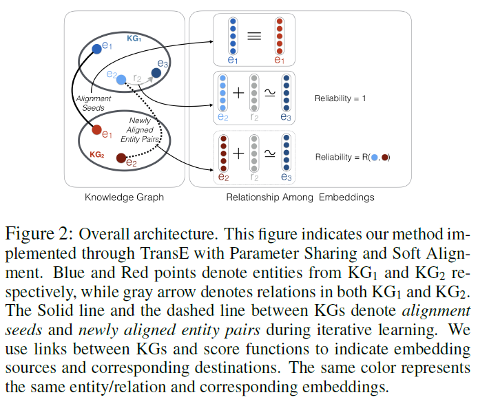
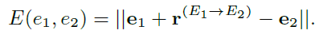
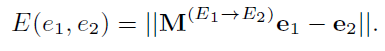
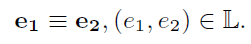
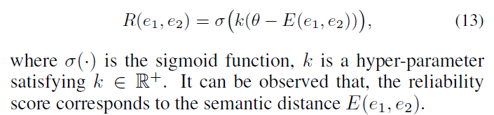
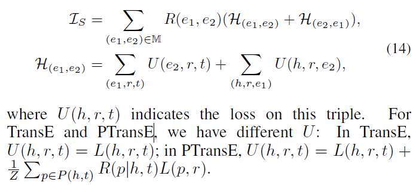
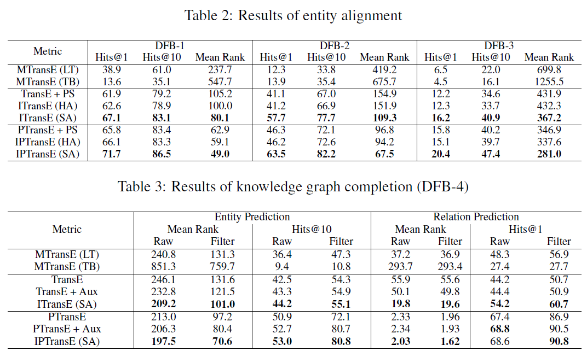

# Iterative Entity Alignment via Joint Knowledge Embeddings
## Information
- 2017 IJCAI
- Zhu, Hao, et al.

## Keywords
- Knowledge Graph
- Knowledge Alignment

## Contribution
- Jointly encode both entities and relations of various KGs into a unified low-dimensional semantic space according to a small seed set of aligned entities.
- Present an iterative and parameter sharing method to improve alignment performance.

## Summary
- Take the triple facts in these KGs and alignment seeds as inputs to learn joint knowledge embeddings and align entities with their counterparts simultaneously.
	
	1. Knowledge Embeddings
		- Learn both entity and relation embeddings following the translation-based KRL methods according to the triple facts in various KGs.
		- Method:
			1. TransE
			2. PTransE
	2. Joint Embeddings
		- Learn to map knowledge embeddings of various KGs into a joint semantic space according to a seed set of known aligned entities.
		1. Translation-based Model:
			- 
		2. Linear Transformation Model:
			- 
		3. Parameter Sharing Model:
			- 
	3. Iterative Alignment
		- Iteratively align entities and their counterparts and update the joint knowledge embeddings by taking those high-confident aligned entities increasingly found by the method into consideration.
		- Define a distance threshold as a hyper-parameter, if distance between entities is small than the distance threshold, it is confident that the two entities are very likely to be the counterpart of each other.
		1. Hard Alignment:
			- Simply force **e1** and **e2** as 0.5x(**e1** + **e2**)
			- Hard Alignment may suffer from error propagation when introducing wrong alignments.
		2. Soft Alignment:
			- Assign a reliability score to each newly aligned entities.
			- Reliability score: 
				- 
			- Based on reliability scores of newly aligned entities, formalize the score function of Soft Alignment as:
				- 

- Results:
	

## Source Code
- [IEAJKE](https://github.com/thunlp/IEAJKE)