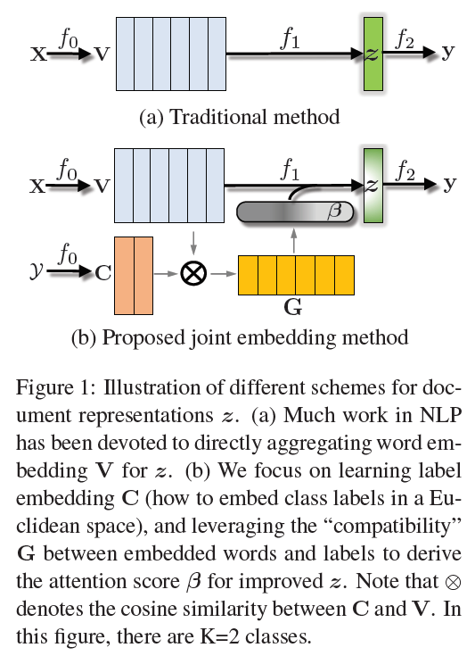
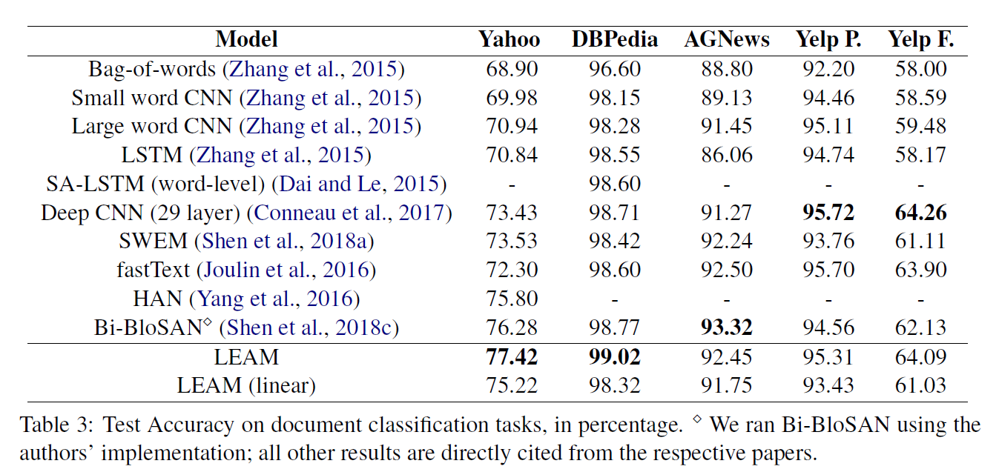

# Joint Embedding of Words and Labels for Text Classification
## Information
- 2018 ACL
- Wang, Guoyin, et al.

## Keywords
- Joint Learning
- Label Embedding
- Text Classification

## Contribution
- Jointly embed the word and label in the same latent space.
- Use attention mechanism to attend on the important words according to the label embedding.

## Summary
1. Propose LEAM(Label-Embedding Attentive Model) to joint learn the embedding of label into the same space as word embedding 
2. Use the label embedding to interact with word embedding to with attention mechanism

## Source Code
- [LEAM](https://github.com/guoyinwang/LEAM)