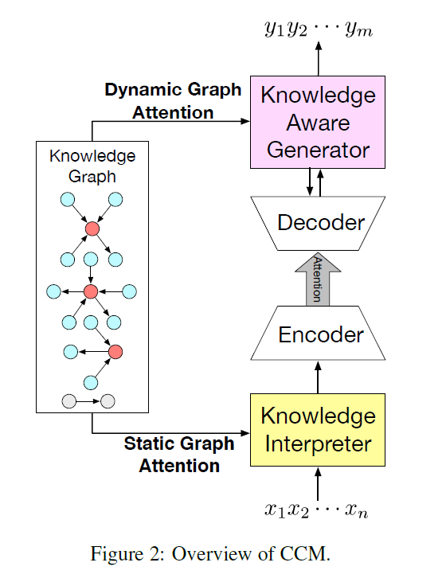
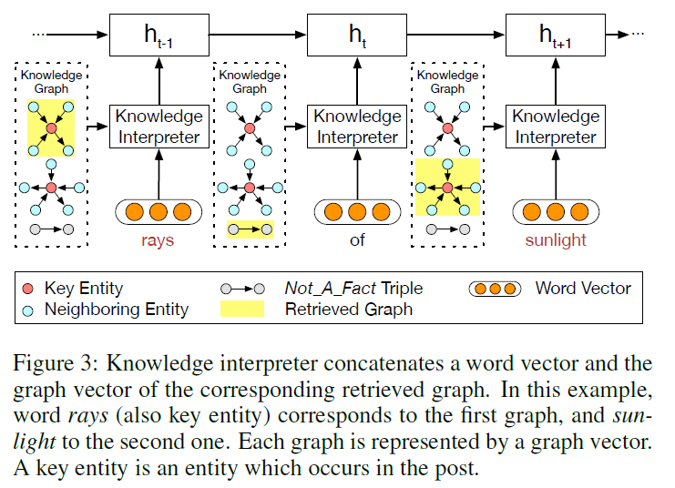
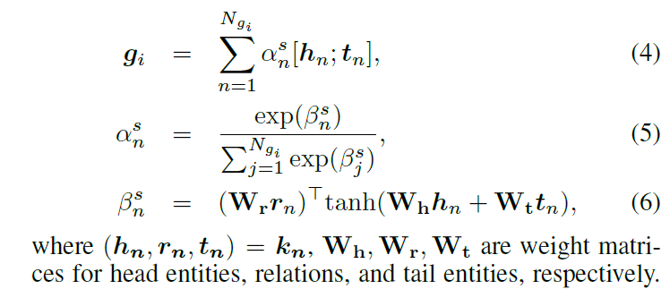
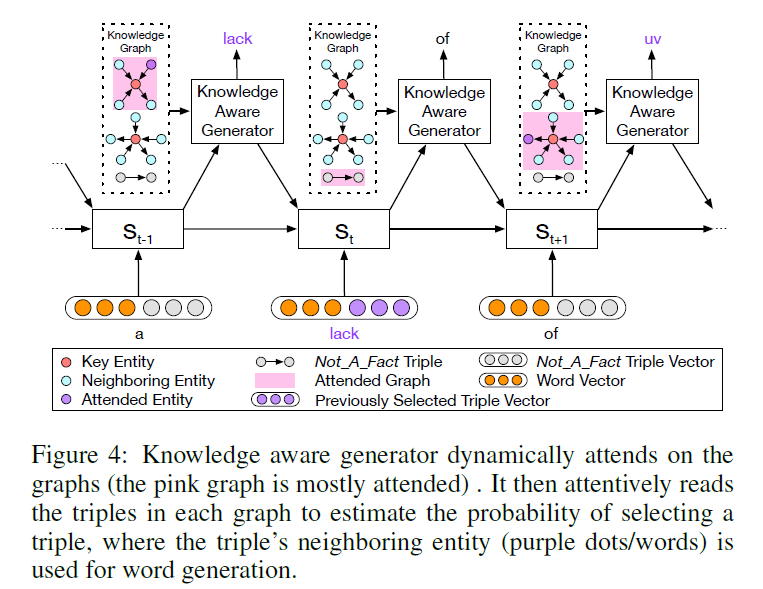
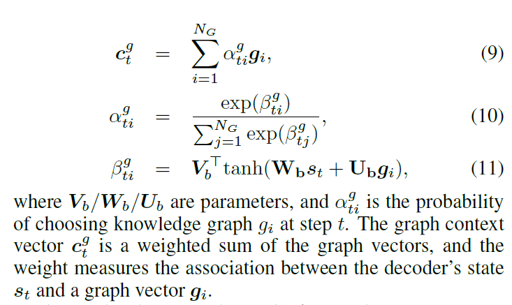
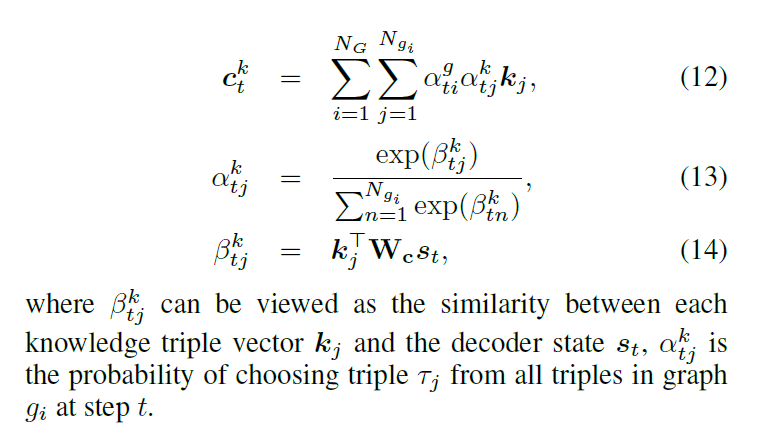
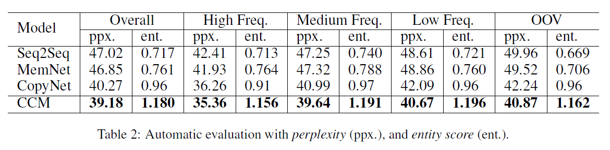
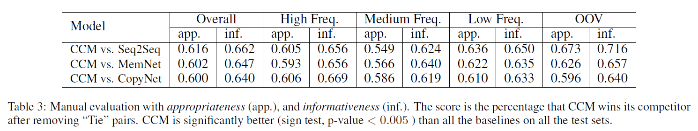

# Commonsense Knowledge Aware Conversation Generation with Graph Attention
## Information
- 2018 IJCAI
- Zhou, Hao, et al.

## Keywords
- Knowledge
- Conversation Model
- NLG

## Contribution
- This work is the first attempt that uses large-scale commonsense knowledge in neural conversation generation.
- Instead of treating knowledge triples (or entities) separately and independently, we devise static and dynamic graph attention mechanisms to treat the knowledge triples as a graph, from which we can better interpret the semantics of an entity from its neighboring entities and relations.

## Summary
This paper presents a novel open-domain conversation generation model(Commonsense Conversational Model(CCM)) to demonstrate how large-scale commonsense knowledge can facilitate language understanding and generation.

1. Knowledge Interpreter:
	
	1. Get the embedding of head , relation, and tail in the knowledge by TransE model.
	2. Use the words in input sequence to retrive the graphs that contain the word.
	3. Get the Graph embedding gi by the **Static Graph Attention Mechanism**(use relation to attend head and tail)
		
	4. Concatenate graph embedding gi and word embedding as the input of the Encoder

2. Knowledge Aware Generator:
	Apply Dynamic Graph Attention Mechanism to get the word for generation.
	
	1. Attend on the graphs that retrive from step1-1
		
	2. Attend on the knowledge triples kj that in the graph of step2-1
		

## Source Code
- [Commonsense Conversational Model(CCM)](https://github.com/tuxchow/ccm)
