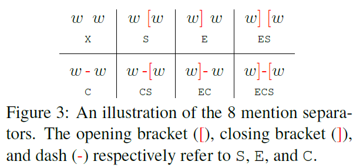
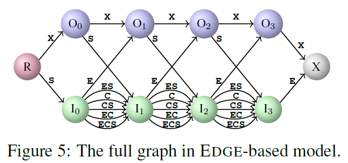
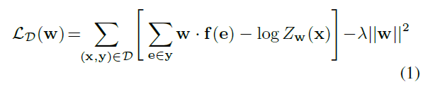
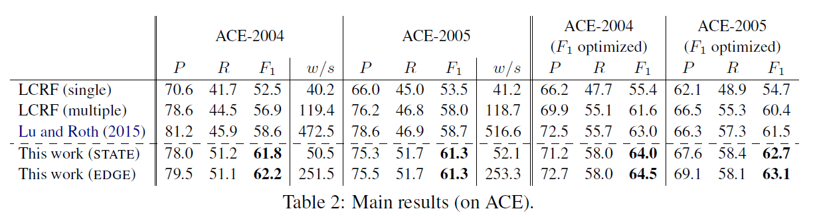
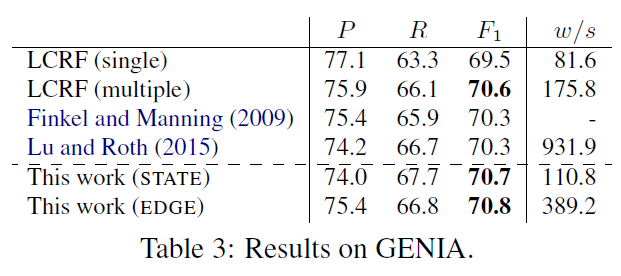

# Labeling Gaps Between Words: Recognizing Overlapping Mentions with Mention Separators
## Information
- 2017 EMNLP
- Aldrian Obaja Muis and Wei Lu

## Keywords
- NER
- Nested NER
- Overlapping Mention

## Contribution
- Propose a set of **Mention Separators** which can be collectively used to define all possible mention combinations together with a novel multigraph representation.
- Use the mention separators to solve the **Spurious Structures** problem while calculate the normalization term in privious works.

## Summary
- Introduce a novel notion of **Mention Separators** that can be effectively used to capture how mentions overlap with one another.
- Mention Separators:
	
	- Assigning mention separators to the gaps between two words
	1. A mention is starting at the next word (S)
	2. A mention is ending at the previous word (E)
	3. A mention is continuing to the next word (C)
- Utilize Mention Separators:
	1. STATE-based:
		Directly use these mention separators to replace the standard mention encoding scheme (e.g., BIO encoding) in standard linear-chain CRF.
	2. EDGE-based:
		Assign the mention separators to the edges of a graphical model.
		
- Training:
	Use regularized log-likelihood in training data D as the objective function.
	

- Results:
	
	

## Source Code
not found