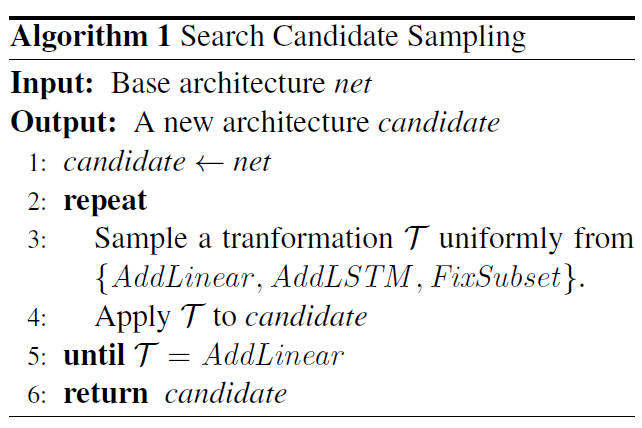
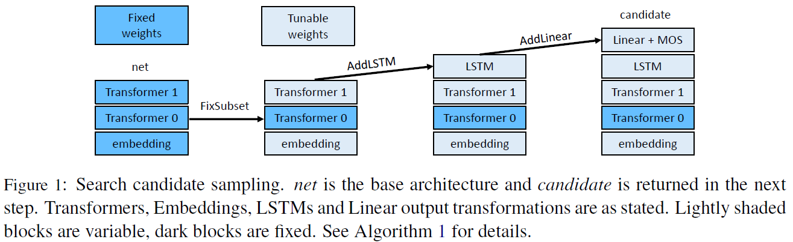
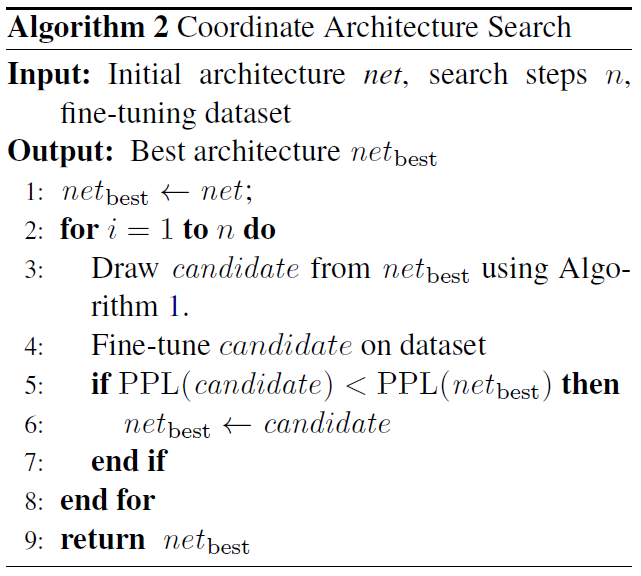
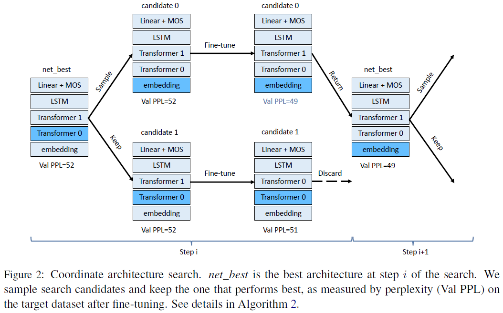
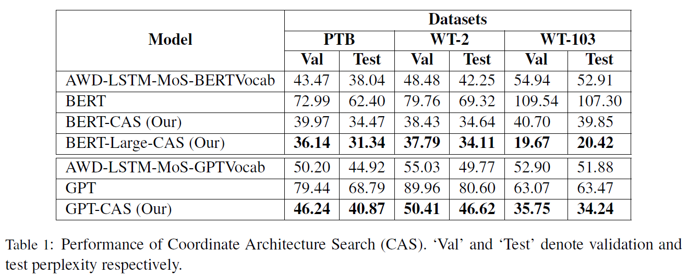
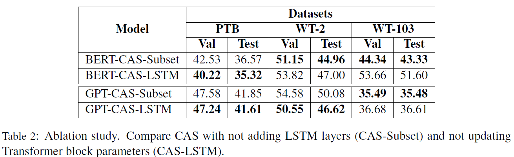
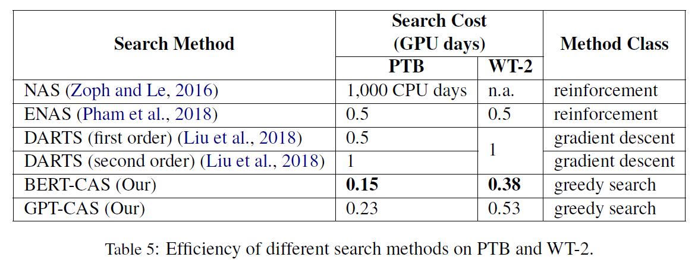

# Language Models with Transformers
## Information
- 2019 arXiv
- Chenguang Wang, Mu Li, Alexander J. Smola

## Keywords
- Language Representation
- fine-tunning
- Meta Learning

## Contribution
- Propose a Transformer architecture for language model. It works by adding LSTM layers after all Transformer blocks (a result of the search algorithm). This captures fine-grained word-level sequential context.
- Describe an effective search procedure, Coordinate Architecture Search (CAS). This algorithm randomly generates variants of the Transformer architecture, based on the current best found architecture.
- Show how this can be used to incorporate substantial prior knowledge in the form of GPT or BERT.

## Summary
- Explore effective Transformer architectures for language model, including adding additional LSTM layers to better capture the sequential context while still keeping the computation efficient.
- Propose Coordinate Architecture Search (CAS) to find an effective architecture through iterative refinement of the model.

- Disadvantages of BERT and GPT:
	1. Despite the fact that both GPT and BERT use language models for pre-training, neither of them achieves state-of-the-art performance in language modeling. 
		- Neither self-attention nor positional encoding in the existing Transformer architecture is effective in modeling fine-grained order information of words in context which is important for Language model to predict the next word given the previous context.
	2. We may often have access to models pre-trained on related, albeit not identical tasks.
	3. The size of the datasets where training a single model for GPT or BERT can cost in excess of $10,000, makes it prohibitively expensive to perform a fully-fledge model exploration with full retraining.

- Adapting GPT and BERT for Sub-word Language Model
	- GPT and BERT pre-trained weights are re-used in the language model fine-tuning process to save the costs of a full retraining.
	1. GPT Model:
		- During fine-tuning add a linear layer with hidden size equal to the vocabulary size.
		- Masked self-attention ensures that only causal information flow can occur.
	2. BERT Model:
		- Design a Gibbs sampler to sample wi|w-i, i.e. wi given its context w-i iteratively and repeatedly for all i to use a variant of this aspect directly.
		- Because the next sentence prediction aims to capture the binarized relationship between two sentences is not directly useful for LM. Remove the objective and replace it by a log likelihood measure during fine-tuning.
		- Add a linear layer with hidden size equal to the vocabulary size.
		- Replace the self-attention heads with masked self-attention to prevent leftward information flow.

- Fine-tuning TransformerWeights
	- Propose to update only a subset of layer weights during fine tuning.
		- Because updating all weights could lead to overfitting since datasets such as WikiText or Penn Tree Bank are over an order of magnitude smaller than the data used to train GPT and BERT.
	- Automatically search the subset which is most effective for the language model task.

- Coordinate Architecture Search(CAS)
	1. Transformations:
		1. AddLinear:
			- Adds a linear output layer with hidden size equal to the vocabulary size. It then randomly initializes its parameters. If such a linear layer already exists, this step is skipped.
		2. AddLSTM:
			- Adds an LSTM layer if no such layer already exists.
			1. Attaches the LSTM before Transformer blocks:
				- Add the LSTM layer immediately after the embedding layer and remove the positional and segment embedding, because we believe the LSTM layer is able to encode sufficient sequential information.
			2. Attaches the LSTM after Transformer blocks:
				- Insert the LSTM layer between the last Transformer block and the output linear layer.
		3. FixSubset:
			- Given n Transformer blocks pick k blocks uniformly at random and fix the parameters for each selected block during fine-tuning.
	2. Sampling a Search Candidate:
		- At each time, sample transformations uniformly at random.
			- 
			- 
	3. Algorithm:
		- 
		- 
		- Use a simple greedy strategy for architecture search.
		- Starting with either GPT or BERT as pretrained model we repeat the search n times.
		- Each time, sample a candidate, then fine-tune it and update the best candidate if necessary.

- Results:
	- Performance of Coordinate Architecture Search (CAS):
		
	- Ablation study:
		
		- On the smaller dataset, i.e. PTB, adding LSTMs is more effective. This might be due to the overfitting incurred in updating Transformers.
		- On the larger datasets, i.e. WT-103, adding an LSTM is less effective, which means that adapting the Transformer parameters for better sentence-level representation is more important.
	- Efficiency:
		

## Source Code
not found