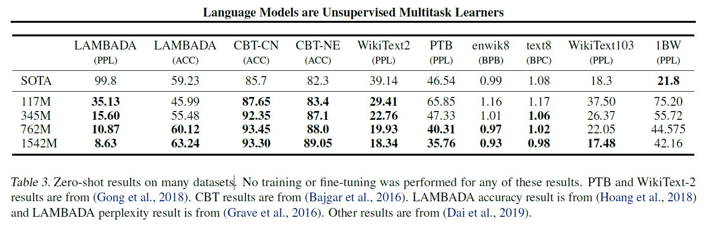

# Language models are unsupervised multitask learners(GPT-2)
## Information
- 2018 [website](https://openai.com/blog/better-language-models/)
- Radford, Alec, et al.

## Keywords
- Language Representation
- Unsupervised Learning

## Contribution
- Demonstrate language models can perform down-stream tasks in a zero-shot setting – without any parameter or architecture modification.

## Summary
- Demonstrate that language models begin to learn NLP tasks without any explicit supervision when trained on a new dataset of millions of webpages called WebText.
- Dataset(WebText)
	- Scraped all outbound links from Reddit which received at least 3 karma.(This can be thought of as a heuristic indicator for whether other users found the link interesting, educational, or just funny)
	- Removed all Wikipedia documents from WebText(Prevent complicate analysis due to overlapping training data with test evaluation tasks)

- Input Representation:
	Apply Byte Pair Encoding (BPE) which is a practical middle ground between character and word level language modeling.

- Model 
	- Largely follows the details of the OpenAI GPT [model](Improving_Language_Understanding_by_Generative_Pre-Training.md) with a few modification.
		- Layer normalization was moved to the input of each sub-block.
		- Additional layer normalization was added after the final self-attention block.
		- Modified initialization which accounts for the accumulation on the residual path with model depth is used.
		- The vocabulary is expanded to 50,257.
		- Increase the context size from 512 to 1024 tokens and a larger batchsize of 512 is used.

- Results:
	- Zero-shot results on many datasets:
		

## Source Code
- [gpt-2](https://github.com/openai/gpt-2)