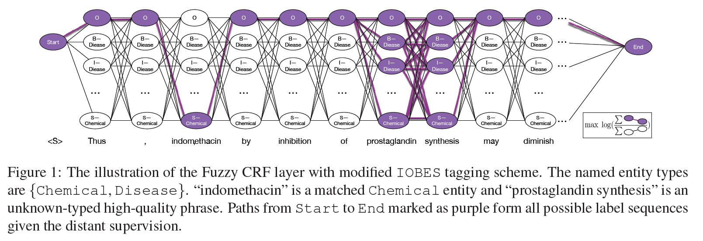
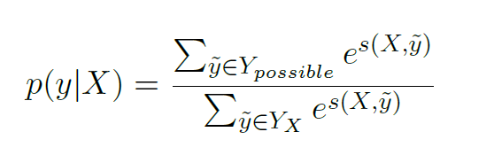
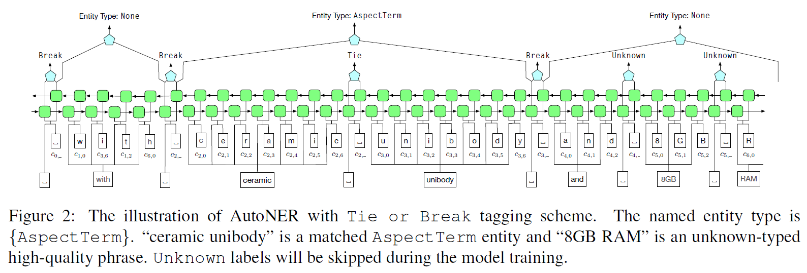
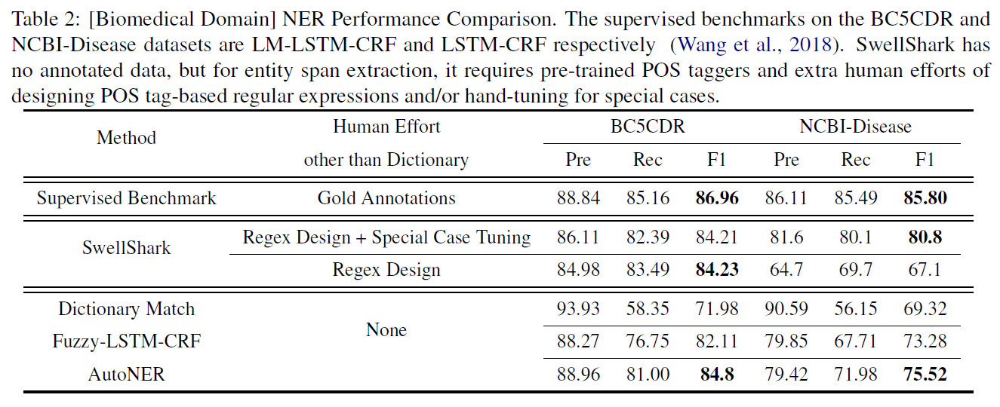
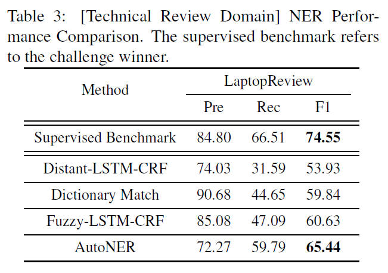

# Learning Named Entity Tagger using Domain-Specific Dictionary
## Information
- 2018 arXiv
- Shang, Jingbo, et al.

## Keywords
- NER
- AutoLabel
- Distant Supervision

## Contribution
- Propose AutoNER, a novel neural model with the new Tie or Break scheme for the distantly supervised NER task.
- Revise the traditional NER model to the Fuzzy-LSTM-CRF model, which serves as a strong distantly supervised baseline.
- Refine distant supervision for better NER performance.

## Summary
1. Fuzzy-LSTM-CRF with Modified IOBES
	- Label with modified IOBES:
  	 Label the sequence with exact dictionary match by the format of modified IOBES scheme.
	 
	-  Fuzzy-LSTM-CRF:
	 Maximizes the total probability of all possible label sequences by enumerating both the tags and IOBES all matched entity types
	 

2. AutoNER with "Tie or Break"
	- "Tie or Break" Tagging Scheme:
	 It focuses on the ties between adjacent tokens, i.e., whether they are tied in the same entity mentions or broken into two parts
	 
	- AutoNER:
		- For entity span detection, build a binary classifier to distinguish Break from Tie, while Unknown positions will be skipped.
		- After obtaining candidate entity spans, we further identify their entity types, including the None type for non-entity spans.

3. Others:
	- About "Unknown" Entities:
		- FuzzyCRF : consider all possible labels
		- AutoNER : skip it
	- Corpus-Aware Dictionary Tailoring:
	 Tailor the original dictionary to a corpus-related subset by excluding entities whose canonical names never appear in the given corpus.

 

## Source Code
- [AutoNER](https://github.com/shangjingbo1226/AutoNER)
- [AutoPhrase](https://github.com/shangjingbo1226/AutoPhrase) used in this paper for mining High-Quality phrases.
