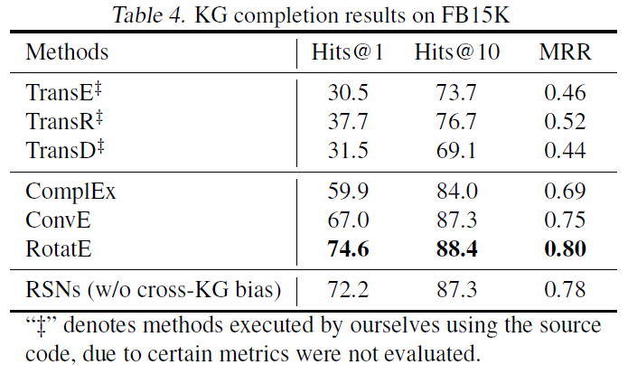

# Learning to Exploit Long-term Relational Dependencies in Knowledge Graphs(RSN)
## Information
- 2019 ICML
- Guo, Lingbing, Zequn Sun, and Wei Hu.

## Keywords
- Knowledge Graph
- Knowledge Representation
- Knowledge Graph completion(Link Prediction)
- Knowledge Alignment

## Contribution
- Propose the path-level learning for KG embedding and design **Recurrent Skipping Networks(RSNs)** to remedy the limitations of using RNNs to model relational paths.
- To obtain desired paths, this paper uses the **biased random walks** to efficiently sample paths from KGs.
- To make the embedding learning more effectively, this paper designs **type-based noise-constrained estimation(NCE)**, which optimizes the negative example sampling according to the types of elements in paths.

## Summary
- RSNs integrate recurrent neural networks(RNNs) with residual learning to efficiently capture the long-term relational dependencies within and between KGs by concentrateing on learning from relational paths.

- Two major limitations of Triple-level learning:
	1. Low expressiveness:
		- Triple-level learning lacks the capability of capturing long-term relational dependencies of entities.
	2. Inefficient information propagation:
		- Triple-level learning is insufficient for the propagation of semantic information among entities, especially for the case of cross-KG embedding.
	- It is clear that paths can provide richer relational dependencies than triples without losing the local relational information of entities.

- Architecture
	1. Biased random walk sampling:
		- Generates deep and cross-KG relational paths.
		- Leverage the idea of second order random walks and introduce a depth bias to smoothly control the depths of sampled paths.
		- Depth bias:
			- 
			, where α ∈ (0,1) is a hyper-parameter controlling the depths of random walks.
			- To reflect the favors on deeper paths, set α > 0.5
		- Cross-KG bias:
			- Also encourage walking across two KGs to deliver alignment information for entity alignment.
			- 
			, where β ∈ (0,1) is a hyper-parameter controlling the behavior of random walks across two KGs.
			- To favor cross-KG paths, set β > 0.5
			- This bias also avoids walking backwards and forwards between entities in the seed alignment.
		- Final bias:
			- Finally, combine the depth and cross-KG biases into the following bias:
				- 

	2. Recurrent Skipping Networks(RSNs):
		- 
		- The basic idea of RSNs is to shortcut the current input entity to let it directly participate in predicting its object entity.
			- 
		- RSNs explicitly distinguish entities and relations, and allow subject entities to skip their connections for directly participating in predicting object entities.
		- Differences of RNNs, Recurrent Residual Networks(RRNs) and RSNs:
			- 	

	3. Type-based noise contrastive estimation(NCE):
		- Evaluates the loss of RSNs in an optimized way.
		- Drawback of the origin optimization:
			- Directly computing the sigmoid loss of each prediction is time-consuming as the number of candidate entities or relations is usually large.
		- Apply NCE to evaluate each output of RSNs, which only requires a small number of negative samples to approximate the integral distribution.
		- Loss of RSNs by applying Type-based NCE:
			- 
		- Separate the computation of noise probability distribution according to the target types(negative entities or negative relations).
			- Specifically, if the current target is an entity, draw negative samples from the noise probability distribution of entities. Negative relation sampling is carried out similarly.
			- In this way, the candidate sets for negative sampling are compacted and the inapplicable negative examples can also be avoided.

- Results:
	- Entity alignment:
		- Results of Entity alignment on the normal datasets:
			- 
		- Results of Entity alignment on the dense datasets:
			- 
	- KG completion task:
		- KG completion results on FB15K:
			- 
		- KG completion results on WN18:
			- 
	- Hits@1 results w.r.t. random walk length:
		- 

## Source Code
- [RSN](https://github.com/nju-websoft/RSN)