# MASS: Masked Sequence to Sequence Pre-training for Language Generation
## Information
- 2019 ICML
- Song, Kaitao, et al.

## Keywords
- NLG
- Pre-train
- Fine-tuning

## Contribution
- Propose MASS, a masked sequence to sequence pre-training method for language generation.
- Apply MASS on a variety of language generation tasks including NMT, text summarization and conversational response generation, and achieve significant improvements.

## Summary
- MAsked Sequence to Sequence pre-training (MASS) adopts the encoder-decoder framework to reconstruct a sentence fragment given the remaining part of the sentence.
- MASS:
	- 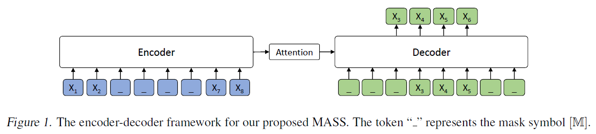
	- Pre-train:
		- MASS is carefully designed to pre-train the encoder and decoder jointly in two steps:
			1. Predicting the fragment of the sentence that is masked on the encoder side:
				- MASS can force the encoder to understand the meaning of the unmasked tokens, in order to predict the masked tokens in the decoder side
			2. Masking the input tokens of the decoder that are unmasked in the source side:
				- MASS can force the decoder rely more on the source representation other than the previous tokens in the target side for next token prediction, better facilitating the joint training between encoder and decoder.
		- Use **transformer** as the basic sequence to sequence model and pre-train on the WMT corpus monolingual with unpaired source sentence.
		- Pre-train Objective Function:
			- 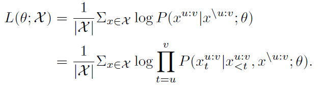
			, where x\u:v a modified version of x where its fragment from position u to v are masked, 0 < u < v < m and m is the number of tokens of sentence x; xu:v denotes the sentence fragment of x from u to v.
		- Generalization of BERT and GPT:
			- 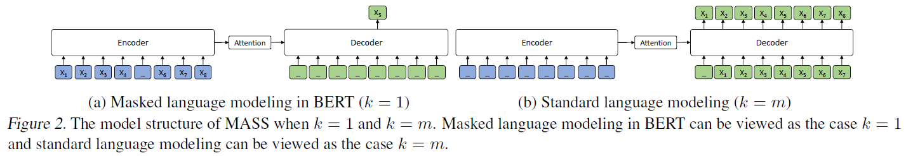
			- 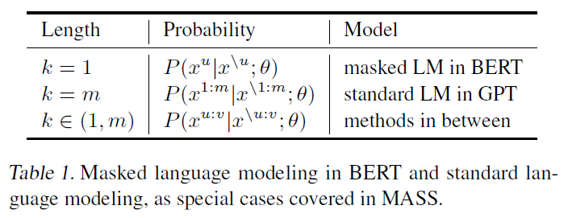
	- Fine-tune
		- Fine-tune on three different language generation tasks including NMT, text summarization and conversational response generation

- Results:
	- Results of unsupervised NMT:
		- 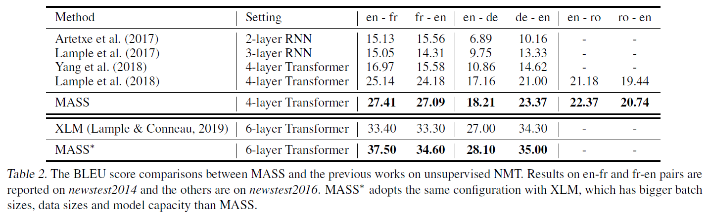
		- 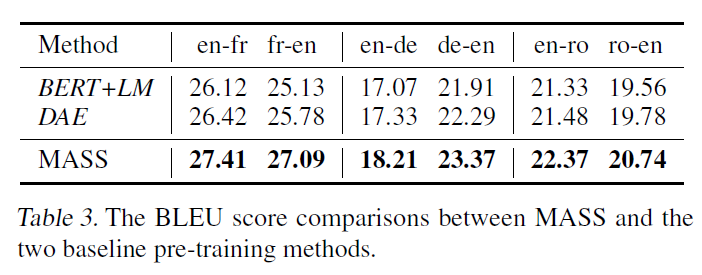
	- Results of Low-Resource NMT:
		- 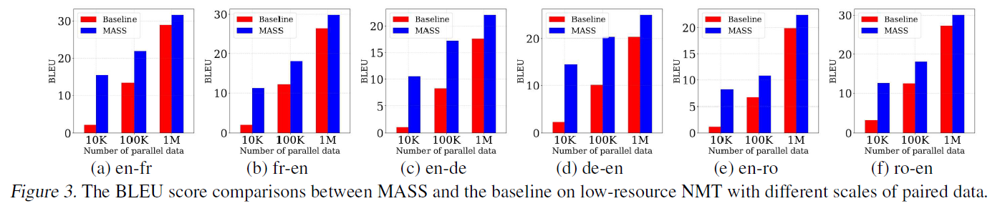
	- Results of Text Summarization:
		- 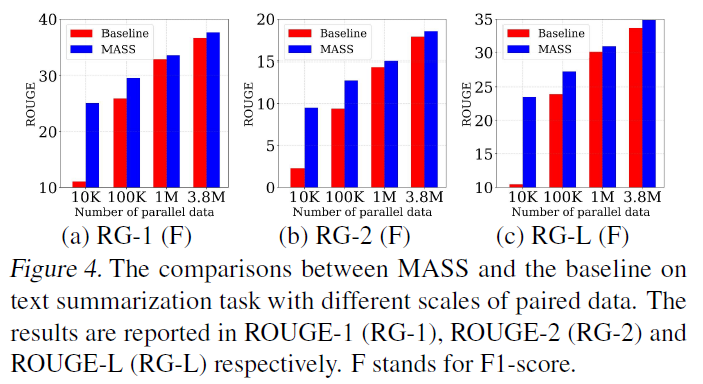
		- 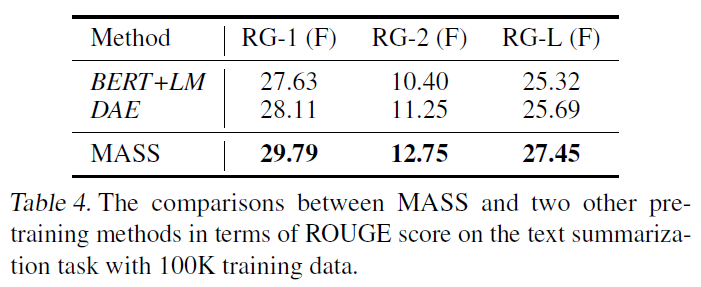
	- Results of Conversational Response Generation:
		- 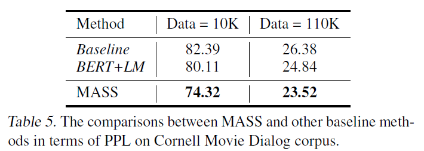
	- Ablation Study:
		- 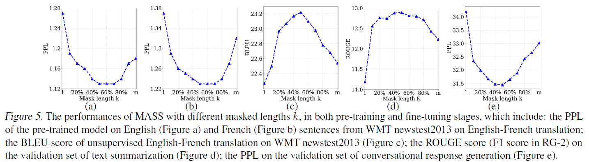
		- It can be seen that MASS achieves best performance on these downstream tasks when k is nearly 50% of the sentence length m.

## Source Code
not found