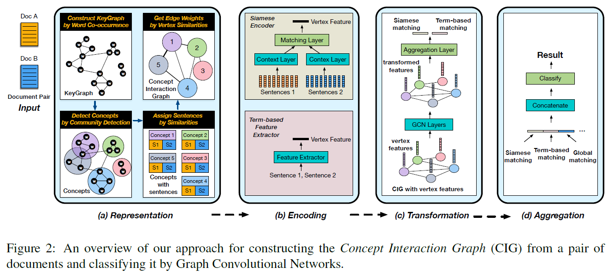
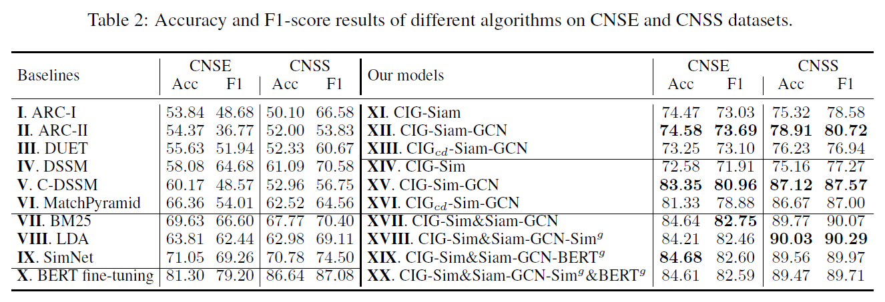

# Matching Article Pairs with Graphical Decomposition and Convolutions
## Information
- 2019 ACL
- Liu, Bang, et al.

## Keywords
- NLU
- Graph Convolutional Network(GCN)
- Long Text Problem

## Contribution
- Propose the so-called Concept Interaction Graph (CIG) to represent a document as a weighted graph of concepts, where each concept vertex is either a keyword or a set of tightly connected keywords. The CIG does not only capture the essential semantic units in a document but also offers a way to perform anchored comparison between two articles along the common concepts found.
- Propose a divide-and-conquer framework to match a pair of articles based on the constructed CIGs and graph convolutional net works (GCNs).

## Summary
- Present the Concept Interaction Graph (CIG) to represent a document as an undirected weighted graph, which decomposes a document into subsets of sentences, each subset focusing on a different concept.

- Article Pair Matching
	- 
	1. Construct CIG:
		- Detailed steps to construct a CIG for a single document:
			1. KeyGraph Construction
				1. Extract the named entities and keywords by TextRank
				2. Construct a keyword co-occurrence graph, called **KeyGraph**, based on the set of found keywords.
				3. Connect two keywords by an edge if they co-occur in a same sentence.
			2. Concept Detection (Optional)
				- If a subset of keywords are highly correlated, they will form a densely connected subgraph in the KeyGraph, which we call a concept.
				- Concepts can be extracted by applying community detection algorithms on the constructed KeyGraph.
			3. Sentence Attachment
				1. Calculate the cosine similarity between each sentence and each concept, where sentences and concepts are represented by TF-IDF vectors.
				2. Assign each sentence to the concept which is the most similar to the sentence.
				- Sentences that do not match any concepts in the document will be attached to a dummy vertex that does not contain any keywords.
			4. Edge Construction
				1. Represent its sentence set as a concatenation of the sentences attached to it.
				2. Calculate the edge weight between any two vertices as the TF-IDF similarity between their sentence sets.
		- Merge CIG for the two documents
			- Align the CIGs of the two articles by the concept vertices, and for each common concept vertex, merge the sentence sets from DA and DB for local comparison.
	2. Encoding Local Matching Vectors
		- Learn an appropriate matching vector of a fixed length for each individual concept v.
		- The matching of two documents is converted to match the pair of sentence sets on each vertex of GAB.
		1. Siamese Encoder:
			- Apply a Siamese neural network encoder [(Neculoiu et al., 2016)](https://www.aclweb.org/anthology/W16-1617) onto each vertex v in GAB to convert the word embeddings into a fixed-sized hidden feature vector mAB(v), which we call the match vector.
			1. Use a Siamese structure to take sequences of word embeddings in document A and B as inputs, and encode them into two context vectors cA(v) and cB(v) through the context layers that share the same weights.
			2. The matching vector mAB(v) for vertex v is given by the subsequent aggregation layer, which concatenates the element-wise absolute difference and the element-wise multiplication of the two context vectors.
		2. Term-based Similarities:
			- Directly calculating term-based similarities.
				1. TF-IDF cosine similarity
				2. TF cosine similarity
				3. BM25 cosine similarity
				4. Jaccard similarity of 1-gram
				5. Ochiai similarity measure
	3. Matching Aggregation via GCN
		- Propose to utilize the ability of the Graph Convolutional Network (GCN) filter to capture the patterns exhibited in the CIG GAB at multiple scales.
	4. Apply the features to a classification network
		- In addition to the graphically merged matching vector mAB described above, we may also append other global matching features to mAB to expand the feature set.
		- Possible global features:
			- By encoding two documents directly with state-of-the-art language models like BERT.
			- By directly computing their term-based similarities.

- Results:
	- Results on CNSE and CNSS datasets datasets:
		- 
		- Model Symbols:
			- "CIG" means that in CIG, we directly use keywords as concepts without community detection
			- "CIGcd" means that each concept vertex in the CIG contains a set of keywords grouped via community detection.
			- "Siam" indicates the use of Siamese encoder
			- "Sim" indicates the use of term-based similarity encoder
			- "GCN" means that we convolve the local matching vectors on vertices through GCN layers.
			- "BERTg" or "Simg" indicates the use of additional global features given by BERT or the five term-based similarity metrics of the Term-based Similarities mentioned above.

## Source Code
- [Doc2Graph](https://github.com/BangLiu/ArticlePairMatching)
