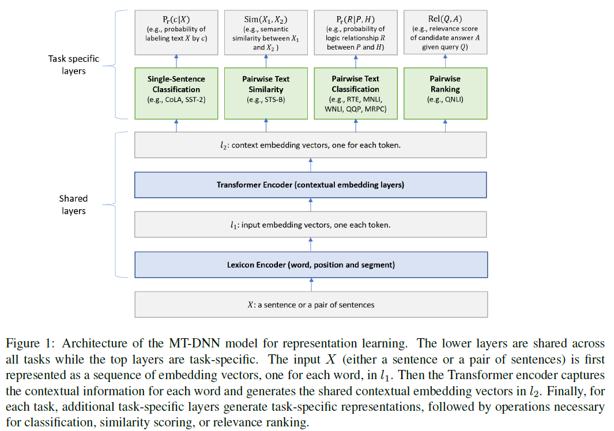
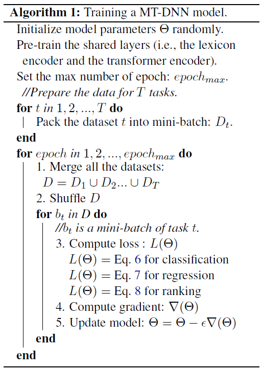
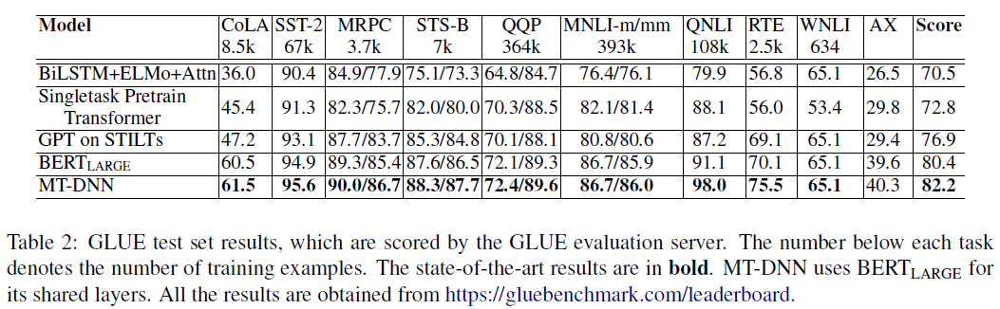

# Multi-Task Deep Neural Networks for Natural Language Understanding
## Information
- 2019 Axiv
- Xiaodong Li, Pengcheng He, Weizhu Chen, Jianfeng Gao

## Keywords
- NLU
- Multi-Task Learning(MTL)

## Contribution
- Combine MTL with BERT pre-training to achieve SOTA of NLU tasks

## Summary
- This paper presents a Multi-Task Deep Neural Network (MT-DNN) that pre-train model with the settings of BERT and fine-tune with multi-task setting(single-sentence classification, pairwise text classification, text similarity scoring, and relevance ranking.) 
	
- Model Architecture:
	1. Lexicon Encoder:
		The lexicon encoder maps X into a sequence of input embedding vectors. Construct by summing the corresponding word, segment, and positional embeddings.
	2. Transformer Encoder:
		Use a multilayer bidirectional Transformer encoder(in BERT) to map the input representation vectors into a sequence of contextual embedding.
	3. Task specific Output Layer:
		1. Single-Sentence Classification Output
		2. Text Similarity Output
		3. Pairwise Text Classification Output
		4. Relevance Ranking Output
- Training Procedure:
	1. Pre-training Stage:
		Follow same settings in the BERT model
	2. Multi-Task Fine-tuning Stage:
		Use minibatch based stochastic gradient descent(SGD) to learn the parameters of the model. In each epoch, a mini-batch bt is selected(e.g., among all 9 GLUE tasks), and the model is updated according to the task-specific objective for the task t.
		

- The Results:
	

## Source Code
- [MT-DNN](https://github.com/namisan/mt-dnn)