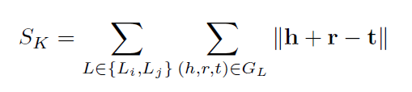
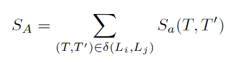
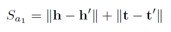
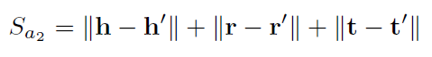
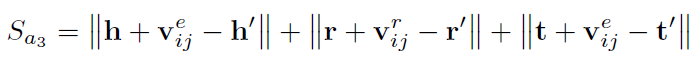
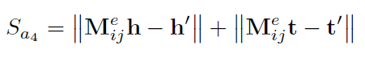
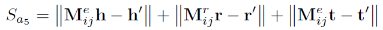
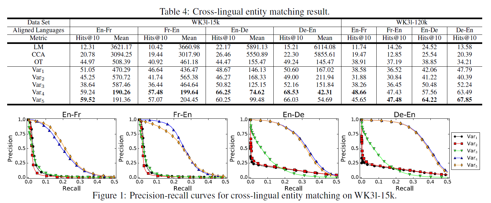

# Multilingual Knowledge Graph Embeddings for Cross-lingual Knowledge Alignment
## Information
- 2017 IJCAI
- Chen, Muhao, et al.

## Keywords
- Knowledge Graph
- Knowledge Alignment

## Contribution
- By encoding entities and relations of each language in a separated embedding space, MTransE provides transitions for each embedding vector to its cross-lingual counterparts in other spaces, while preserving the functionalities of monolingual embeddings.

## Summary
- Propose MTransE, a translation-based model for multilingual knowledge graph embeddings.
- MTransE learns the multilingual knowledge graph structure using a combination of two component models, namely knowledge model and alignment model.
	1. Knowledge Model:
		- Encodes entities and relations in a language-specific version of knowledge graph.
		- Adopts TransE as the knowledge model.
		- 
	2. Alignment Model:
		- Learn cross-lingual transitions for both entities and relations across different embedding spaces, where the following three representations of cross-lingual alignment are considered: 
		- 
		1. Distance-based axis calibration
			- 
			- 
			- Assume analogous spatial emergence of items in each language.
		2. Translation vectors
			- 
			- Consolidate alignment into graph structures and characterize cross-lingual transitions as regular relational translations.
			- v deployed as the entity-dedicated and relation-dedicated translation vectors.
		3. Linear transformations
			- 
			- 
			- Learn a k x k square matrix as a linear transformation on entity vectors from Li to Lj.

- Results:
	

## Source Code
- [MTransE](https://github.com/muhaochen/MTransE)